# OpenCHAI Infrastructure Control Plane — Architecture Document

**Document 2 of the Phase 0 Architecture Series**
**Status:** Draft for review
**Scope:** System architecture, component design, control/data flow, sequence diagrams, and end-to-end flowcharts for the OpenCHAI Control Plane.

---

## 1. Purpose and Scope

This document defines the architecture of OpenCHAI: how its components are organized, how they communicate, and how a request moves from a user action to a change in physical or virtual HPC/AI infrastructure and back.

It does **not** define the detailed Resource schema, API contract, or Controller Framework internals — those are covered in dedicated documents later in the Phase 0 series (Resource Model Specification, API Design Guidelines, Controller Framework Design). This document is the connective tissue that those documents will plug into.

**Read this document to understand:**
- What the major subsystems are and what each owns
- How a user-initiated change becomes a reconciled, running piece of infrastructure
- How the system behaves under drift, failure, and retry
- How the pieces map onto the technology stack and deployment topology

---

## 2. Architectural Principles (Recap and Application)

The Master Plan established these principles. Here we state how each one shapes concrete architecture decisions in this document:

| Principle | Architectural Consequence |
|---|---|
| Resource-oriented architecture | Every noun in the system (Cluster, Node, GPU, Workflow...) is a Resource with a uniform schema, stored in one place, addressable by one API pattern |
| Desired state management | The Resource Store holds *intent*; a separate path holds *observation*. These are never merged into one mutable object |
| Continuous reconciliation | Controllers run as independent, restartable loops — never as one-shot scripts triggered by a UI click |
| Event-driven workflows | State changes emit events; workflows and controllers react to events rather than polling business logic |
| API-first development | The API Server is the only writer to the Resource Store; no component reaches into the database directly |
| Modular controllers | One controller owns one Resource Kind (or a small, cohesive set); controllers do not call each other directly |
| Separation of control plane and automation | Ansible/xCAT/Redfish/Slurm/K8s are invoked *only* from Infrastructure Adapters, never from controllers or the API layer |
| Idempotent operations | Every adapter operation must be safe to retry; controllers assume at-least-once delivery of work |
| Scalability & HA | Stateless API/controller/worker processes; all durable state lives in PostgreSQL (+ future Redis/event bus) |
| Extensibility via adapters | New infrastructure integrations are new adapters implementing a fixed interface — core code does not change |

---

## 3. System Context

Before looking inside OpenCHAI, this diagram shows OpenCHAI as a single box among the actors and external systems it touches.

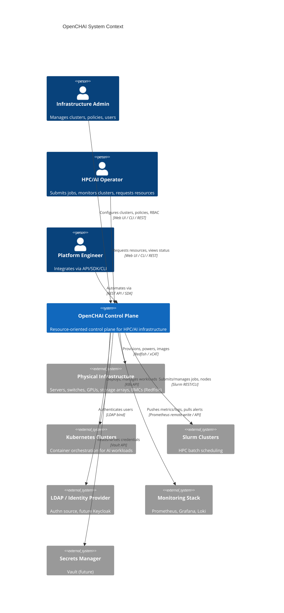

**Key takeaway:** OpenCHAI is the single point of intent for infrastructure. Every external system (Slurm, Kubernetes, Redfish-managed hardware, LDAP) is treated as a managed target, never as a peer that OpenCHAI defers decisions to.

---

## 4. High-Level Component Architecture

This expands the "Instead of / Architecture should follow" diagram from the Master Plan into a full component view.

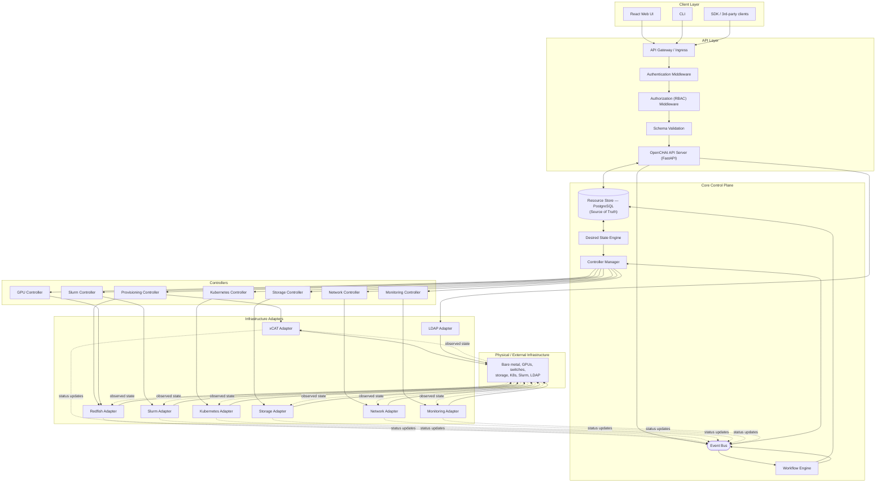

### 4.1 Component Responsibilities

| Component | Responsibility | Does NOT do |
|---|---|---|
| **API Server** | CRUD on resources, auth enforcement, schema validation, emits events on write | Talk to infrastructure directly; make scheduling/reconciliation decisions |
| **Resource Store (PostgreSQL)** | Durable, versioned storage of desired state, observed state, status, history | Business logic; it is a passive store |
| **Desired State Engine** | Computes diffs between desired and observed state; exposes "what needs to change" | Execute changes itself |
| **Controller Manager** | Schedules, supervises, and restarts individual controllers; assigns work | Contain domain logic for any specific resource kind |
| **Controllers** (Provisioning, Network, GPU, Storage, K8s, Slurm, Monitoring) | Reconcile one Resource Kind's desired vs. observed state by invoking adapters | Talk to hardware/software directly (must go through adapters) |
| **Workflow Engine** | Orchestrates multi-step, long-running, retryable, rollback-capable processes that span multiple controllers | Own steady-state reconciliation (that's the controllers' job) |
| **Event Bus** | Publishes resource-change and status events to interested subscribers | Store durable state (it is transport, not source of truth) |
| **Infrastructure Adapters** | Translate controller intent into calls against a specific technology (xCAT, Redfish, Slurm, K8s, LDAP...) | Make decisions about *whether* to act — only *how* to act |

---

## 5. Layered / Logical View

Another useful lens on the same system — how requests move down through logical layers regardless of which physical component instance handles them.

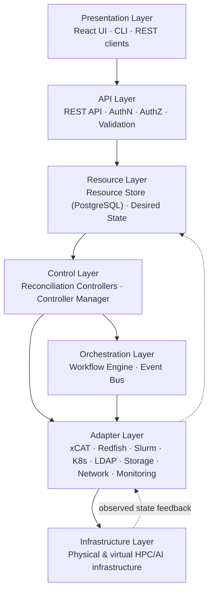

This is the layer diagram the Master Plan sketched (`GUI → Resource API → Desired State → Controllers → Workflow Engine → Infrastructure → Observed State → Reconciliation`), made explicit with the orchestration layer running alongside — not strictly after — the control layer, since workflows and controllers both react to the same event stream.

---

## 6. Detailed Component Diagrams

### 6.1 API Server — Internal Structure

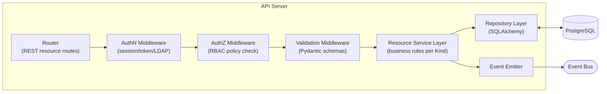

### 6.2 Controller Manager and a Single Controller

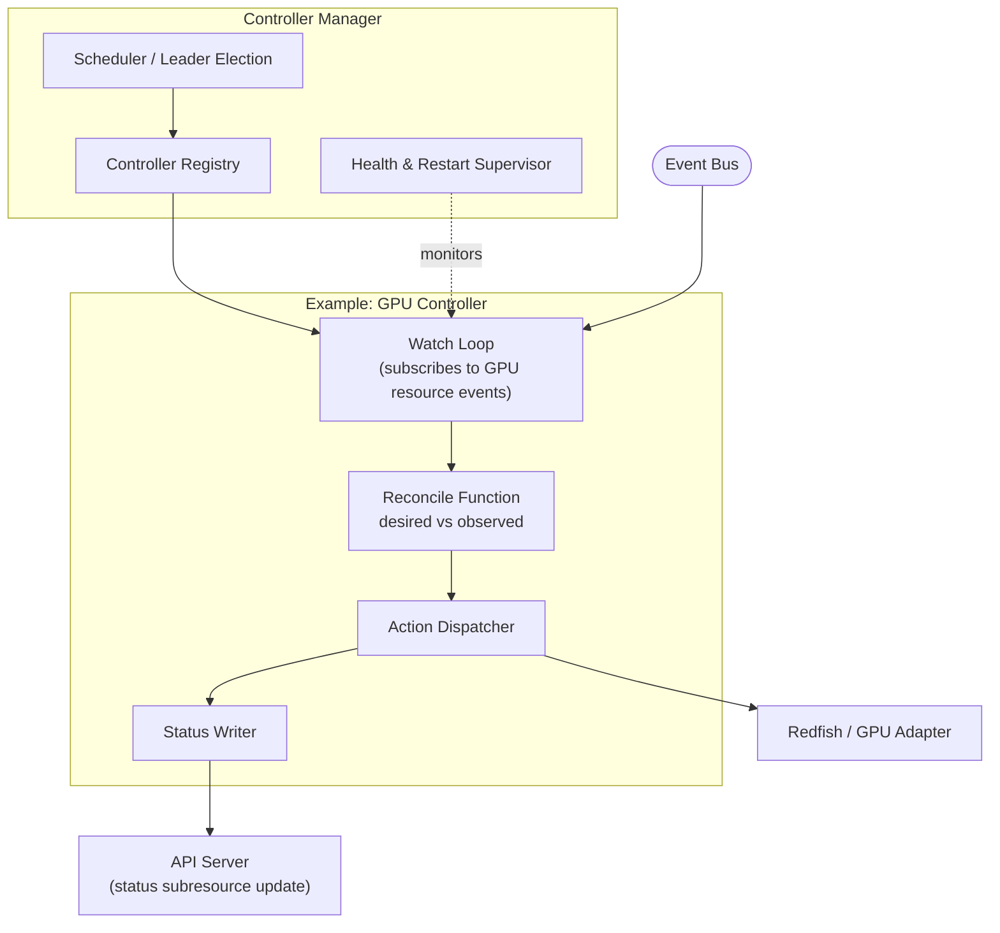

**Reconciliation loop contract (applies to every controller):**
1. Read desired state for the resources it owns.
2. Read last-known observed state.
3. Diff. If no diff, sleep/wait for next event.
4. If diff, call the appropriate adapter action(s).
5. Write status/conditions back through the API Server (never directly to the DB).
6. Requeue on failure with backoff; never crash-loop the whole controller on a single resource's failure.

### 6.3 Workflow Engine — Internal Structure

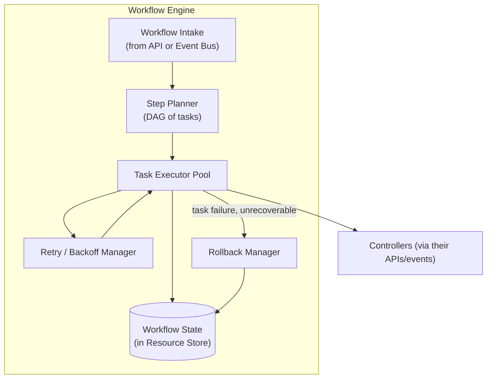

### 6.4 Infrastructure Adapter — Common Shape

Every adapter, regardless of target technology, implements the same interface so controllers remain adapter-agnostic:

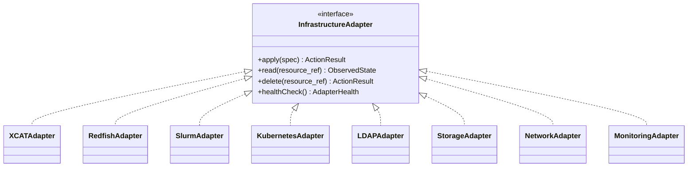

This uniform interface is what makes "extensibility through adapters" real: adding support for a new hypervisor or scheduler means writing one new class, not touching the Controller Manager, Workflow Engine, or API Server.

---

## 7. Sequence Diagrams

### 7.1 End-to-End: Admin Provisions a New Bare-Metal Node

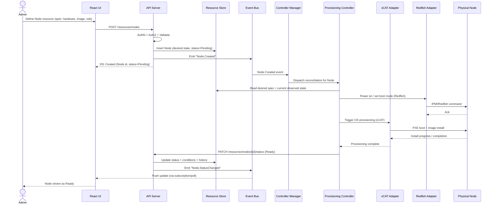

### 7.2 Continuous Reconciliation (Drift Correction)

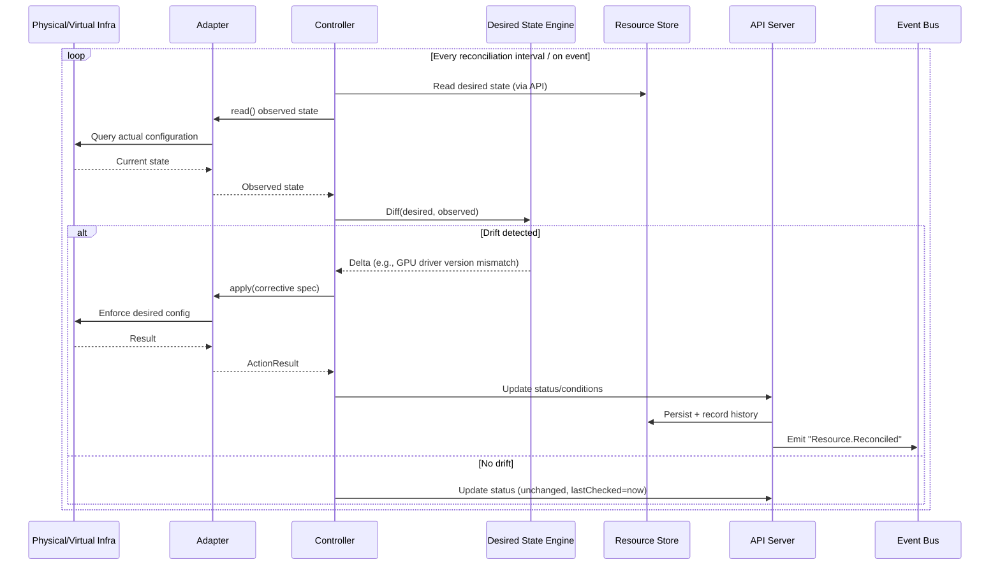

### 7.3 Workflow Execution with Retry and Rollback (Example: Cluster Bring-Up)

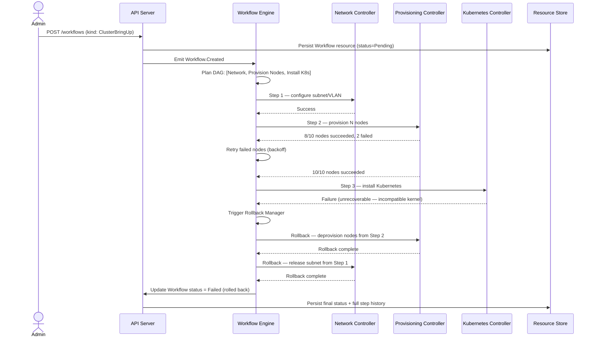

### 7.4 AuthN / AuthZ Flow

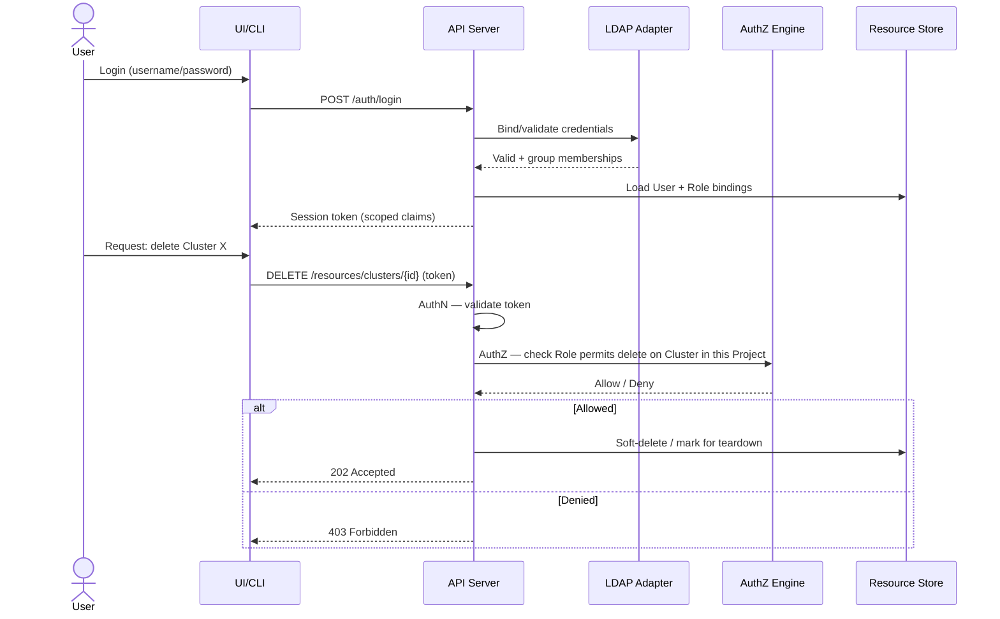

---

## 8. End-to-End Flowcharts

### 8.1 Full Lifecycle: From API Call to Running Infrastructure and Back

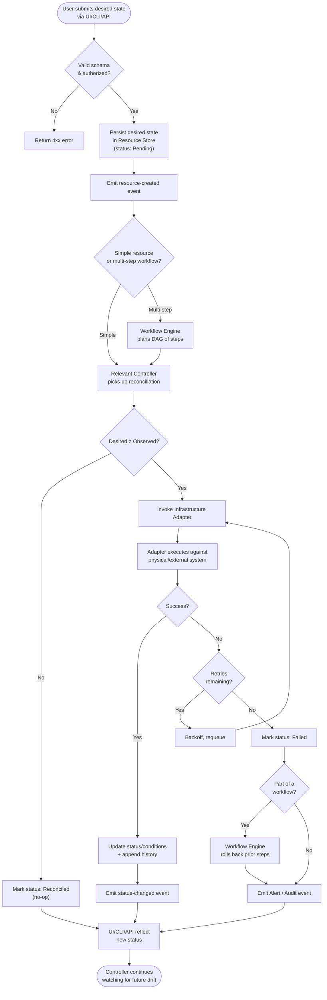

### 8.2 Drift Detection Loop (Standalone Detail)

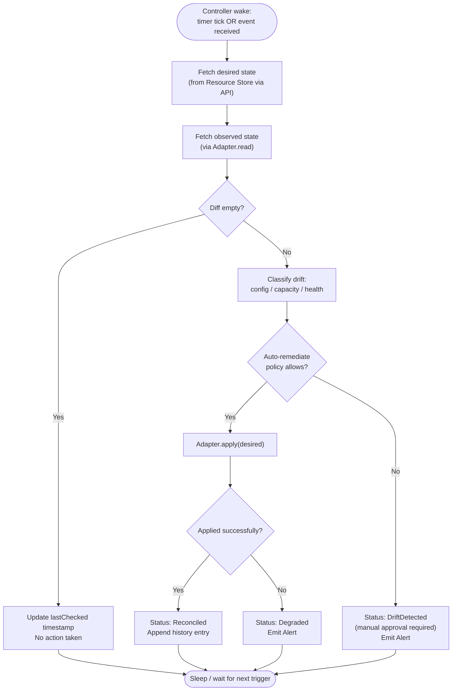

### 8.3 New Adapter Onboarding Flow (Extensibility in Practice)

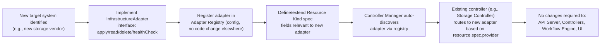

---

## 9. Deployment / Runtime Topology

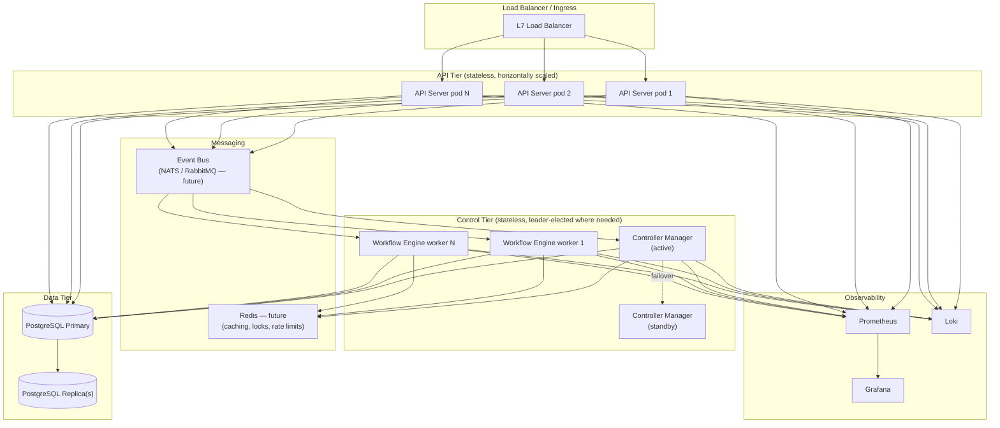

**HA notes:**
- API Server tier is fully stateless — scale horizontally behind the load balancer with no session affinity required (auth is token-based).
- Controller Manager uses leader election; only one active instance reconciles at a time per controller shard to avoid duplicate actions, with hot standbys.
- Workflow Engine workers are stateless executors; workflow state itself lives in PostgreSQL, so any worker can pick up a queued step.
- PostgreSQL is the only stateful component in Phase 1–2; replication/HA for it is planned explicitly in Phase 7 of the roadmap.

---

## 10. Technology Stack Mapping

| Architecture Component | Technology (per Master Plan) | Notes |
|---|---|---|
| Web UI | React, TypeScript, Tailwind CSS, Vite | Talks only to REST API |
| API Server | Python, FastAPI, Pydantic | Owns AuthN/AuthZ/Validation |
| Resource Store | PostgreSQL, SQLAlchemy, Alembic | Single source of truth |
| Event Bus | NATS or RabbitMQ (future) | Not required for Phase 1–2 MVP; can start with in-process pub/sub |
| Cache / Locks | Redis (future) | Used by Controller Manager for leader election, rate limiting |
| Controllers / Controller Manager | Python services | One process type, many controller instances/threads |
| Workflow Engine | Python service | Could adopt an existing workflow library (e.g., Temporal-style pattern) rather than building fully custom — a decision for the Workflow Engine Design doc |
| Adapters | xCAT, Redfish, Slurm, Kubernetes API, LDAP, Docker | Each isolated so one failing integration doesn't affect others |
| Secrets | Vault (future) | Referenced by adapters needing credentials, never stored in plaintext in the Resource Store |
| AuthN/AuthZ | LDAP now, Keycloak (future) | RBAC model detailed in Multi-Tenancy & Security doc |
| Monitoring | Prometheus, Grafana, Loki | Controllers/adapters emit metrics & structured logs |

---

## 11. Non-Functional Requirements Addressed by This Architecture

- **Scalability:** Stateless API/controller/worker tiers scale horizontally; only the database requires vertical/HA strategy.
- **High Availability:** Leader election for singleton-sensitive components (Controller Manager); no single point of failure in the request path once the DB is made HA (Phase 7).
- **Idempotency:** Enforced at the adapter interface contract (`apply()` must be safe to call repeatedly with the same spec).
- **Auditability:** Every resource carries `history` and `events`; every state-changing action flows through the API Server, giving one place to enforce audit logging.
- **Security:** All external-system credentials are isolated behind adapters; AuthZ is enforced centrally in the API layer, not duplicated per-controller.
- **Extensibility:** New infrastructure targets are additive (new adapters), not invasive (no core changes) — shown explicitly in §8.3.

---

## 12. Open Questions for Subsequent Phase 0 Documents

These are flagged here so they're not lost, but are intentionally deferred to their owning document:

1. **Resource Model Specification:** Exact schema fields, versioning scheme (`apiVersion`), and relationship/ownership rules between Resource Kinds (e.g., does deleting a Cluster cascade to its Nodes?).
2. **API Design Guidelines:** REST conventions, pagination, subresource patterns (`/status`, `/events`), API versioning policy.
3. **Controller Framework Design:** Concurrency model per controller, requeue/backoff parameters, how controllers claim work in a multi-replica Controller Manager.
4. **Workflow Engine Design:** Build vs. adopt an existing durable-execution framework; DAG definition format; how rollback steps are declared per task.
5. **Database Architecture:** Migration strategy, partitioning/retention for `history`/`events`/`audit` at national-supercomputing scale.
6. **Security & Multi-Tenancy Model:** RBAC role/permission granularity, Organization/Project isolation guarantees at the query layer.

---

*End of Architecture Document. Next in sequence: Resource Model Specification.*
