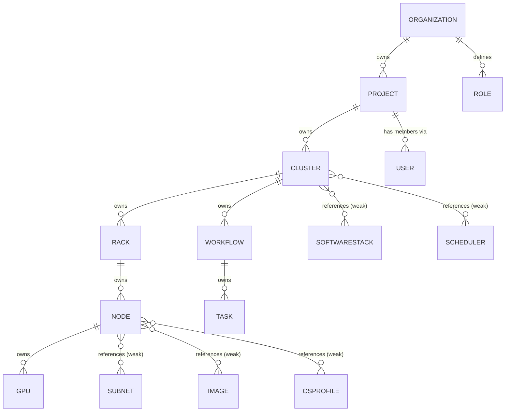
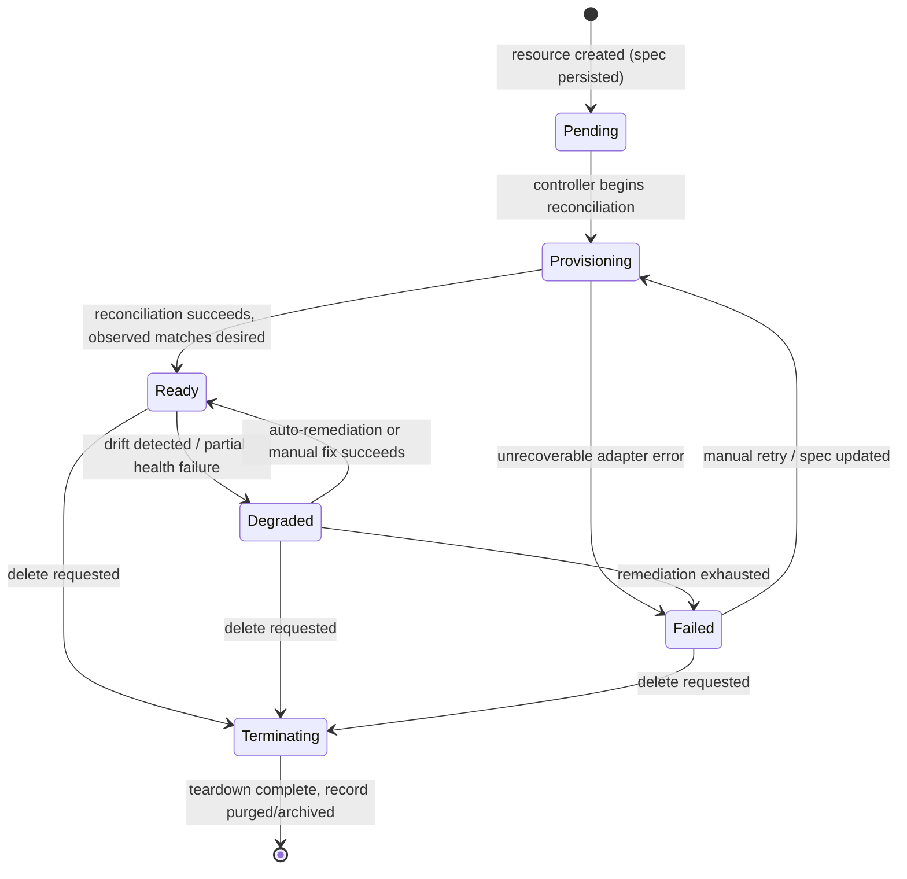

# OpenCHAI Resource Model Specification

**Document 3 of the Phase 0 Architecture Series**
**Status:** Draft for review
**Depends on:** OpenCHAI Architecture Document (Doc 2)
**Feeds into:** API Design Guidelines, Controller Framework Design, Database Architecture

---

## 1. Purpose and Scope

The Architecture Document established that "everything in OpenCHAI is a Resource" and that the Resource Store is the single source of truth. This document makes that concrete: the exact schema every resource follows, how resources relate to and own each other, how they move through their lifecycle, and the full catalog of Resource Kinds defined for the platform.

This document does **not** define REST endpoint conventions (see API Design Guidelines) or how controllers execute reconciliation (see Controller Framework Design) — it defines the *data* those documents operate on.

---

## 2. Design Goals

1. **Uniformity** — one schema shape for all 25+ Resource Kinds, so tooling (UI, CLI, SDK, validation, storage) is written once, not per-kind.
2. **Separation of intent and observation** — `spec` (desired) and `status` (observed) are always distinct fields, never merged.
3. **Traceability** — every resource can answer "what happened to me and when" via `conditions`, `events`, and `history`.
4. **Explicit relationships** — ownership and references between resources are first-class, queryable fields, not implied by naming conventions.
5. **Evolvability** — resources can gain new fields/kinds over time without breaking existing stored data (`apiVersion` scheme).

---

## 3. Common Resource Schema

Every resource — regardless of Kind — is an instance of this envelope:

```yaml
apiVersion: openchai.io/v1
kind: <ResourceKind>
metadata:
  id: <uuid>                     # system-assigned, immutable
  name: <string>                 # human-assigned, unique within scope
  organizationId: <uuid>         # tenant scope (nullable only for Organization itself)
  projectId: <uuid | null>       # optional narrower scope
  labels: {}                     # user-defined key/value for selection/grouping
  annotations: {}                # user-defined non-identifying metadata
  ownerReferences: []            # see §5 Ownership Model
  createdAt: <timestamp>
  createdBy: <userId>
  resourceVersion: <int>         # optimistic concurrency token, incremented on every write
  generation: <int>              # incremented only when `spec` changes (not status)
spec:
  # Kind-specific desired state — the only part a user directly authors
status:
  phase: <string>                # coarse lifecycle state, see §7
  observedGeneration: <int>      # which generation of `spec` this status reflects
  lastReconciledAt: <timestamp>
  # Kind-specific observed state fields
conditions:
  - type: <string>               # e.g. "Ready", "Provisioned", "Degraded"
    status: "True" | "False" | "Unknown"
    reason: <string>
    message: <string>
    lastTransitionTime: <timestamp>
events: []                       # pointers/refs to Event resources involving this resource
history: []                      # append-only log of significant status/spec transitions
```

### 3.1 Field Semantics

| Field | Mutability | Owner | Purpose |
|---|---|---|---|
| `metadata.id` | Immutable | System | Canonical identity; all references use this, never `name` |
| `metadata.name` | Mutable (rare) | User | Human-friendly identifier, unique within `(organizationId, projectId, kind)` |
| `metadata.resourceVersion` | System-incremented | System | Optimistic locking — writes must supply the version they read |
| `metadata.generation` | System-incremented | System | Lets controllers/status detect "spec changed since I last reconciled" via `status.observedGeneration` |
| `spec` | Mutable | User (via API) | The *only* field a controller reads as intent — never inferred from `status` |
| `status` | Mutable | Controllers only | Written exclusively via the status subresource (see API Design Guidelines); users cannot write it directly |
| `conditions` | Append/update | Controllers | Structured, machine-readable health signals (pattern borrowed deliberately from Kubernetes) |
| `history` | Append-only | System | Full audit trail of transitions; never deleted, only retained per data-retention policy |

### 3.2 Why `spec`/`status` Are Never Merged

This is the single most load-bearing rule in the Resource Model, directly implementing the Architecture Document's "desired state vs. observed state" separation:

- A user (or another controller) **only ever writes `spec`**.
- A controller **only ever writes `status`/`conditions`/`history`**, and always for resources it owns.
- The Desired State Engine's diff operation is always `diff(spec, status.<observed fields>)` — never spec-vs-spec or status-vs-status.

---

## 4. Naming, Identity, and Versioning Conventions

- **`apiVersion`** follows `openchai.io/v1` (group/version). A future breaking change to a Kind's schema ships as `v2` alongside `v1` with a defined conversion path — Kinds are never silently mutated in place.
- **Uniqueness scope:** `(organizationId, projectId, kind, name)` must be unique. `metadata.id` is globally unique across the whole platform.
- **Immutability:** `kind`, `metadata.id`, `metadata.organizationId`, and `metadata.createdAt` are immutable after creation. Changing tenancy scope requires delete+recreate, not an update — this avoids ambiguous ownership transfer bugs.
- **Labels vs. annotations:** `labels` are indexed and used for selection (e.g., "all Nodes with `rack=R12`"); `annotations` are not indexed and carry free-form metadata (e.g., a ticket link).

---

## 5. Ownership and Relationship Model

Resources relate to each other in two distinct ways, and the Resource Model keeps them explicitly separate:

1. **Ownership** (`metadata.ownerReferences`) — a strong, lifecycle-binding relationship. If the owner is deleted, owned resources are garbage-collected (cascade), unless explicitly orphaned.
2. **References** (plain `spec` fields, e.g., `spec.networkId`) — a weak, pointer-style relationship. Deleting the referenced resource does **not** cascade; it is validated (deletion blocked or reference nulled, per policy) rather than cascaded.

```yaml
metadata:
  ownerReferences:
    - kind: Cluster
      id: <uuid>
      controller: true      # exactly one ownerReference may set controller:true
```

### 5.1 Ownership Hierarchy (Cascade-on-Delete)



**Cascade rule:** deleting a Cluster cascades to its Racks, Nodes, GPUs (owned), and its Workflows/Tasks — this answers the open question raised in the Architecture Document. Deleting a Cluster does **not** cascade to a Subnet or Image it merely references; those are independently owned (typically by a Project or Organization) and may be shared across multiple Clusters.

### 5.2 Reference Integrity Rules

- A `spec` reference field (e.g., `spec.imageId`) must point to a resource the caller has read-access to in the same or a parent scope.
- Deleting a resource that is still referenced (not owned) by others is **blocked by default** (`409 Conflict`) unless the caller passes an explicit `force` flag, in which case referencing resources transition to a `Degraded` condition rather than being silently broken.

---

## 6. Resource Kind Catalog

Organized by domain. Each entry lists the Kind, its owner (per §5), and its most important `spec`/`status` fields (illustrative, not exhaustive — full field-level schemas belong in per-Kind API reference docs, not here).

### 6.1 Organizational / Tenancy

| Kind | Owned by | Key `spec` fields | Key `status` fields |
|---|---|---|---|
| `Organization` | — (root) | `displayName`, `contact` | `projectCount` |
| `Project` | Organization | `displayName`, `quotas` | `resourceUsage` |

### 6.2 Physical Infrastructure

| Kind | Owned by | Key `spec` fields | Key `status` fields |
|---|---|---|---|
| `Cluster` | Project | `topology`, `desiredNodeCount`, `schedulerRef` | `phase`, `nodeCount`, `healthySummary` |
| `Rack` | Cluster | `location`, `powerCapacity` | `occupiedUnits` |
| `Node` | Rack | `hardwareProfile`, `osProfileRef`, `imageRef`, `role` | `powerState`, `bootState`, `lastCheckIn` |
| `GPU` | Node | `model`, `driverVersionDesired` | `driverVersionActual`, `utilization`, `eccErrors` |
| `Storage` | Project/Cluster | `type`, `capacity`, `backendRef` | `usedCapacity`, `healthState` |
| `Network` | Project | `cidrRange`, `vlanId` | — |
| `Subnet` | Network | `range`, `gateway` | `allocatedIPs` |
| `Switch` | Rack | `model`, `portCount`, `managementIP` | `portStatus[]` |

### 6.3 Software / Platform

| Kind | Owned by | Key `spec` fields | Key `status` fields |
|---|---|---|---|
| `Image` | Project/Org | `osType`, `version`, `sourceUri` | `checksum`, `available` |
| `OSProfile` | Project/Org | `packages`, `kernelParams` | — |
| `SoftwareStack` | Cluster | `components[]` (e.g., MPI, CUDA versions) | `installedVersions[]` |
| `ContainerRuntime` | Node | `engine` (Docker/containerd), `version` | `runningContainers` |
| `Scheduler` | Cluster | `type` (Slurm/K8s), `config` | `queueDepth`, `activeJobs` |

### 6.4 Identity, Security, and Policy

| Kind | Owned by | Key `spec` fields | Key `status` fields |
|---|---|---|---|
| `User` | Organization | `externalId` (LDAP DN), `email` | `lastLogin` |
| `Role` | Organization | `permissions[]` | — |
| `Policy` | Organization/Project | `rules[]` (e.g., auto-remediation allowed) | — |
| `Secret` | Project | `type`, `encryptedRef` (pointer into Vault, never raw value) | `rotationDue` |
| `Credential` | Project | `targetSystem`, `secretRef` | `lastValidated` |
| `Certificate` | Project | `commonName`, `issuerRef` | `expiresAt` |
| `Backup` | Project/Cluster | `schedule`, `retention` | `lastSuccessfulRun` |

### 6.5 Workflow and Operational

| Kind | Owned by | Key `spec` fields | Key `status` fields |
|---|---|---|---|
| `Workflow` | Cluster/Project | `type`, `parameters` | `phase`, `currentStep`, `stepHistory[]` |
| `Task` | Workflow | `action`, `targetRef` | `attempt`, `result` |
| `Audit` | Organization (system) | *(system-generated, no user `spec`)* | `actor`, `action`, `target`, `timestamp` |
| `Alert` | Organization/Project | `condition`, `severity` | `firing`, `acknowledgedBy` |
| `Event` | Any resource (weak ref) | *(system-generated)* | `type`, `reason`, `involvedObjectRef` |

> **Note:** `Audit` and `Event` are themselves resources (consistent with "everything is a resource") but are system-authored — they have no meaningful user-writable `spec`. This is a deliberate, narrow exception documented here rather than silently special-cased.

---

## 7. Lifecycle Model (`status.phase`)

All resources that represent something provisioned/managed (Cluster, Node, GPU, Storage, Workflow, etc.) share a common coarse-grained phase state machine. Kind-specific `conditions` add detail underneath this.



**Rules:**
- A resource's `status.phase` is always one of: `Pending`, `Provisioning`, `Ready`, `Degraded`, `Failed`, `Terminating`.
- Only controllers write `status.phase`. The API Server rejects any client attempt to set it directly.
- `Terminating` is itself reconciled — deletion is a controller-driven teardown (deprovision, release IPs, revoke credentials), not an immediate row delete. The row is removed (or archived, per retention policy) only once all owned resources have completed their own `Terminating` phase.

---

## 8. Conditions Convention

`conditions` supplement `phase` with finer-grained, independently-updatable signals — directly reused from the Architecture Document's controller contract.

Standard condition types used across Kinds:

| Condition Type | Meaning |
|---|---|
| `Ready` | The resource is fully reconciled and usable |
| `Provisioned` | Underlying infrastructure exists (may not yet be `Ready`, e.g., still booting) |
| `Degraded` | Functioning but below desired state (e.g., 9/10 nodes healthy) |
| `Progressing` | An active reconciliation or workflow step is in flight |
| `Blocked` | Waiting on an external dependency (e.g., referenced Image not yet available) |

Each controller only ever writes the condition types relevant to the Kind it owns, and must always set `lastTransitionTime` only when `status` actually changes — not on every reconciliation tick — so `conditions` remains a meaningful change log rather than noise.

---

## 9. Validation Rules (Cross-Cutting)

Enforced by the API Server's validation middleware before persistence (detailed schemas per Kind belong in the API Design Guidelines doc):

1. **Schema validation** — `spec` must conform to the Kind's Pydantic model for the given `apiVersion`.
2. **Referential validation** — any `spec.*Ref`/`*Id` field must reference an existing resource within an accessible scope (§5.2).
3. **Tenancy validation** — `organizationId`/`projectId` must exist and the caller must have access to that scope.
4. **Immutable-field validation** — updates that attempt to change `kind`, `metadata.id`, or `metadata.organizationId` are rejected (`422`).
5. **Optimistic concurrency** — updates must include the `resourceVersion` last read; a stale version is rejected (`409 Conflict`) rather than silently overwritten.
6. **Quota validation** — creation is checked against `Project.spec.quotas` (e.g., max GPUs) before persistence.

---

## 10. Example Manifests

### 10.1 Cluster

```yaml
apiVersion: openchai.io/v1
kind: Cluster
metadata:
  id: 8f14e2b0-...-c9a1
  name: gpu-research-cluster-01
  organizationId: 3c2a...
  projectId: 91bd...
  labels:
    environment: production
    tier: gpu
spec:
  topology: fat-tree
  desiredNodeCount: 64
  schedulerRef: slurm-default
  softwareStackRef: cuda-12-mpi-stack
status:
  phase: Ready
  observedGeneration: 3
  nodeCount: 64
  healthySummary: "64/64 healthy"
conditions:
  - type: Ready
    status: "True"
    reason: AllNodesHealthy
    lastTransitionTime: 2026-07-20T10:12:00Z
```

### 10.2 Node (owned by the Cluster above via its Rack)

```yaml
apiVersion: openchai.io/v1
kind: Node
metadata:
  id: 4a91...
  name: node-r12-u04
  organizationId: 3c2a...
  projectId: 91bd...
  ownerReferences:
    - kind: Rack
      id: rack-12-id
      controller: true
spec:
  hardwareProfile: dgx-h100
  osProfileRef: ubuntu-22.04-hpc
  imageRef: base-image-v4
  role: compute
status:
  phase: Ready
  powerState: On
  bootState: Booted
  lastCheckIn: 2026-07-27T06:00:00Z
conditions:
  - type: Ready
    status: "True"
    reason: ProvisioningComplete
    lastTransitionTime: 2026-07-19T22:03:00Z
```

### 10.3 Workflow (Task DAG parent)

```yaml
apiVersion: openchai.io/v1
kind: Workflow
metadata:
  id: 77bd...
  name: cluster-bringup-2026-07-27
  ownerReferences:
    - kind: Cluster
      id: 8f14e2b0-...-c9a1
      controller: true
spec:
  type: ClusterBringUp
  parameters:
    nodeCount: 64
status:
  phase: Provisioning
  currentStep: "InstallKubernetes"
  stepHistory:
    - step: ConfigureNetwork
      result: Success
    - step: ProvisionNodes
      result: Success
```

---

## 11. Relationship to Storage and API Layers (Forward Pointers)

This spec intentionally stops short of two things, called out explicitly so nothing is assumed silently:

- **How this maps to PostgreSQL tables** (single table with JSONB `spec`/`status` vs. per-Kind tables) is a decision for the **Database Architecture** document — this spec is storage-engine-agnostic by design.
- **How this is exposed over REST** (URL patterns, subresource endpoints for `/status`, pagination of list operations, `resourceVersion` as an `If-Match` header vs. body field) is a decision for the **API Design Guidelines** document.

---

## 12. Open Questions Carried Forward

1. Should `Secret`/`Credential` values ever transit through the Resource Store at all, or should the store hold only Vault references from creation time (leaning toward the latter, per Architecture Document §10)?
2. Do we need a `Quota` Kind distinct from `Project.spec.quotas`, for finer-grained per-resource-kind limits?
3. Retention policy for `Audit`/`Event`/`history` at scale — addressed in Database Architecture, flagged here since it affects whether `history` stays embedded on the resource or becomes its own table/Kind.
4. Should `Terminating` support a `force` (skip owned-resource teardown ordering) path for stuck deletions, and if so, what audit trail does that require?

---

*End of Resource Model Specification. Next in sequence: Domain Model.*
