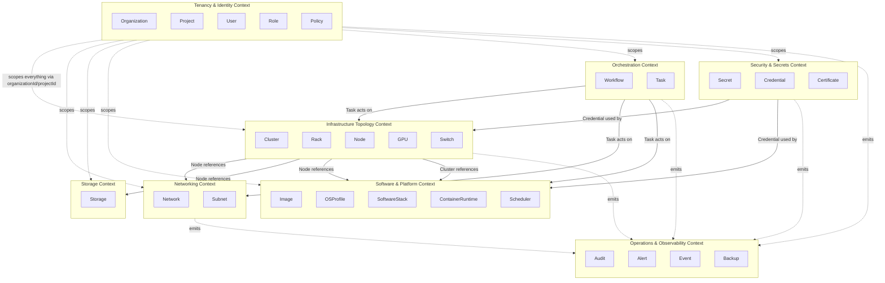
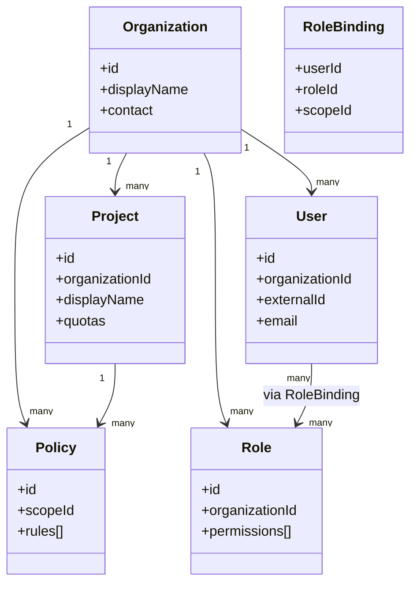
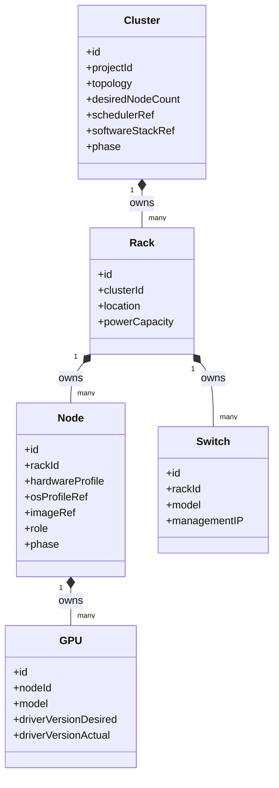
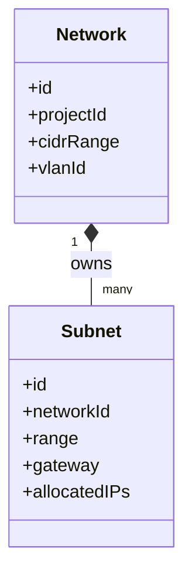
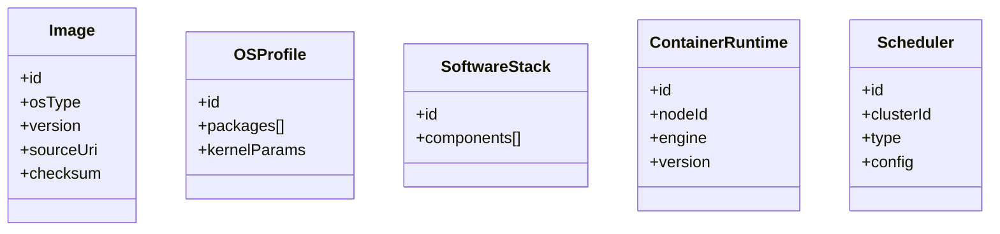
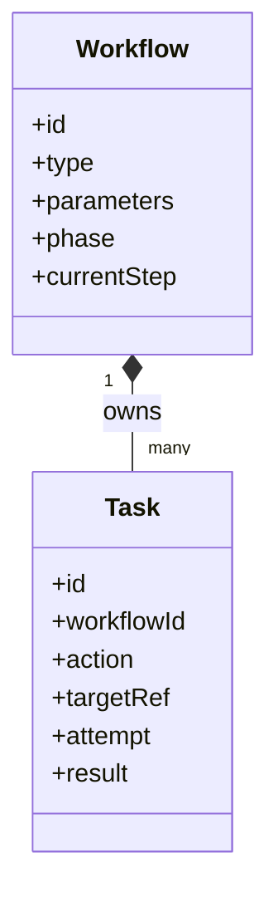

# OpenCHAI Domain Model

**Document 4 of the Phase 0 Architecture Series**
**Status:** Draft for review
**Depends on:** Terminology & Glossary (Doc 1), Architecture Document (Doc 2), Resource Model Specification (Doc 3)
**Feeds into:** API Design Guidelines, Controller Framework Design, Workflow Engine Design, Security & Multi-Tenancy Model

---

## 1. Purpose and Scope

The Resource Model Specification defined the **shape** every Resource takes (`spec`/`status`/`conditions`) and the **catalog** of Resource Kinds. This document defines the **meaning**: which Resources belong together as a consistency unit, what business rules (invariants) must always hold, which domain groups things fall into (bounded contexts), and what events flow between those groups.

Where the Resource Model asks *"what fields does a Cluster have?"*, the Domain Model asks *"what must always be true about a Cluster, what is it not allowed to be inconsistent with, and who else in the system needs to know when it changes?"*

This distinction matters because it directly determines:
- Where transactional consistency is required vs. where eventual consistency (via events) is acceptable
- Which Controllers can safely act independently vs. which must coordinate
- Where the API Design Guidelines need to enforce compound validation vs. where a single-Resource check suffices

---

## 2. Bounded Contexts

A **Bounded Context** is a domain area with its own consistent vocabulary and rules, deliberately kept loosely coupled to other contexts (per the → Terminology & Glossary's emphasis on explicit, non-cascading References across ownership boundaries).

**Reading this diagram:** solid arrows are cross-context **References** (weak — no cascade, see Doc 3 §5). Dotted arrows into the Observability context represent **domain events**, not structural ownership. Tenancy & Identity is drawn scoping everything because `organizationId`/`projectId` appear on nearly every Resource, but it does not *own* those Resources in the ownership-cascade sense — deleting a Project does not silently delete a Cluster without going through the Cluster's own Terminating lifecycle (Doc 3 §7).

---

## 3. Context-by-Context Detail

For each context: its **Aggregate(s)**, the **Aggregate Root**, the **invariants** enforced within the aggregate boundary (i.e., enforceable in a single transaction), and the **domain events** it produces.

### 3.1 Tenancy & Identity Context

**Aggregate roots:** `Organization` (owns Projects, Users, Roles at the org level); `Project` (owns its own quota state and Project-scoped Policies).

**Invariants:**
- A Project's `organizationId` is immutable and must reference an existing Organization.
- A RoleBinding cannot reference a Role from a different Organization than the User.
- `Project.spec.quotas` values must be non-negative; total allocated resources across Clusters in a Project cannot exceed its quota (enforced at creation-time validation in the API layer, not just advisory).
- Deleting an Organization is only permitted when it has zero Projects (no implicit cascade across tenancy boundaries — this is a deliberate, stricter rule than infrastructure ownership cascade, given the blast radius).

**Domain events:** `OrganizationCreated`, `ProjectCreated`, `ProjectQuotaExceeded`, `UserRoleBindingChanged`, `PolicyUpdated`.

---

### 3.2 Infrastructure Topology Context

**Aggregate root:** `Cluster` is the aggregate root for the whole topology subtree (Rack → Node → GPU/Switch). This is the single most important aggregate boundary decision in the platform.

**Why Cluster is the aggregate root and not Node:** Node-level reconciliation (provisioning, drift correction) is frequent and independent — that's a → Controller's job, not a transactional boundary. But structural invariants like *desired node count vs. actual node count* and *cascade-delete ordering* must be evaluated at the Cluster level. Treating Cluster as the aggregate root means:
- Structural changes (add/remove Rack, change `desiredNodeCount`) go through Cluster-level validation.
- Steady-state status reconciliation (Node health, GPU driver drift) happens per-Node/per-GPU without needing to lock the whole Cluster aggregate — this is status reconciliation, not a structural invariant, and is intentionally kept outside strict aggregate transactional boundaries (see §4).

**Invariants:**
- A Node's `rackId` must reference a Rack owned by the same Cluster the Node's own `ownerReferences` implies (no orphaned cross-Cluster Nodes).
- `Cluster.status.nodeCount` cannot exceed `Cluster.spec.desiredNodeCount` without a corresponding Workflow-driven scale-out (prevents controllers from "inventing" capacity).
- A GPU cannot outlive its owning Node (enforced via ownership cascade, Doc 3 §5, not a separate rule here).
- `Cluster.spec.schedulerRef` and `softwareStackRef` must reference existing, compatible-scope resources in the Software & Platform Context before the Cluster can leave `Pending`.

**Domain events:** `ClusterCreated`, `ClusterScaleRequested`, `NodeProvisioned`, `NodeDrifted`, `GPUDriverMismatchDetected`, `ClusterHealthChanged`.

---

### 3.3 Networking Context

**Aggregate root:** `Network` (owns its Subnets; IP allocation across Subnets within one Network must be consistent to avoid overlap).

**Invariants:**
- No two Subnets under the same Network may have overlapping IP ranges.
- A Subnet's `range` must fall within its parent Network's `cidrRange`.
- IP allocation (`allocatedIPs`) is tracked per-Subnet and must never exceed the Subnet's addressable range.

**Domain events:** `NetworkCreated`, `SubnetExhausted`, `IPAllocated`, `IPReleased`.

**Cross-context relationship:** `Node.spec` (Topology Context) *references* a Subnet by ID — a weak reference, not ownership. Deleting a Subnet still in use by Nodes is blocked (Doc 3 §5.2) rather than silently orphaning those Nodes.

---

### 3.4 Storage Context

**Aggregate root:** `Storage` (single-entity aggregate for now; no owned sub-resources yet).

**Invariants:**
- `usedCapacity` (status) can never exceed `capacity` (spec) — a Storage resource reporting over-capacity is a `Degraded` condition, not a valid observed state to accept silently.
- A Storage resource cannot be deleted while referenced by an active Cluster/Node (same weak-reference-block rule as Networking).

**Domain events:** `StorageCapacityWarning`, `StorageHealthChanged`.

---

### 3.5 Software & Platform Context

**Aggregate roots:** `Image`, `OSProfile`, and `SoftwareStack` are independent, Org/Project-scoped aggregates (shared reference data, not owned by any single Cluster). `Scheduler` is owned by its Cluster. `ContainerRuntime` is owned by its Node.

**Invariants:**
- `Image.checksum` must be verified (adapter-populated status) before any Node may reference it in a provisioning Workflow — an unverified Image blocks dependent Node provisioning rather than proceeding optimistically.
- `SoftwareStack.components[]` versions must be mutually compatible (e.g., a declared CUDA/driver compatibility matrix) — validated at the API layer against a compatibility table, not left to fail at the adapter layer.
- Exactly one `Scheduler` per `Cluster`.

**Domain events:** `ImageVerified`, `ImageVerificationFailed`, `SoftwareStackIncompatible`, `SchedulerConfigChanged`.

---

### 3.6 Orchestration Context

**Aggregate root:** `Workflow` (owns its Tasks; step ordering, retry count, and rollback state must be consistent as a unit).

**Invariants:**
- Tasks within a Workflow execute according to the planned DAG order; a Task cannot be marked `Success` out of dependency order.
- A Workflow in `Failed` (rolled back) status must have every prior-succeeded Task's corresponding rollback Task also marked complete before the Workflow itself is considered fully terminal.
- `Task.targetRef` must point to a Resource the Workflow's caller has AuthZ to act upon — re-validated at Task execution time, not just at Workflow submission time (permissions may change mid-flight for long-running workflows).

**Domain events:** `WorkflowStarted`, `TaskCompleted`, `TaskFailed`, `WorkflowRolledBack`, `WorkflowCompleted`.

**Cross-context relationship:** the Orchestration Context is the one context that legitimately *acts across* other contexts' aggregates (a ClusterBringUp Workflow touches Topology, Networking, and Platform contexts). It does so only through those contexts' own APIs/Controllers — never by reaching into their storage directly — preserving each context's own invariants.

---

### 3.7 Security & Secrets Context

**Aggregate roots:** `Secret`, `Credential`, `Certificate` — each independent, Project-scoped aggregates.

**Invariants:**
- `Secret.spec` never contains a raw value, only an `encryptedRef` pointer (per the open question raised in Doc 3, resolved here: **Resource Store holds references only, always**).
- A `Credential` must reference exactly one `Secret` and one `targetSystem`; rotating the underlying Secret does not require recreating the Credential.
- A `Certificate` nearing `expiresAt` (within a configurable threshold) must raise an `Alert` (Operations context) — this is a cross-context invariant enforced via domain event, not a direct dependency.

**Domain events:** `SecretRotated`, `CredentialValidationFailed`, `CertificateExpiringWarning`, `CertificateExpired`.

---

### 3.8 Operations & Observability Context

**Aggregate roots:** `Audit`, `Alert`, `Event`, `Backup` — each is its own aggregate; these are largely **event-sourced from other contexts** rather than user-authored, consistent with the Resource Model's noted exception (Doc 3 §6.5).

**Invariants:**
- `Audit` records are immutable once written — no update path exists, only creation and (per retention policy) archival.
- An `Alert` must reference a real, currently-or-formerly-existing Resource (`involvedObjectRef`); it cannot exist detached from a cause.
- `Backup.status.lastSuccessfulRun` age exceeding `spec.schedule`'s expected interval must itself raise an `Alert` — a self-monitoring invariant.

**Domain events produced:** none consumed further downstream by default (this context is the terminal consumer of most other contexts' events), except `Alert` firing may itself be consumed by external notification integrations (out of scope for this document).

---

## 4. Aggregate Design Rules (Cross-Cutting)

These rules apply uniformly across every context above and should guide the Controller Framework and API Design Guidelines documents:

1. **One transaction, one aggregate.** A single API write transaction may only modify one aggregate instance (e.g., one Cluster and its structural fields) at a time. Cross-aggregate effects happen via domain events and eventual consistency, never via a single distributed transaction.
2. **Status reconciliation is not a structural invariant.** Per-Node or per-GPU status updates (health, drift) do not require locking the parent Cluster aggregate — they are appended/updated independently. Only *structural* changes (adding/removing a Rack, changing desired counts) go through Cluster-level validation.
3. **Cross-context effects are event-driven, never synchronous cross-context transactions.** E.g., `SubnetExhausted` (Networking) does not synchronously block Node creation (Topology) inside one transaction; it is checked as an API-layer validation (read-only cross-context check) at request time, and monitored on an ongoing basis via events, not enforced through distributed locking.
4. **Aggregate roots are the only entry point for structural writes.** You cannot create a `Rack` directly without it being attached to a `Cluster`; the API enforces that structural children are always created/modified in the context of their aggregate root.

---

## 5. Domain Event Catalog (Consolidated)

| Event | Producing Context | Typical Consumers |
|---|---|---|
| `ProjectQuotaExceeded` | Tenancy & Identity | API validation layer (blocks further creation), Alert |
| `ClusterScaleRequested` | Infrastructure Topology | Workflow Engine (triggers a scale-out Workflow) |
| `NodeDrifted` | Infrastructure Topology | Provisioning Controller, Alert |
| `GPUDriverMismatchDetected` | Infrastructure Topology | GPU Controller, Alert |
| `SubnetExhausted` | Networking | API validation layer, Alert |
| `StorageCapacityWarning` | Storage | Alert |
| `ImageVerificationFailed` | Software & Platform | Provisioning Controller (blocks dependent Workflows) |
| `SoftwareStackIncompatible` | Software & Platform | API validation layer (at Cluster creation/update time) |
| `WorkflowRolledBack` | Orchestration | Audit, Alert |
| `CertificateExpiringWarning` | Security & Secrets | Alert |
| `SecretRotated` | Security & Secrets | Credential validation logic |

This table is the seed for the → Event Bus's subject/topic taxonomy, to be finalized in the Controller Framework and Workflow Engine Design documents.

---

## 6. Relationship Summary: Domain Model vs. Resource Model vs. Architecture

| Question | Answered by |
|---|---|
| What fields does a Resource have? | Resource Model Specification (Doc 3) |
| What must always be true about a group of Resources together, and where are transaction boundaries? | **This document (Domain Model, Doc 4)** |
| What physical components enforce these rules at runtime? | Architecture Document (Doc 2) |
| What word do we use for "the thing that enforces an invariant across a Workflow's Tasks"? | Terminology & Glossary (Doc 1) |

---

## 7. Open Questions Carried Forward

1. Should **Rack** remain part of the Topology aggregate, or become independently addressable (e.g., for data-center capacity planning tools that operate across Clusters within a physical Rack)? Currently modeled strictly inside the Cluster aggregate.
2. Is a **cross-Project shared Network** a valid future case (e.g., a backbone network spanning multiple Projects' Clusters), and if so, does that break the "Network is Project-scoped" assumption in §3.3?
3. Should **Workflow** be allowed to span multiple Clusters (e.g., a platform-wide upgrade Workflow), and if so, how does that interact with the "Workflow acts across contexts only through their own APIs" rule in §3.6 at scale?
4. Formal **compatibility matrix** for `SoftwareStack.components[]` (§3.5) — is this a static config table, or itself a Resource Kind (`CompatibilityPolicy`)? Leaning toward the latter for consistency with "everything is a Resource," to be resolved in the Resource Model's next revision if adopted.

---

*End of Domain Model. Next in sequence: API Design Guidelines.*
