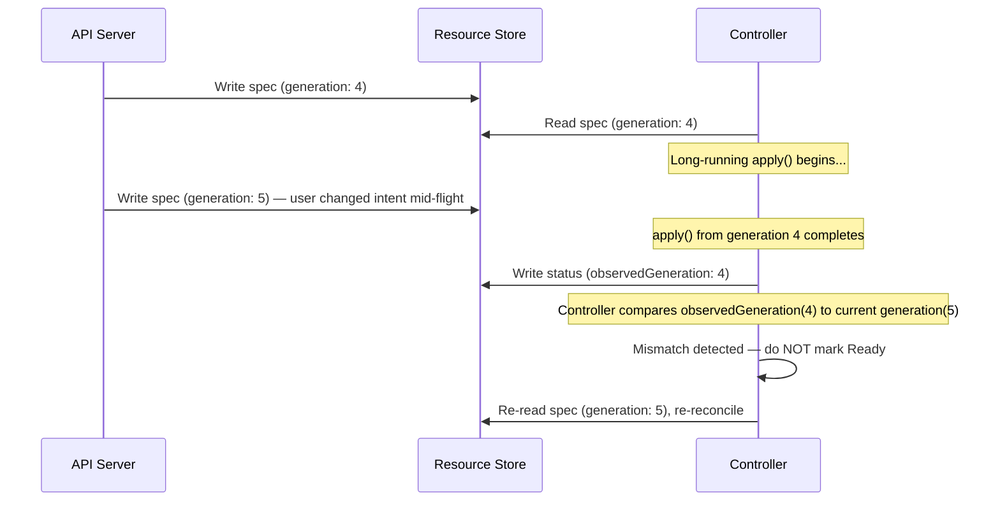
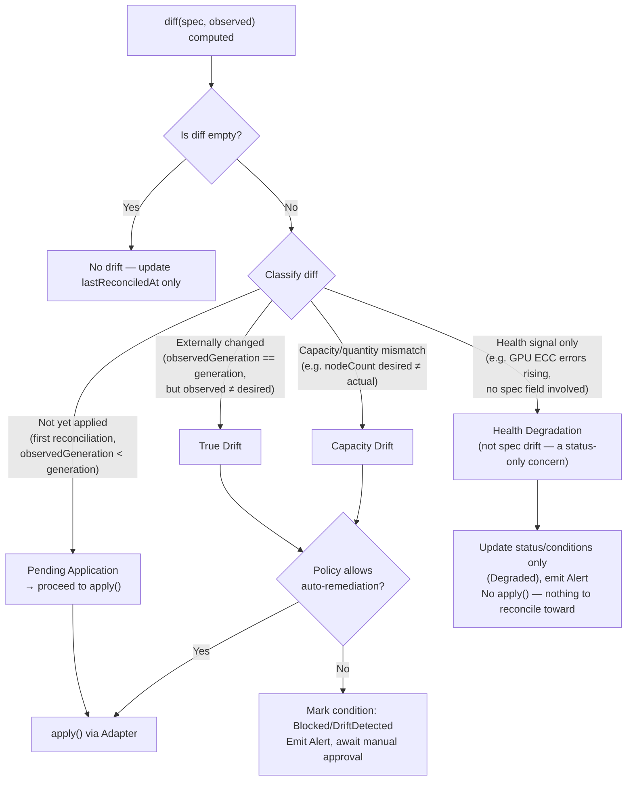
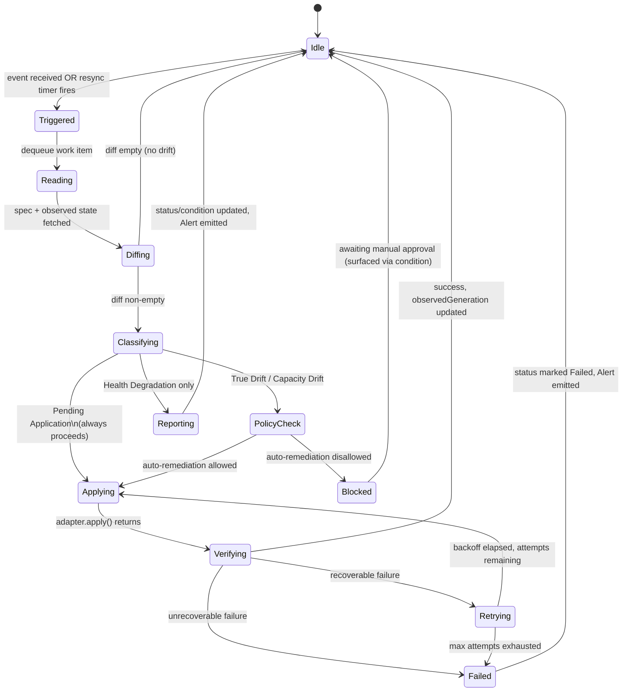
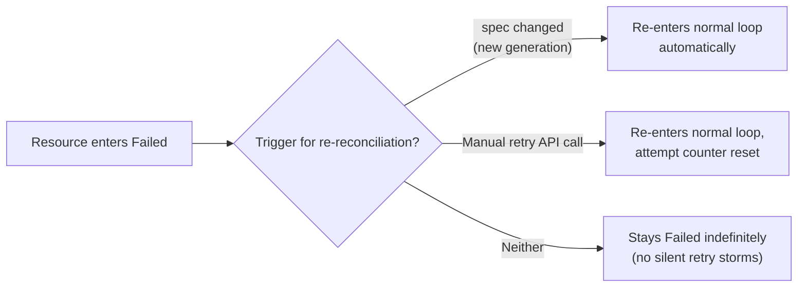
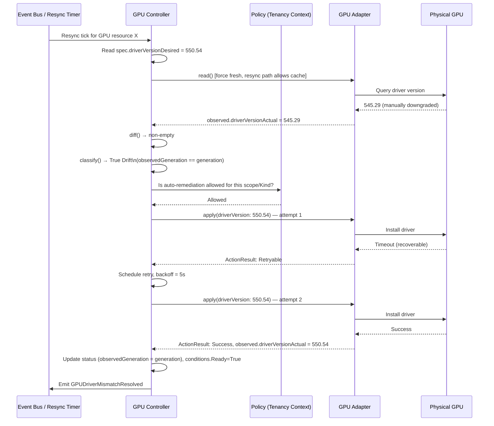

# OpenCHAI Reconciliation & State Model

**Document 5 of the Phase 0 Architecture Series**
**Status:** Draft for review
**Depends on:** Terminology & Glossary (Doc 1), Architecture Document (Doc 2), Resource Model Specification (Doc 3), Domain Model (Doc 4)
**Feeds into:** Controller Framework Design, Workflow Engine Design, API Design Guidelines

---

## 1. Purpose and Scope

Earlier documents established *that* OpenCHAI reconciles Desired State against Observed State (Architecture Document §2, §7), *where* that state lives (`spec`/`status`, Resource Model §3), and *which* changes require transactional consistency (Domain Model §4). This document defines the **mechanics** of reconciliation itself: precisely how a Controller decides something needs to change, how it classifies and responds to Drift, what guarantees the loop provides (and doesn't), and how conflicting or failing reconciliations are resolved.

This is the document the Controller Framework Design will implement against — it defines *behavior*, not *code structure*. Where this document says "a Controller must X," the Controller Framework document will say "here is the class/interface that does X."

---

## 2. State Model Recap and Formalization

### 2.1 The Two States

| | Desired State | Observed State |
|---|---|---|
| Field | `spec` | `status` (the observation-derived subset, not lifecycle bookkeeping) |
| Written by | User / API caller | Controller, via Infrastructure Adapter reads |
| Represents | Intent | Reality, as last measured |
| Changes when | A user/automation issues an update | The underlying infrastructure changes, or a reconciliation action succeeds |
| Staleness | Never stale — it's not a measurement | Always potentially stale — it's a measurement taken at `status.lastReconciledAt` |

**Formal definition of Reconciliation:** for a given Resource `R`, reconciliation is the function

```
reconcile(R) = apply( diff( R.spec, observe(R) ) )
```

where `observe(R)` calls the owning Controller's Infrastructure Adapter `read()`, `diff()` is Kind-specific comparison logic (§3), and `apply()` invokes the Adapter's `apply()` only when `diff()` is non-empty.

### 2.2 State Is Always Attributed to a Generation

Every reconciliation attempt is tied to the `spec` generation it is reconciling against (Resource Model §3.1). This prevents a well-known class of bug: a Controller finishing a long-running action against a `spec` that has since changed, then incorrectly marking the *new* spec as satisfied.



**Rule:** a Resource is only considered fully reconciled (eligible for `conditions: Ready=True`) when `status.observedGeneration == metadata.generation`. A Controller that completes work against a stale generation must immediately re-trigger reconciliation rather than reporting success.

---

## 3. Diff / Drift Classification

Not all differences between `spec` and observed reality are the same kind of problem. This taxonomy determines the response.



| Classification | Definition | Default response |
|---|---|---|
| **Pending Application** | `status.observedGeneration < metadata.generation` — the Controller simply hasn't acted on the newest intent yet | Always apply automatically — this is normal reconciliation, not a policy decision |
| **True Drift** | `observedGeneration == generation`, but the live system no longer matches what was last successfully applied (e.g., someone manually changed a config outside OpenCHAI) | Governed by the resource's/scope's → `Policy` (Domain Model §3.1); auto-remediate or flag for approval |
| **Capacity Drift** | A quantity in `status` (e.g., `nodeCount`) doesn't match a quantity in `spec` (e.g., `desiredNodeCount`) | Governed by Policy, same as True Drift, but typically requires a → Workflow (multi-step) rather than a single Adapter call |
| **Health Degradation** | A `status` signal (GPU ECC errors, node check-in staleness) indicates a problem with no corresponding `spec` field to reconcile toward | Never auto-"applied" — there is nothing to converge to. Surfaced via `conditions`/`Alert` only; may inform a human decision to change `spec` |

This taxonomy directly resolves an ambiguity in the Architecture Document's drift-loop flowchart (§8.2), which showed a single "Drift?" branch — this document specifies that not every non-empty diff should trigger the same action.

---

## 4. The Reconciliation Loop — Full State Machine

This is the authoritative version of the loop sketched in Architecture Document §8.2, now precise about triggers, guards, and terminal conditions.



**Loop-level guarantees:**
- **Level-triggered, not edge-triggered.** A Controller must be able to compute the correct action from current `spec` + current observed state alone, at any time — never by remembering "what changed since last time." This is what makes a missed or duplicated event harmless: a resync timer (§6) guarantees eventual correctness even if an event is dropped.
- **At-least-once delivery assumed.** The Event Bus (Architecture Document §4.1) may deliver the same event more than once, or a Controller may crash mid-reconciliation and restart. Because `apply()` is required to be idempotent (Terminology & Glossary, Resource Model §9.6-equivalent), redelivery is always safe.
- **No cross-resource locking in the loop itself.** Per Domain Model §4 rule 1, one reconciliation pass touches one Resource's `apply()`. Multi-resource coordination happens in the Workflow Engine, not by a Controller acquiring locks across Resources.

---

## 5. Retry, Backoff, and Failure Handling

### 5.1 Recoverable vs. Unrecoverable Failures

| | Recoverable | Unrecoverable |
|---|---|---|
| Examples | Adapter timeout, transient network error, target system temporarily unreachable, rate-limited by target API | Invalid spec value the adapter rejects outright, referenced dependency permanently missing, hardware reports a fault code with no automated remedy |
| Response | Requeue with exponential backoff | Mark `status.phase = Failed`, set `conditions.Ready = False` with a specific `reason`, emit `Alert` |
| Who decides which is which | The Infrastructure Adapter classifies the error and returns a typed `ActionResult` (`Retryable` vs. `Terminal`) — Controllers do not guess based on generic exception types | — |

### 5.2 Backoff Policy

- Exponential backoff with jitter: `min(baseDelay * 2^attempt, maxDelay) ± jitter`.
- `baseDelay` and `maxDelay` and `maxAttempts` are configurable per Controller (a Node provisioning retry has different economics than a lightweight status poll), but must have platform-wide defaults so no Controller is written without them.
- Backoff state (`attempt` count, `nextRetryAt`) lives in the Controller's work queue, **not** written into the Resource's `status` — retry bookkeeping is operational, not part of the Resource's durable observed state. (Contrast with `Task.attempt` in the Orchestration Context, Domain Model §3.6, which *is* durable because Workflow steps must survive a Workflow Engine restart with full history.)

### 5.3 Poison Resource Protection

A Resource that exhausts `maxAttempts` is marked `Failed` and **removed from the active resync loop** until either its `spec` changes (new generation) or a human explicitly requests a retry (an explicit API action, not automatic). This prevents one permanently-broken Resource from consuming Controller throughput indefinitely — a gap in the Architecture Document's flowchart, which showed retries but not a circuit breaker.



---

## 6. Resync: Guaranteeing Eventual Correctness

Event-driven reconciliation (Architecture Document's Event Bus) is the *fast path*, but events can be lost (bus outage, Controller downtime during the event). OpenCHAI therefore requires every Controller to also run a **periodic full resync**, independent of events:

- On a configurable interval (Kind-dependent — e.g., Node health every 60s, a rarely-changing Kind like `OSProfile` every 10 minutes), a Controller lists **all** Resources it owns and runs the full `reconcile()` function against each, exactly as if triggered by an event.
- This is what makes the system self-healing against any missed signal, not just against Drift in the infrastructure itself.
- Resync and event-triggered reconciliation share the identical code path (§4's state machine) — there is no separate "resync logic." An event is simply one way `Triggered` is entered; the timer is the other.

---

## 7. Conflict Resolution

### 7.1 Concurrent Writes to `spec` (User vs. User)

Handled entirely at the API layer via `resourceVersion` optimistic concurrency (Resource Model §3.1, §9.5) — a stale write is rejected with `409` before it ever reaches a Controller. Reconciliation logic never needs to resolve `spec` conflicts because the API Server guarantees only one write wins.

### 7.2 Concurrent Reconciliation of the Same Resource (Controller vs. Controller)

Prevented structurally, not by locking:
- Exactly one Controller instance owns a given Resource Kind's work queue shard at a time (Leader Election, Architecture Document §9).
- Within that instance, work items for a single Resource `id` are processed by a single worker at a time (a per-resource-id work queue de-duplication key), even if multiple events for it arrive concurrently — later events for a Resource already being processed are coalesced, not queued as separate parallel executions.

### 7.3 Controller Writing Status vs. User Reading Status

No conflict possible by construction: users never write `status`, so there is nothing to conflict with. A user reading `status` mid-reconciliation simply sees a `Progressing` condition and a possibly-stale `lastReconciledAt` — this is expected, not an error state.

---

## 8. Observed State Caching

Calling `adapter.read()` on every reconciliation pass against every underlying system is not always cheap or fast (e.g., querying thousands of Redfish endpoints). This section defines the caching contract so the Controller Framework Design can implement it consistently rather than each Controller inventing its own approach:

- Adapters **may** cache observed state internally with a declared max-staleness (e.g., 30s for power state, 5s for job-queue depth), but must expose this staleness to the Controller via the returned `ObservedState` envelope (`observedAt` timestamp).
- A Controller reconciling in response to a **user-initiated change** (Pending Application, §3) must bypass adapter cache and force a fresh read — acting on stale observed state right after a user made a change would produce incorrect diffs.
- A Controller reconciling on a **resync timer** (§6) may use cached observed state within its staleness bound, trading a small correctness window for load reduction at scale.

---

## 9. Reconciliation Sequence — Fully Worked Example

Combining §3–§8 into one concrete trace: a GPU driver is manually changed outside OpenCHAI (True Drift), auto-remediation is allowed by Policy, and the first attempt fails transiently before succeeding.



---

## 10. Relationship to Workflows

Controllers reconcile **single Resources toward steady state**; Workflows orchestrate **multi-step processes across Resources** (Domain Model §3.6). The state model in this document governs the former. The two interact at a defined boundary:

- A Workflow Task that changes a Resource's `spec` (e.g., setting `Cluster.spec.desiredNodeCount`) triggers ordinary reconciliation exactly as a direct user edit would — the Controller has no awareness it was a Workflow that made the change.
- A Workflow Task that needs to *wait for* a Resource to reach `Ready` polls/subscribes to that Resource's `conditions`, using the same eventing mechanism as any other consumer — Workflows do not have a privileged fast-path into Controller internals.
- This boundary is what keeps Controllers and the Workflow Engine independently testable and independently scalable, per Architecture Document §4.1's separation of Controller Manager and Workflow Engine as peer components.

---

## 11. Summary of Guarantees and Non-Guarantees

**This model guarantees:**
- Eventual correctness despite dropped events (via resync, §6)
- Safety under redelivery/restart (via idempotent `apply()`, §4)
- No lost updates to `spec` (via optimistic concurrency, §7.1)
- No duplicate concurrent reconciliation of one Resource (via per-resource work serialization, §7.2)
- Bounded retry behavior — no infinite retry storms (via poison-resource handling, §5.3)

**This model explicitly does NOT guarantee:**
- Real-time reconciliation latency (bounded by resync interval and Adapter cache staleness, not instantaneous)
- Cross-Resource atomicity (that is the Workflow Engine's job, not a Controller's)
- That `status` is ever a perfectly live view of infrastructure — it is always "as of `lastReconciledAt`/`observedAt`," and callers must treat it accordingly

---

## 12. Open Questions Carried Forward

1. Should the auto-remediation `Policy` check (§3, §9) be evaluated per-reconciliation (as shown) or cached with its own invalidation model? Frequent Policy lookups at high Resource counts may need the same caching treatment as Adapter reads (§8).
2. Default backoff parameters (`baseDelay`, `maxDelay`, `maxAttempts`) per Controller — to be tabulated concretely in the Controller Framework Design rather than left as "configurable" here.
3. Should `Health Degradation` (§3) be allowed to *ever* trigger an automatic Workflow (e.g., auto-drain a Node with rising ECC errors), or does that always require human-in-the-loop per current Policy philosophy? This has real availability implications and deserves explicit product-level sign-off before Controller Framework Design assumes an answer.
4. Work-queue de-duplication (§7.2) implies a specific queue technology capability (per-key coalescing) — needs to be validated against the eventual Event Bus choice (NATS vs. RabbitMQ, Architecture Document §10) rather than assumed generically.

---

*End of Reconciliation & State Model. Next in sequence: API Design Guidelines.*
