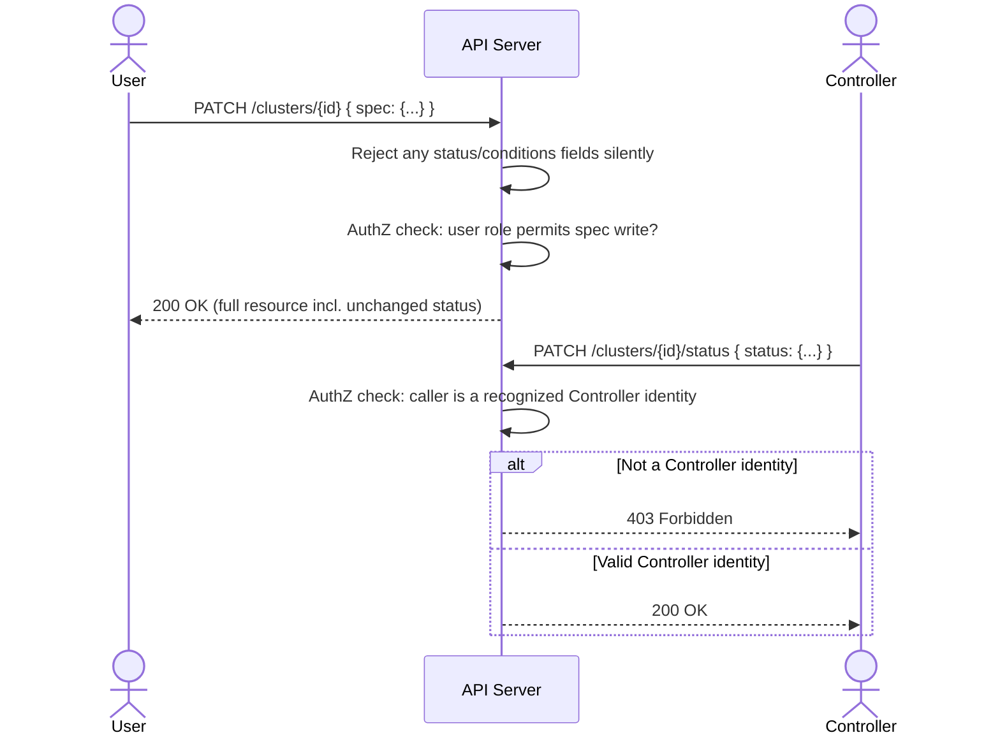

# OpenCHAI API Design Guidelines

**Document 6 of the Phase 0 Architecture Series**
**Status:** Draft for review
**Depends on:** Terminology & Glossary (Doc 1), Architecture Document (Doc 2), Resource Model Specification (Doc 3), Domain Model (Doc 4), Reconciliation & State Model (Doc 5)
**Feeds into:** Controller Framework Design, Adapter Interface Contract, Security & Multi-Tenancy Model, Repository Structure

---

## 1. Purpose and Scope

This document defines the concrete REST API contract that the API Server (Architecture Document §6.1) implements: URL structure, HTTP verb semantics, request/response envelopes, error format, concurrency control, subresource conventions, and how the CLI/SDK/Web UI are all expected to consume the same surface. It operationalizes two prior decisions directly:

- Resource Model §3's `spec`/`status` separation → enforced here as **separate write paths** (main resource vs. `/status` subresource).
- Reconciliation Model §7.1's optimistic concurrency → enforced here as **`resourceVersion`/`ETag` semantics**.

Everything in this document applies uniformly across all Resource Kinds (Resource Model §6) — one convention, not one per Kind.

---

## 2. URL Structure

```
/api/v1/organizations/{orgId}/projects/{projectId}/{kindPlural}/{id}
/api/v1/organizations/{orgId}/{kindPlural}/{id}                      # org-scoped kinds (User, Role)
/api/v1/{kindPlural}/{id}                                            # platform-scoped (Organization itself)
```

- `{kindPlural}` is the lower-kebab-case plural of the Resource Kind (`clusters`, `nodes`, `software-stacks`).
- Tenancy scope is **always in the path**, never inferred solely from a query parameter or token claim — this makes every URL self-describing and makes accidental cross-tenant queries structurally harder to write.
- `apiVersion` from the Resource Model maps to the `/v1` path segment. A breaking schema change ships as `/v2` for that Kind's routes; unrelated Kinds are not forced to bump together.

**Subresources** (Resource Model §3.1's write-boundary rules made concrete):

```
GET/PATCH  /clusters/{id}/status         # Controllers only — see §5
GET        /clusters/{id}/events
GET        /clusters/{id}/history
POST       /clusters/{id}/actions/scale  # custom actions, see §7
```

---

## 3. HTTP Verb Semantics

| Verb | Path | Meaning | Writes to |
|---|---|---|---|
| `GET` | `/{kind}` | List (paginated, filterable — §6) | — |
| `GET` | `/{kind}/{id}` | Read one | — |
| `POST` | `/{kind}` | Create | `spec` (new resource) |
| `PATCH` | `/{kind}/{id}` | Partial update (JSON Merge Patch) | `spec` only |
| `PUT` | `/{kind}/{id}` | Full replace of `spec` | `spec` only |
| `DELETE` | `/{kind}/{id}` | Begin teardown (→ `Terminating`, Resource Model §7) | triggers, does not immediately remove |
| `PATCH` | `/{kind}/{id}/status` | Status update | `status`/`conditions` only, **Controller-authenticated callers only** |
| `POST` | `/{kind}/{id}/actions/{verb}` | Custom action (§7) | Kind-specific, always validated against `spec` invariants |

`PATCH` (JSON Merge Patch, RFC 7396) is the default for partial updates rather than JSON Patch (RFC 6902) — simpler client ergonomics for the common case of "change a few fields," at the cost of not supporting array-element-level patches; array fields that need granular edits get dedicated sub-endpoints instead (e.g., `POST /clusters/{id}/racks` rather than patching an array in place).

---

## 4. Request / Response Envelope

**Single resource response:**

```json
{
  "apiVersion": "openchai.io/v1",
  "kind": "Cluster",
  "metadata": { "id": "...", "resourceVersion": 7, "generation": 3, "...": "..." },
  "spec": { "...": "..." },
  "status": { "...": "..." },
  "conditions": [ { "...": "..." } ]
}
```

This is a direct, unwrapped serialization of the Resource Model's common schema (Doc 3 §3) — the API does not introduce a second envelope on top of it. What you GET is what you PATCH (minus `status`/`metadata` write restrictions, §5).

**List response:**

```json
{
  "apiVersion": "openchai.io/v1",
  "kind": "ClusterList",
  "items": [ { "...": "..." } ],
  "page": { "nextCursor": "...", "totalEstimate": 128 }
}
```

- `page.totalEstimate` is explicitly an estimate (not a locked count) so pagination doesn't require an expensive `COUNT(*)` on every request at national-supercomputing scale (Master Plan goal).

---

## 5. Enforcing the `spec`/`status` Write Boundary (Resource Model §3.1)

This is the most important rule this document enforces at the transport level:

- The main resource endpoints (`POST`, `PATCH`, `PUT` on `/{kind}/{id}`) accept **only** `spec` and user-editable `metadata` fields (`labels`, `annotations`, `name`). Any `status` or `conditions` field present in the request body is silently ignored on write and **must** be echoed back unchanged in the response — never rejected outright, since clients commonly `GET` then `PATCH` the same object and shouldn't have to strip fields manually.
- The `/status` subresource endpoint accepts **only** `status`/`conditions`/`history` fields, and is authorized differently (§8): callable only by Controller service identities, never by end-user tokens, regardless of RBAC role. This is a hard rule, not a permission that can be granted — matching Reconciliation Model §4's requirement that Controllers are the sole writer of observed state.



---

## 6. Listing, Filtering, and Selection

```
GET /clusters?label=environment%3Dproduction&label=tier%3Dgpu
GET /nodes?fields=metadata.id,status.phase          # sparse fieldsets
GET /clusters?sort=-metadata.createdAt
GET /clusters?limit=50&cursor=<opaque>
```

- Filtering is by **label selector** only in v1 (matching Resource Model §4's indexed `labels` field) — arbitrary `spec`/`status` field filtering is not guaranteed indexed and is deferred to a future search/query endpoint rather than allowed to silently degrade list performance.
- Pagination is **cursor-based**, not offset-based, so results stay stable under concurrent writes at scale (a documented weakness of offset pagination the platform explicitly avoids given the "national supercomputing deployment" goal).

---

## 7. Custom Actions

Some operations are not naturally a `spec` field mutation (Resource Model's desired-state model doesn't fit every verb — e.g., "reboot this Node now" is an imperative action, not a persistent desired state). These are modeled as explicit action endpoints rather than overloading `PATCH`:

```
POST /nodes/{id}/actions/reboot
POST /clusters/{id}/actions/scale     { "desiredNodeCount": 128 }
POST /certificates/{id}/actions/rotate
```

Rules:
- An action endpoint that *does* have a lasting effect on desired state (e.g., `scale`) must still go through the same `spec` write and validation path internally — it is sugar over a `PATCH`, not a bypass of Reconciliation Model rules.
- An action endpoint with no persistent `spec` representation (e.g., `reboot`) returns a reference to a `Task`/`Workflow` (§9) tracking its execution, since it is inherently an imperative, trackable operation rather than an instantaneous state change.

---

## 8. AuthN / AuthZ on Every Request

Every request passes through, in order (Architecture Document §6.1):

1. **AuthN** — validate bearer token (session token today, OIDC-issued in the Keycloak future), resolve to a `User` or Controller service identity.
2. **AuthZ** — evaluate RBAC (detailed in Security & Multi-Tenancy Model, Doc 7) against `(identity, verb, Kind, scope)`.
3. **Validation** — schema + referential + quota checks (Resource Model §9).

A request failing at any stage returns immediately; later stages never execute (e.g., an unauthenticated request is never schema-validated — this avoids leaking schema details to unauthenticated callers).

---

## 9. Long-Running Operations

Some writes (provisioning a Node, scaling a Cluster) cannot complete synchronously within a single HTTP request/response. The API never blocks waiting for Reconciliation (Doc 5) to finish:

```
POST /clusters/{id}/actions/scale
→ 202 Accepted
  { "operationRef": { "kind": "Workflow", "id": "wf-...", "statusUrl": "/workflows/wf-..." } }
```

- Any write that triggers asynchronous work returns `202 Accepted` with a reference to the tracking `Workflow` or, for simpler single-Resource reconciliation, the caller is expected to poll/watch the affected Resource's own `status.phase` and `conditions` directly (no separate operation object needed for the common create/update case — the Resource *is* the tracking object, consistent with "everything is a Resource").
- `201 Created` is used only when the Resource row itself is durably created — this is nearly always immediate (`Pending` phase), even though reconciliation toward `Ready` continues afterward. Clients must not conflate "created" with "ready."

---

## 10. Watching for Changes (Streaming)

To avoid clients polling at scale:

```
GET /clusters/{id}/watch          (Server-Sent Events)
GET /clusters?watch=true&label=... (SSE stream of a filtered list)
```

- Backed directly by the Event Bus (Architecture Document §4.1) — the API Server subscribes on the caller's behalf and forwards relevant events, applying the same AuthZ filter that would apply to a `GET`.
- SSE (not WebSockets) is the v1 choice: simpler, HTTP-cache/proxy-friendly, and sufficient for the server-to-client-only nature of resource change notifications. WebSockets remain an option for a future bidirectional need (none identified yet).
- A watch stream always begins with the current state of matching resources (a synthetic "initial sync" event per item), then live updates — clients never have to separately `GET` then `watch` and reconcile the race between them.

---

## 11. Idempotency for Non-Idempotent Verbs

`POST` (create, and custom actions) is not naturally idempotent. Clients supply an `Idempotency-Key` header; the API Server deduplicates within a retention window (default 24h), returning the original response for a repeated key rather than creating a duplicate — necessary because network retries at the UI/CLI/SDK layer are expected, and Reconciliation Model §4's "redelivery is always safe" guarantee for Adapters does not by itself cover a user's client retrying a `POST /clusters`.

---

## 12. Concurrency Control

Maps Resource Model §3.1/§9.5 and Reconciliation Model §7.1 directly onto HTTP:

- `GET` responses include an `ETag` header equal to `metadata.resourceVersion`.
- `PATCH`/`PUT` requests must include `If-Match: <resourceVersion>`. A mismatch returns `409 Conflict` with the current resource in the body, so the client can re-read and re-apply without a second round trip.
- Omitting `If-Match` is rejected (`428 Precondition Required`) for any Kind where concurrent edits are plausible (essentially everything except pure system-authored Kinds like `Audit`/`Event`) — this makes "blind overwrite" a deliberate opt-out rather than the default.

---

## 13. Error Format

Standardized on `application/problem+json` (RFC 7807):

```json
{
  "type": "https://docs.openchai.io/errors/quota-exceeded",
  "title": "Project quota exceeded",
  "status": 409,
  "detail": "Requested GPU count (16) exceeds remaining project quota (4).",
  "instance": "/organizations/.../projects/.../clusters",
  "openchaiErrorCode": "QUOTA_EXCEEDED"
}
```

- `openchaiErrorCode` is a stable, documented machine-readable code (independent of the HTTP status, which can be ambiguous across cases) — SDKs and the UI branch on this, not on parsing `detail` text.
- Validation errors (Resource Model §9) return `422` with a `errors[]` array of `{field, code, message}` for every failing field at once — never fail-fast on the first invalid field, so a client can fix everything in one round trip.

---

## 14. Bulk and Batch Operations

- **Bulk read** is covered by list filtering (§6); no separate bulk-GET endpoint needed.
- **Bulk write** (e.g., label 500 Nodes at once) is deliberately **not** a v1 feature of the core resource endpoints — it is modeled as a `Workflow` (`type: BulkLabelUpdate`) so it gets retry/rollback/progress tracking for free (Domain Model §3.6) rather than requiring bespoke bulk-transaction semantics in the API layer itself.

---

## 15. Rate Limiting and Fair Use

- Per-identity (`User` or Controller) token-bucket rate limiting at the API Gateway layer (Architecture Document §4), returning `429` with a `Retry-After` header.
- Controller/Adapter service identities get separate, higher-throughput limit tiers than interactive user tokens, since resync loops (Reconciliation Model §6) at scale generate legitimately high request volume that must not be throttled the same as an interactive UI session.

---

## 16. Deprecation Policy

- A field or endpoint marked deprecated must remain functional for a minimum of one major `apiVersion` cycle and is flagged via a `Deprecation` and `Sunset` HTTP header (RFC 8594) on every response that touches it, so automated clients can detect it without reading changelogs.
- Removing a Resource Kind entirely (not just a field) requires a `v2` route namespace to coexist with `v1` for the deprecation window — never an in-place breaking change to `v1`.

---

## 17. Open Questions Carried Forward

1. Should the Watch (§10) mechanism support resuming from a specific event offset after a client disconnect (like a Kubernetes `resourceVersion` watch resume), or is "always restart with a fresh initial sync" acceptable for v1 given expected client counts? Affects Event Bus technology choice (Architecture Document §10) more than the API surface itself.
2. Bulk operations (§14) routing through Workflow adds latency/overhead for genuinely simple bulk cases (e.g., labeling) — worth revisiting once real usage patterns are known.
3. GraphQL or gRPC alternative surface for high-frequency programmatic consumers (e.g., a monitoring integration polling thousands of Nodes) — explicitly out of scope for v1 REST design, flagged for the Ecosystem phase (Master Plan Phase 5).

---

*End of API Design Guidelines. Next in sequence: Security & Multi-Tenancy Model.*
