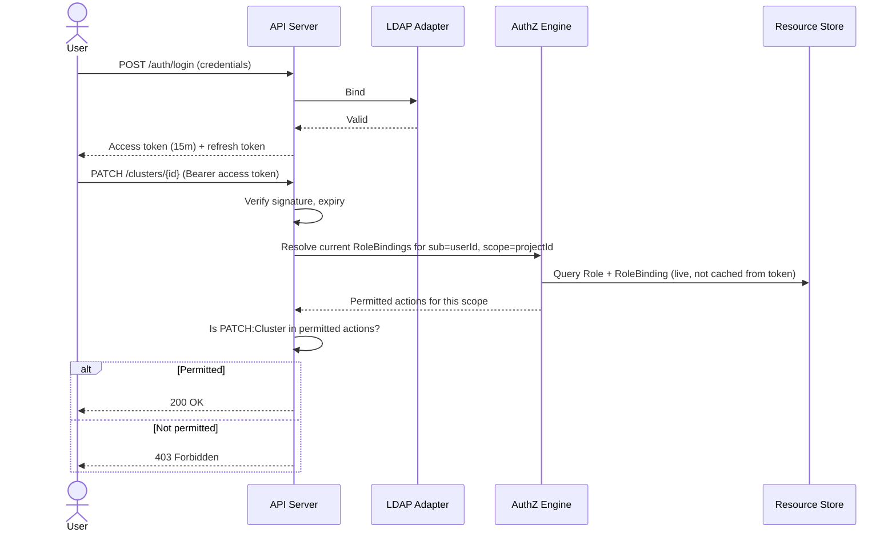
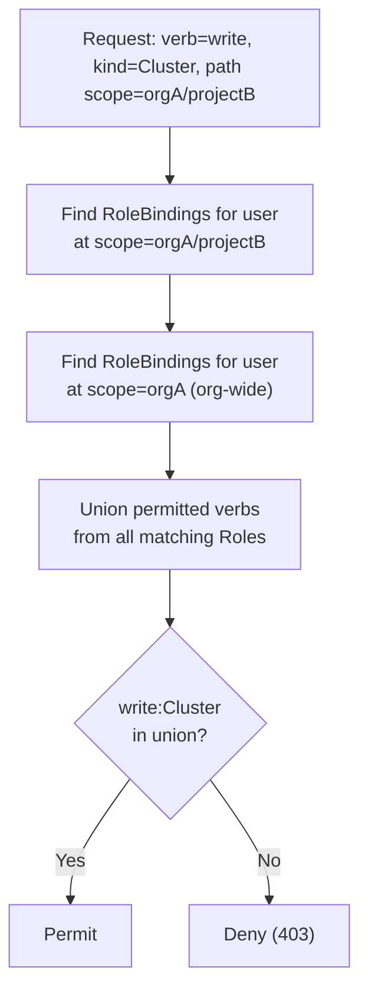
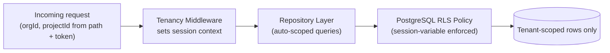
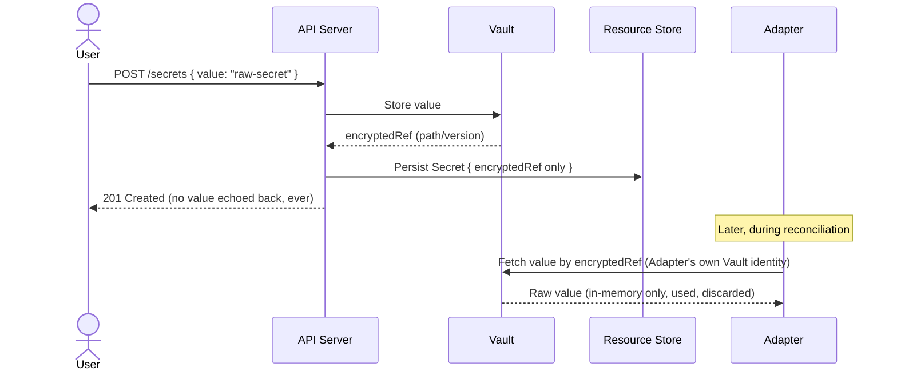

# OpenCHAI Security & Multi-Tenancy Model

**Document 7 of the Phase 0 Architecture Series**
**Status:** Draft for review
**Depends on:** Terminology & Glossary (Doc 1), Architecture Document (Doc 2), Resource Model Specification (Doc 3), Domain Model (Doc 4), Reconciliation & State Model (Doc 5), API Design Guidelines (Doc 6)
**Feeds into:** Controller Framework Design, Adapter Interface Contract, Database Architecture, Repository Structure

---

## 1. Purpose and Scope

This document defines how OpenCHAI verifies identity (AuthN), enforces permissions (AuthZ), isolates tenants from each other, and protects sensitive material (secrets, credentials, certificates). It resolves several items explicitly deferred by earlier documents:

- Domain Model §3.7's assumption that "the Resource Store holds references only" for `Secret` — formalized here (§6).
- Resource Model §12's open question on RBAC granularity — formalized here (§4).
- API Design Guidelines §8's AuthN/AuthZ pipeline — given its full model here.

---

## 2. Threat Model Summary

| Actor / Vector | Primary Concern | Primary Mitigation |
|---|---|---|
| Authenticated user, wrong tenant | Reading/modifying another Organization's or Project's resources | Mandatory scope-in-path (API Guidelines §2) + row-level tenancy enforcement (§5) |
| Authenticated user, insufficient privilege | Performing an action their Role doesn't grant | RBAC AuthZ on every request (§4) |
| Compromised Controller/Adapter credential | Broad infrastructure access beyond what one Controller needs | Per-Controller service identity with scoped permissions, credential isolation (§7) |
| Leaked database backup/dump | Exposure of secret values at rest | Resource Store never holds raw secret values (§6) |
| Man-in-the-middle on API or Adapter traffic | Interception/tampering | TLS everywhere, mTLS for Adapter-to-infrastructure where the target supports it (§8) |
| Malicious or buggy Workflow Task | Acting beyond the permissions of the user who submitted it | Re-validated AuthZ at Task execution time, not just submission time (Domain Model §3.6, restated §4.4) |
| Insider with direct DB access | Bypassing API-layer AuthZ entirely | Defense in depth via PostgreSQL row-level security, not API-layer checks alone (§5.2) |

This table is not exhaustive; it captures the threats each subsequent section is designed against, so the "why" behind each control is traceable.

---

## 3. Authentication (AuthN)

### 3.1 Identity Sources

- **v1:** LDAP bind. The API Server validates credentials against the configured LDAP directory and issues a short-lived, signed session token (JWT) containing the resolved `User` id and group memberships at issuance time.
- **Future:** Keycloak/OIDC, allowing federated identity providers, MFA, and SSO without changing anything downstream of AuthN — the token contract (§3.2) is designed to be provider-agnostic from day one so this swap doesn't ripple into AuthZ or the API layer.

### 3.2 Token Contract

```json
{
  "sub": "<userId>",
  "iss": "openchai",
  "iat": ..., "exp": ...,
  "orgId": "<organizationId>",
  "identityType": "user" | "controller",
  "controllerName": "gpu-controller"   // present only when identityType = controller
}
```

- Tokens are short-lived (default 15 minutes) with refresh handled by a separate long-lived refresh token, standard practice to bound the blast radius of a leaked access token.
- **Group memberships are deliberately NOT embedded in the token.** Role/permission resolution happens at request time against the current `RoleBinding` state (§4), not against a snapshot taken at login — otherwise revoking a Role would not take effect until the user's token expired, which is an unacceptable security gap for an infrastructure control plane.

### 3.3 Non-Human (Controller/Adapter) Identities

Per Reconciliation Model §4 and API Guidelines §5, Controllers write to the `/status` subresource using a distinct identity class, never a human user's token:

- Each Controller type has its own service identity, provisioned at deployment time, credentialed via a mechanism independent of LDAP (e.g., a mounted service credential, rotated automatically).
- `identityType: controller` tokens are accepted **only** on `/status` subresource writes and on read paths — never on main-resource `spec` writes or destructive actions (`DELETE`), which are reserved for human-initiated or Workflow-initiated (on behalf of a human, §4.4) requests.



---

## 4. Authorization (AuthZ) — RBAC Model

### 4.1 Core Entities (Domain Model §3.1, expanded)

| Entity | Definition |
|---|---|
| `Permission` | An atomic `(verb, resourceKind)` pair, e.g., `write:Cluster`, `read:Secret`, `delete:*` (wildcard). Not a standalone Resource Kind — a value embedded in `Role.spec.permissions[]`. |
| `Role` | A named, reusable set of Permissions, scoped to an Organization. |
| `RoleBinding` | Associates a `User` (or group) with a `Role` at a specific scope — Organization-wide or a single Project. |

### 4.2 Permission Granularity

Resolving Resource Model §12's open question: permissions are granted at **(verb, Kind, scope)** granularity — not per-instance. There is no "grant write access to *this one* Cluster" without also creating a Project-scoped Role bound only to that Project. This keeps the permission model tractable at scale (Master Plan's national-supercomputing goal) rather than requiring per-resource ACL rows that don't index well at high Resource counts.

Standard verbs: `read`, `write` (create+update), `delete`, `status-write` (Controller-only, never grantable to a human `Role`), `act` (custom actions, API Guidelines §7).

### 4.3 Scope Resolution



- Org-wide RoleBindings apply to every Project within that Organization (additive, never overridden by a narrower deny — OpenCHAI's RBAC is allow-only, with no explicit deny rules in v1, to avoid the complexity and audit difficulty of precedence resolution between allow and deny rules).
- A user with **no** matching RoleBinding at any applicable scope is denied by default (deny-by-default posture).

### 4.4 Policy vs. RBAC (Domain Model §3.1 distinction, restated precisely)

RBAC governs **who** can call **which API operations**. `Policy` (Resource Model §6.4, Reconciliation Model §3/§9) governs **how the system itself behaves autonomously** — e.g., whether a Controller may auto-remediate Drift without human approval. These are deliberately separate mechanisms:

- A user might have full `write:GPU` permission (RBAC) yet still have Policy configured to require manual approval before a Controller auto-remediates GPU driver drift — RBAC answers "is this user allowed to change the spec," Policy answers "is the system allowed to act on its own."
- Both are evaluated independently; neither substitutes for the other.

### 4.5 Re-Validation for Long-Running Work

Per Domain Model §3.6's invariant: a `Task` re-validates AuthZ against the *current* RoleBindings of the submitting user at execution time, not just at Workflow submission. If a user's access is revoked mid-Workflow, in-flight Tasks acting on their behalf fail closed (`Blocked`, requiring re-authorization or Workflow cancellation) rather than completing on stale authority.

---

## 5. Multi-Tenancy Isolation

### 5.1 Defense in Depth — Two Independent Layers

Isolation is enforced at **two** independent layers so a bug in one does not by itself cause a cross-tenant leak:

1. **API layer:** every query the Repository Layer (Architecture Document §6.1) issues is automatically scoped by `organizationId`/`projectId` derived from the authenticated request's path and token — application code cannot construct a query that omits this scope; it is injected by the Repository Layer itself, not left to each endpoint handler to remember.
2. **Database layer:** PostgreSQL Row-Level Security (RLS) policies on every tenant-scoped table, keyed to a session variable set at the start of each transaction (`SET app.current_org_id = ...`). Even a direct database query (insider threat, §2, or a bug bypassing the Repository Layer) cannot return rows outside the session's tenant scope.



### 5.2 Cross-Tenant Sharing (Domain Model Open Question)

Domain Model §7 raised whether Resources can ever be legitimately shared across Projects (e.g., a shared backbone Network). Resolution: **explicit, auditable sharing only, never implicit.** A Resource may declare `spec.sharedWith: [projectId, ...]` — read-only access is then granted to those specific Projects via a system-managed RoleBinding, logged as an `Audit` event. There is no ambient "org-wide visibility" shortcut; every cross-Project reference is a deliberate, traceable act.

---

## 6. Secrets, Credentials, and Certificates

Resolving Resource Model §12 Q1 and Domain Model §3.7's invariant explicitly:

- **The Resource Store never holds a raw secret value at any point** — not on write, not transiently. `Secret.spec` accepts a value only at the API boundary, which immediately forwards it to Vault and persists only the returned reference (`encryptedRef`); the raw value is never written to the PostgreSQL WAL or any application log.
- `Credential` resources reference a `Secret` by id; rotating the underlying value (Vault-side) does not require any Resource Store write, keeping rotation fast and audit-clean (Domain Model §3.7).
- Adapters (Adapter Interface Contract, Doc 9) fetch secret material directly from Vault at the moment of use, scoped to that Adapter's own Vault identity/policy — the API Server and Controllers never proxy raw secret values through themselves, minimizing the number of components that ever hold plaintext in memory.
- `Certificate` expiry monitoring (Domain Model §3.7) and `Secret` rotation reminders are Alert-driven (Reconciliation Model-style status monitoring), never silent.



---

## 7. Controller/Adapter Credential Isolation

Each Infrastructure Adapter (Architecture Document §6.4) holds only the credentials it needs for its own target system:

- The Redfish Adapter's Vault policy grants access only to BMC credentials; it cannot read Slurm or LDAP credentials, and vice versa for every other Adapter — least-privilege applied per-integration, not a single shared service credential for "the platform."
- A compromised Adapter process therefore has a bounded blast radius limited to the one external system it integrates with, directly mitigating the "compromised Controller/Adapter credential" threat in §2.
- Adapter credential rotation is itself modeled as a `Credential` resource (§6) subject to the same Alert-driven expiry monitoring as any other credential in the system — Adapters are not a special, unmonitored exception.

---

## 8. Transport Security

- **Client → API Server:** TLS 1.2+ required, no plaintext HTTP even on internal networks (defense in depth against internal network compromise).
- **API Server → PostgreSQL:** TLS required; RLS session variables (§5.1) set per-connection at the start of each request-scoped transaction, never reused across requests from a connection pool without being reset.
- **Adapter → target infrastructure:** mTLS where the target supports it (Redfish, Kubernetes API); credential-based auth with TLS otherwise (xCAT, Slurm REST, LDAP). This is a per-Adapter capability declared in its registration (Adapter Interface Contract, Doc 9) rather than a platform-wide assumption that every integration supports mTLS equally.
- **Event Bus:** TLS between publishers/subscribers once a networked bus (NATS/RabbitMQ) is adopted (Architecture Document §10); in-process pub/sub in the interim MVP has no network exposure to secure.

---

## 9. Audit Logging

Every AuthN attempt (success and failure) and every AuthZ decision (permit and deny) on a mutating request is written as an `Audit` Resource (Domain Model §3.8), including:

- Actor identity, requested verb/Kind/scope, decision, and — for denies — the specific missing permission, to make legitimate troubleshooting possible without weakening the deny-by-default posture.
- `Audit` records are immutable (Domain Model §3.8 invariant) and are themselves subject to RLS scoping (§5.1) so a Project-scoped user cannot read audit trails belonging to other Projects, while an Organization-level auditor Role can read across the Organization's Projects.

---

## 10. Break-Glass Access

Infrastructure control planes need a documented emergency path that doesn't depend on normal RBAC being correctly configured (e.g., LDAP outage, misconfigured Role locking out all admins):

- A narrowly-scoped, separately-credentialed break-glass identity exists per Organization, disabled by default, requiring a distinct out-of-band activation step (not just a login).
- Every action taken under break-glass identity is flagged distinctly in `Audit` records (`viaBreakGlass: true`) and triggers an immediate `Alert` to configured security contacts — using it is always visible, never silent, and is expected to be rare enough that its use itself is an incident-review trigger.

---

## 11. Summary: Where Each Threat Is Mitigated

| Threat (from §2) | Section |
|---|---|
| Cross-tenant access | §5 |
| Privilege escalation | §4 |
| Compromised Adapter credential | §7 |
| Secret leakage at rest | §6 |
| Transport interception | §8 |
| Stale-authority Workflow execution | §4.5 |
| Insider DB access bypassing API | §5.1 (RLS) |
| Undetected unauthorized access | §9 (Audit) |
| Total lockout / emergency access | §10 |

---

## 12. Open Questions Carried Forward

1. Should RBAC support **deny** rules in a future version (§4.3's current allow-only stance), and if so, what precedence model avoids the audit-complexity problem cited as the reason for deferring it now?
2. Cross-Project sharing (§5.2) is modeled as `spec.sharedWith`, generating implicit system-managed RoleBindings — should this instead be a first-class `ShareGrant` Resource Kind for better auditability and revocation UX? Leaning toward yes, deferred to the next Resource Model revision.
3. Break-glass (§10) activation mechanism (out-of-band step) is intentionally left unspecified here — needs a concrete design (hardware token? secondary approver? time-boxed grant?) before Phase 6 (Multi-Tenancy & Security) implementation begins.
4. mTLS coverage gaps (§8) for Adapters that don't natively support it (xCAT) — worth evaluating a sidecar/proxy pattern to normalize transport security across all Adapters uniformly.

---

*End of Security & Multi-Tenancy Model. Next in sequence: Controller Framework Design.*
