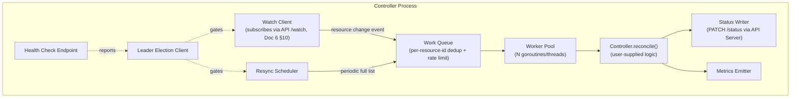
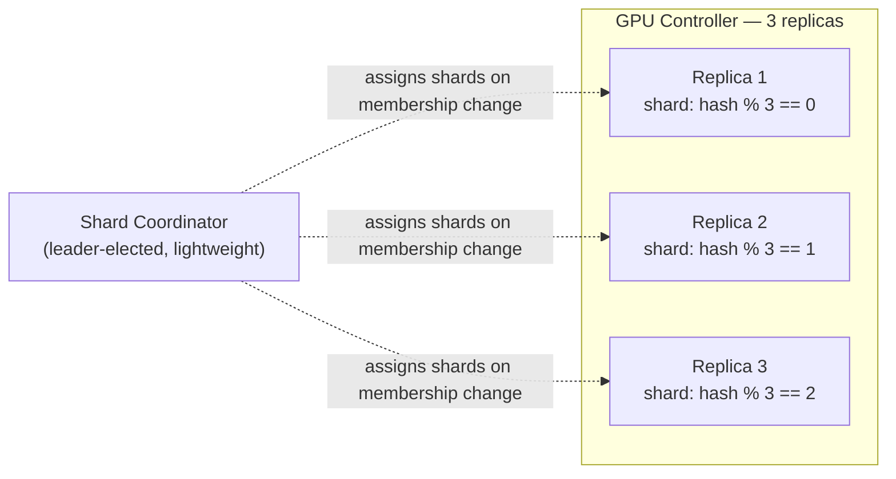
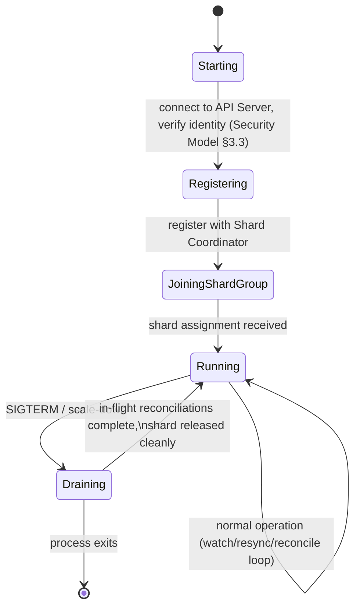

# OpenCHAI Controller Framework Design

**Document 8 of the Phase 0 Architecture Series**
**Status:** Draft for review
**Depends on:** Terminology & Glossary (Doc 1), Architecture Document (Doc 2), Resource Model Specification (Doc 3), Domain Model (Doc 4), Reconciliation & State Model (Doc 5), API Design Guidelines (Doc 6), Security & Multi-Tenancy Model (Doc 7)
**Feeds into:** Adapter Interface Contract, Workflow Engine Design, Repository Structure, Coding Standards & Engineering Guidelines

---

## 1. Purpose and Scope

The Reconciliation & State Model (Doc 5) defined the *behavior* every Controller must exhibit: the state machine, drift classification, retry/backoff rules, and conflict resolution. This document defines the *framework* — the concrete interfaces, processes, and runtime structure that make every Controller in OpenCHAI implement that behavior consistently, without each Controller author re-solving the same problems.

This document resolves several items explicitly deferred by Doc 5:
- §5.2's backoff defaults, tabulated concretely (§6).
- §7.2's work-queue de-duplication, given a concrete design (§4).
- §3's Policy-check caching question, given a concrete answer (§5.3).

---

## 2. Design Goal

**A Controller author should only ever write the Kind-specific `reconcile()` logic — diffing and calling Adapters. Everything else (watching, queuing, retrying, leader election, metrics, health checks) is provided by the framework and is identical across every Controller.** This is what "modular controllers" (Architecture Document §2) means in practice: modularity is enforced by the framework doing the undifferentiated heavy lifting once.

---

## 3. The Controller Interface

Every Controller implements exactly this contract; the framework calls it, never the reverse:

```python
class Controller(Protocol):
    kind: str                    # the single Resource Kind this Controller owns
                                  # (or a small explicit set, e.g. ["Node", "GPU"])

    def reconcile(self, resource_id: str) -> ReconcileResult:
        """
        Level-triggered (Reconciliation Model §4): must compute the correct
        action from current spec + observed state alone. Called by the
        framework; must NOT be called directly by another Controller.
        """
        ...

    def adapters(self) -> list[AdapterRef]:
        """Declares which Infrastructure Adapters this Controller depends on."""
        ...
```

```python
class ReconcileResult:
    outcome: Literal["Reconciled", "Retryable", "Terminal", "Blocked"]
    requeue_after: Optional[timedelta]   # for Retryable, overrides default backoff if set
    reason: Optional[str]                 # required for Terminal/Blocked
```

**Everything a Controller author does NOT implement** (provided by the framework, described below): event subscription, work queue management, per-resource serialization, leader election, retry/backoff scheduling, resync scheduling, status-write plumbing to the API Server, metrics emission, health check endpoints.

---

## 4. Runtime Architecture



### 4.1 Work Queue Semantics (Resolving Reconciliation Model §7.2)

- The queue holds **resource IDs**, not event payloads — a Controller always re-reads current `spec`/observed state fresh when it dequeues an item (level-triggered, Doc 5 §4), so queuing the ID is sufficient and avoids acting on stale event data.
- **De-duplication:** if resource ID `X` is already queued (or currently being processed) and a new event for `X` arrives, it is coalesced — the queue never holds two entries for the same ID. This is the concrete mechanism behind Doc 5 §7.2's "later events are coalesced, not queued as separate parallel executions."
- **Per-resource serialization:** the Worker Pool's dispatch guarantees no two workers process the same resource ID concurrently (a claim/lock held for the duration of one `reconcile()` call), even though different resource IDs are processed fully in parallel across the pool.
- **Rate limiting:** the queue applies a global token-bucket limit per Controller instance to bound the rate of Adapter calls, independent of per-resource backoff (§6) — this protects the target infrastructure system, not just the individual failing resource.

### 4.2 Leader Election and Sharding

- Each Controller **type** (GPU Controller, Network Controller, etc.) runs as a horizontally-scaled deployment. Within it, work is sharded by consistent hashing of `resource_id` across active replicas, not by a single active/standby leader for the whole Controller — this allows the GPU Controller, for example, to scale out across many replicas at national-supercomputing scale rather than being bottlenecked by one active instance.
- Leader election (Architecture Document §9) is used only for the narrow coordination need of **shard membership changes** (a replica joining/leaving triggers rebalancing) — not for gating all reconciliation through one instance. This refines Architecture Document §9's original "active/standby" sketch into a sharded model suitable for the Master Plan's scale goals.



### 4.3 Resync Scheduling (Reconciliation Model §6)

- Default resync interval is Kind-specific and configured centrally (not hardcoded per Controller), defaulting conservatively and tunable per deployment:

| Kind category | Default resync interval | Rationale |
|---|---|---|
| High-churn health (Node, GPU) | 60s | Hardware health changes fast enough to matter operationally |
| Structural (Cluster, Rack, Network) | 5 min | Structural drift is rarer; tighter loop adds little value |
| Reference data (Image, OSProfile, SoftwareStack) | 15 min | Rarely changes outside explicit user action |
| System-authored (Audit, Event) | Not resynced | No reconciliation applies — these are write-once records, not desired-state Kinds |

- Resync work is spread evenly across the interval (jittered start, not all resources listed at `t=0`) to avoid thundering-herd load spikes against the API Server and Adapters at scale.

---

## 5. Status Writing and Policy Checks

### 5.1 Status Writer

The framework — not each `reconcile()` implementation — is responsible for calling `PATCH /{kind}/{id}/status` (API Guidelines §5) using the Controller's service identity (Security Model §3.3). `reconcile()` returns a `ReconcileResult` plus whatever status fields changed; the framework handles the actual authenticated write, retry-on-transient-failure of that write itself, and setting `observedGeneration` correctly (Reconciliation Model §2.2) — a Controller author cannot forget this or get it subtly wrong.

### 5.2 Condition Update Discipline

The framework enforces Reconciliation Model §8's condition-writing rule mechanically: it diffs the new conditions against the last-written conditions and only updates `lastTransitionTime` for conditions whose `status` actually changed, regardless of what the `reconcile()` implementation passes — this makes the "meaningful change log, not noise" guarantee structural rather than a matter of author discipline.

### 5.3 Policy Check Caching (Resolving Reconciliation Model §12 Q1)

Auto-remediation Policy lookups (Doc 5 §3, §9) are cached by the framework at the Controller-instance level with a short TTL (default 30s) and invalidated early via a `PolicyUpdated` domain event subscription (Domain Model §5) — giving both the low-latency benefit of caching and near-immediate effect when a Policy is deliberately changed, rather than forcing every reconciliation to hit the API Server for a Policy read.

---

## 6. Backoff and Retry Defaults (Resolving Reconciliation Model §12 Q2)

| Parameter | Default | Configurable per Controller? |
|---|---|---|
| `baseDelay` | 2s | Yes |
| `maxDelay` | 5 min | Yes |
| `maxAttempts` | 10 | Yes |
| Jitter | ±20% of computed delay | No (platform-wide, prevents synchronized retry storms across many resources) |

- These are framework-level defaults applied automatically; a Controller only overrides them if its domain genuinely warrants it (e.g., bare-metal provisioning may reasonably use a longer `maxDelay` than a lightweight config push) — declared as Controller metadata, not hardcoded in `reconcile()` logic.
- Poison-resource handling (Doc 5 §5.3) is entirely framework-managed: once `maxAttempts` is exhausted, the framework marks the resource `Failed` via the Status Writer and removes it from the queue's active rotation, independent of any `reconcile()` logic.

---

## 7. Controller Lifecycle



- **Graceful shutdown is mandatory**, not optional: a Controller receiving a termination signal finishes any `reconcile()` calls currently in flight (bounded by a max drain timeout) and explicitly releases its shard assignment before exiting, so the Shard Coordinator can reassign work immediately rather than waiting for a liveness-check timeout — important given Reconciliation Model §4's per-resource serialization guarantee must not be violated by two replicas briefly believing they both own a shard during a rolling deployment.

---

## 8. Observability

Every Controller instance, via the framework (never bespoke per Controller), emits:

- **Metrics:** reconciliation duration histogram, outcome counters (`Reconciled`/`Retryable`/`Terminal`/`Blocked`), queue depth, work-queue dedup rate, shard rebalance events — all labeled by `kind` and `controller_instance`.
- **Structured logs:** one log line per `reconcile()` invocation minimum, including `resource_id`, `generation`, `observedGeneration`, `outcome`, `duration` — sufficient to reconstruct a resource's reconciliation history from logs alone as a debugging aid independent of the `history` field in the Resource itself.
- **Health check endpoint:** reports `Starting`/`Running`/`Draining` (§7), current shard assignment, and time-since-last-successful-resync per owned Kind — consumed by the Controller Manager's supervisory health checks (Architecture Document §4.1) to decide whether to restart a stuck instance.

---

## 9. Testing Strategy

- **Unit level:** `reconcile()` implementations are tested against a **fake Adapter** (an in-memory implementation of the Adapter Interface Contract, Doc 9) — never against a real xCAT/Redfish/Slurm target in unit tests, keeping Controller logic tests fast and deterministic.
- **Conformance level:** every Controller is run against a shared framework-level conformance test suite that verifies it correctly implements the `ReconcileResult` contract (e.g., a `reconcile()` that returns `Terminal` actually results in `status.phase = Failed` and no further automatic retries) — this catches an author accidentally violating a framework guarantee (like calling an Adapter's real credentials from inside `reconcile()` instead of going through the declared `adapters()` dependency list).
- **Integration level:** a small number of Controllers are tested end-to-end against real (or realistically-simulated, e.g., a Redfish simulator) target systems in CI, not every Controller for every commit — reserved for release-gating rather than per-PR checks, given cost/flakiness tradeoffs.

---

## 10. What This Framework Deliberately Does NOT Do

To keep the framework's responsibility boundary sharp:

- It does **not** coordinate across Resource Kinds or across Controllers — that is the Workflow Engine's job (Domain Model §3.6, Reconciliation Model §10). A Controller cannot call another Controller directly, even indirectly through the framework.
- It does **not** decide *whether* a drift should be auto-remediated in a business sense — it fetches the Policy decision (§5.3) but the decision logic itself lives in the Policy Resource, not in framework code.
- It does **not** hold or proxy secret material — Adapters fetch credentials directly from Vault under their own identity (Security Model §7); the framework never touches a credential value.

---

## 11. Open Questions Carried Forward

1. Consistent-hashing shard rebalancing (§4.2) needs a concrete algorithm choice (rendezvous hashing vs. classic consistent hashing with virtual nodes) — a Repository Structure / implementation-level decision, not resolved here.
2. Should the conformance test suite (§9) be a required CI gate before a new Controller can be merged, or advisory initially during Phase 3 (Controller Framework rollout) with enforcement added later? Leaning toward required from the start given how much correctness the framework is centralizing.
3. Drain timeout (§7) default value needs to be chosen per Controller based on realistic `reconcile()` durations (a Node provisioning reconcile may legitimately run long) — needs input from realistic Adapter latency data, not a value this design document should guess at.

---

*End of Controller Framework Design. Next in sequence: Adapter Interface Contract.*
