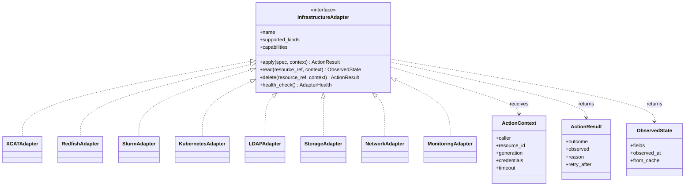
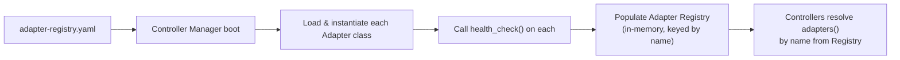
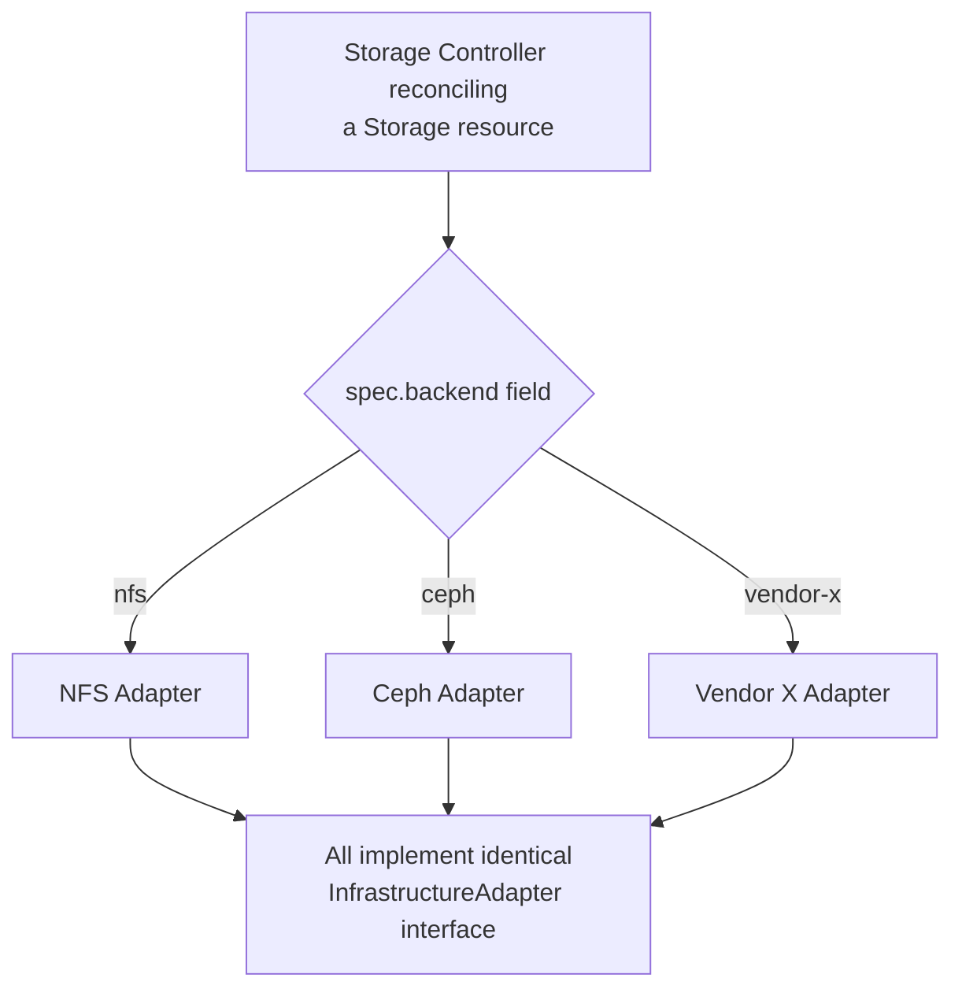
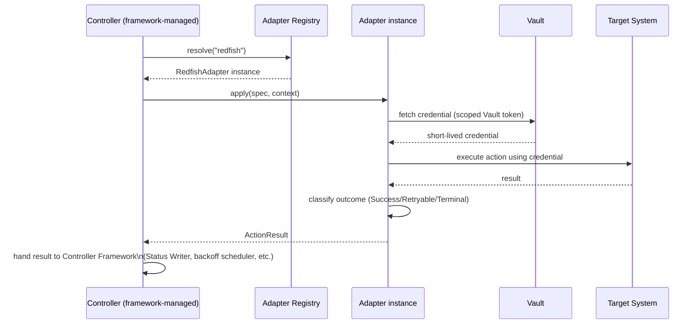

# OpenCHAI Adapter Interface Contract

**Document 9 of the Phase 0 Architecture Series**
**Status:** Draft for review
**Depends on:** Terminology & Glossary (Doc 1), Architecture Document (Doc 2), Resource Model Specification (Doc 3), Domain Model (Doc 4), Reconciliation & State Model (Doc 5), Security & Multi-Tenancy Model (Doc 7), Controller Framework Design (Doc 8)
**Feeds into:** Workflow Engine Design, Database Architecture, Repository Structure, Coding Standards & Engineering Guidelines

---

## 1. Purpose and Scope

Every prior document has referred to "Infrastructure Adapters" as the sole components permitted to touch xCAT, Redfish, Slurm, Kubernetes, LDAP, storage, and networking systems (Architecture Document §4.1, §6.4). This document is the formal contract those Adapters implement — the exact interface, the typed result contract Controllers depend on (Controller Framework Design §3, §6), and the operational rules (isolation, credential access, versioning, conformance testing) every Adapter must follow regardless of which technology it wraps.

This is what makes "extensibility through adapters" (Master Plan, Architecture Document §8.3) a real, enforceable property rather than an aspiration: a new integration is conformant to this document, or it isn't accepted into the platform.

---

## 2. The Adapter Interface

```python
class InfrastructureAdapter(Protocol):
    name: str                      # unique registration name, e.g. "redfish"
    supported_kinds: list[str]     # Resource Kinds this adapter can act on
    capabilities: AdapterCapabilities

    def apply(self, spec: dict, context: ActionContext) -> ActionResult:
        """
        MUST be idempotent (Reconciliation Model §4): calling apply() twice
        with the same spec must converge to the same end state without
        side effects from the first call breaking the second.
        """
        ...

    def read(self, resource_ref: ResourceRef, context: ActionContext) -> ObservedState:
        """Returns current reality. MUST NOT mutate anything."""
        ...

    def delete(self, resource_ref: ResourceRef, context: ActionContext) -> ActionResult:
        """MUST be idempotent: deleting an already-deleted target is a Success, not an error."""
        ...

    def health_check(self) -> AdapterHealth:
        """Reports whether this Adapter can currently reach its target system at all."""
        ...
```

This is the same four-method shape introduced in Architecture Document §6.4; this document defines every supporting type precisely.

### 2.1 `ActionContext`

```python
class ActionContext:
    caller: str                 # Controller name invoking this call (audit trail)
    resource_id: str
    generation: int              # the spec generation being reconciled (Reconciliation Model §2.2)
    credentials: CredentialHandle  # scoped handle, NOT a raw secret (see §6)
    timeout: timedelta
```

### 2.2 `ActionResult` (Consumed Directly by the Controller Framework, Doc 8 §3)

```python
class ActionResult:
    outcome: Literal["Success", "Retryable", "Terminal"]
    observed: Optional[dict]      # updated observed fields, if immediately known
    reason: Optional[str]         # required for Retryable/Terminal
    retry_after: Optional[timedelta]   # Adapter's own hint, may override Controller default backoff
```

**The Adapter — not the Controller — classifies Retryable vs. Terminal.** This is a deliberate design decision restated from Reconciliation Model §5.1: only the component actually talking to the target system knows whether an error code means "try again" (HTTP 503, connection timeout) or "this will never succeed as specced" (HTTP 400 invalid parameter, hardware fault code). Controllers trust this classification rather than re-deriving it from generic exception types.

### 2.3 `ObservedState`

```python
class ObservedState:
    fields: dict            # Kind-specific observed values
    observed_at: datetime   # required — backs Reconciliation Model §8's staleness contract
    from_cache: bool         # required — tells the caller whether this honored a cache hit
```

### 2.4 `AdapterCapabilities`

```python
class AdapterCapabilities:
    supports_mtls: bool
    supports_bulk_read: bool
    max_concurrent_actions: int
    cache_ttl: dict[str, timedelta]   # per observed-field-category staleness bound (Reconciliation Model §8)
```

Declared once at registration (§4), not re-negotiated per call — this is what lets the Security Model (§8, mTLS coverage) and Reconciliation Model (§8, cache staleness) reason about an Adapter's behavior without inspecting its internals.

---

## 3. Class Structure



---

## 4. Registration and Discovery

Resolving Architecture Document §8.3's "registered in the Adapter Registry (config, no code change elsewhere)" into a concrete mechanism:

```yaml
# adapter-registry.yaml (deployment-time configuration, not a Resource in the Resource Store)
adapters:
  - name: redfish
    module: openchai.adapters.redfish
    supported_kinds: [Node, GPU]
    capabilities:
      supports_mtls: true
      supports_bulk_read: false
      max_concurrent_actions: 50
    vault_policy: redfish-adapter-policy     # Security Model §7
  - name: xcat
    module: openchai.adapters.xcat
    supported_kinds: [Node]
    capabilities:
      supports_mtls: false
      max_concurrent_actions: 20
    vault_policy: xcat-adapter-policy
```



- Adding a new adapter is: implement the interface (§2), add one entry to this config, deploy — no changes to the Controller Manager, any Controller, the API Server, or the Workflow Engine, which is the concrete mechanism behind the "no core changes" claim in Architecture Document §8.3.
- A Controller declares which Adapter(s) it needs by **name** (Controller Framework Design §3's `adapters()` method) — the framework resolves the name against the Registry at startup and fails fast (Controller stays in `Starting`, never reaches `Running`, Controller Framework Design §7) if a declared Adapter is missing or fails its `health_check()`.

---

## 5. Capability-Based Routing

Not every Adapter for a given Kind supports every operation identically (Architecture Document didn't address this explicitly — resolved here). Example: a Storage Controller might route to different Storage Adapters (NFS, Ceph, vendor-specific) depending on `spec.storageBackend`, each registered with the same `supported_kinds: [Storage]` but different `capabilities`.



This is why `apply(spec, ...)` takes the full `spec` rather than pre-parsed fields — the Adapter itself is responsible for interpreting the portion of `spec` relevant to its backend, keeping the Controller backend-agnostic (it only knows "call the Storage Adapter for this resource," resolved by name from `spec.backend`, not by backend-specific branching in Controller code).

---

## 6. Credential Access (Security Model §6, §7 — Applied Here)

- An Adapter never receives a raw secret value through `ActionContext.credentials` — it receives a `CredentialHandle` (a Vault path + the Adapter's own scoped Vault token), and calls Vault itself at the point of use.
- This means credential material exists in memory only inside the Adapter process, for the shortest possible window (Security Model §6's sequence diagram), and never passes through the Controller, Controller Manager, or API Server.
- An Adapter's `health_check()` (§2) should validate credential validity as part of its check (e.g., a Vault token near expiry, or an LDAP bind failing) — surfaced to the Controller Manager's supervisory health checks (Controller Framework Design §8) so a credential problem is visible as an Adapter health issue, not a mysterious wave of `Retryable` reconciliation failures with no clear root cause.

---

## 7. Isolation and Failure Containment

- Each Adapter runs with its own **circuit breaker**: after a configurable consecutive-failure threshold against its target system, the Adapter trips to an `Unavailable` health state, and the framework (Controller Framework Design §4.1) stops dispatching new `apply()`/`read()` calls to it — queued work for Kinds routed to that Adapter accumulates as `Retryable` (with backoff) rather than hammering an already-failing target system.
- One Adapter's circuit breaker tripping (e.g., Slurm REST API down) has **no effect** on Controllers/Adapters for unrelated Kinds (e.g., GPU/Redfish keeps operating normally) — isolation is per-Adapter, consistent with Architecture Document §4.1's principle that adapters "translate... a specific technology" and nothing more.
- Adapters run as separate deployable units from Controllers (not in-process libraries) in the target production topology, so an Adapter crash (e.g., an unhandled exception from a malformed vendor API response) cannot crash the Controller process reconciling other resources — this is stated as a requirement here; the exact process/container boundary is a Repository Structure decision.

---

## 8. Versioning

- Adapters are versioned independently of `apiVersion` (Resource Model §4) — an Adapter version bump (e.g., supporting a new Redfish API version) does not require a Resource schema change, and vice versa. The two are deliberately decoupled.
- A breaking change to an Adapter's *behavior* (not its interface — the `InfrastructureAdapter` interface itself is stable per §2) is handled by registering a new adapter `name` (e.g., `redfish-v2`) alongside the old one during a migration window, with Controllers/Kinds migrated via the registry config (§4) rather than an in-place swap that could silently change behavior for in-flight reconciliations.

---

## 9. Conformance Testing

Every Adapter must pass a shared conformance suite before being accepted into the platform, verifying (independent of what technology it wraps):

1. `apply()` called twice in a row with identical `spec` produces no error and converges to the same `ObservedState` on a subsequent `read()` (idempotency, §2's core requirement).
2. `delete()` on an already-deleted `resource_ref` returns `Success`, not `Terminal` or an exception.
3. A simulated timeout/connection error from the underlying system is classified `Retryable`, not `Terminal`.
4. A simulated invalid-parameter rejection from the underlying system is classified `Terminal`, not `Retryable` (verifies the Adapter isn't defaulting everything to one outcome).
5. `read()` never mutates target-system state (verified via a read-only credential in the test harness, where the target system supports scoped credentials — otherwise verified via a mock).
6. `health_check()` correctly reflects a deliberately-broken connection to the (simulated) target.

This suite is what makes an Adapter's `Retryable`/`Terminal` classification (§2.2) trustworthy enough for the Controller Framework to build automatic retry/poison-resource logic (Controller Framework Design §6) directly on top of it without each Controller re-verifying Adapter correctness itself.

---

## 10. Illustrative Sketch: Redfish Adapter

Not a full implementation — illustrates how the contract maps onto a real integration:

```python
class RedfishAdapter(InfrastructureAdapter):
    name = "redfish"
    supported_kinds = ["Node", "GPU"]
    capabilities = AdapterCapabilities(
        supports_mtls=True, supports_bulk_read=False,
        max_concurrent_actions=50,
        cache_ttl={"power_state": timedelta(seconds=15)},
    )

    def apply(self, spec, context):
        client = self._client(context.credentials)   # fetches scoped Vault handle, §6
        try:
            client.set_power_state(spec["desiredPowerState"])
        except RedfishTimeout:
            return ActionResult(outcome="Retryable", reason="BMC timeout", retry_after=timedelta(seconds=10))
        except RedfishInvalidParameter as e:
            return ActionResult(outcome="Terminal", reason=str(e))
        return ActionResult(outcome="Success", observed={"powerState": spec["desiredPowerState"]})

    def read(self, resource_ref, context):
        client = self._client(context.credentials)
        state = client.get_power_state()
        return ObservedState(fields={"powerState": state}, observed_at=now(), from_cache=False)

    def delete(self, resource_ref, context):
        return ActionResult(outcome="Success")   # no persistent BMC-side object to remove

    def health_check(self):
        return AdapterHealth(reachable=self._ping_bmc_gateway())
```

---

## 11. Sequence: A Full Adapter Call Within Reconciliation

Ties this document to the reconciliation trace already worked through in Reconciliation Model §9, now showing the Adapter-internal steps explicitly:



---

## 12. Open Questions Carried Forward

1. Deployment boundary for Adapters (§7 — "separate deployable units") — sidecar-per-Controller vs. shared Adapter service reachable by multiple Controllers — needs resolution in Repository Structure / deployment design, not this contract document.
2. Bulk operation support (`supports_bulk_read` in `AdapterCapabilities`, §2.4) is declared but this document doesn't yet define a bulk method signature — needed once real Adapters (e.g., Redfish across a full rack) show single-resource `read()` calls don't scale acceptably.
3. Conformance suite (§9) — should it be run against every Adapter on every CI run (fast, mocked target) with a separate, less frequent run against real/simulated target systems (e.g., a Redfish simulator), mirroring the Controller Framework's own two-tier testing strategy (Controller Framework Design §9)? Leaning yes, for consistency.
4. Cross-Adapter transaction needs (e.g., a single logical action that must call both the Network Adapter and the Redfish Adapter atomically) — this contract deliberately provides no multi-Adapter transaction primitive; confirm this is correctly deferred entirely to the Workflow Engine (Domain Model §3.6) rather than needed here.

---

*End of Adapter Interface Contract. This completes Documents 6–9 (API Design Guidelines, Security & Multi-Tenancy Model, Controller Framework Design, Adapter Interface Contract). Next in sequence: Workflow Engine Design.*
