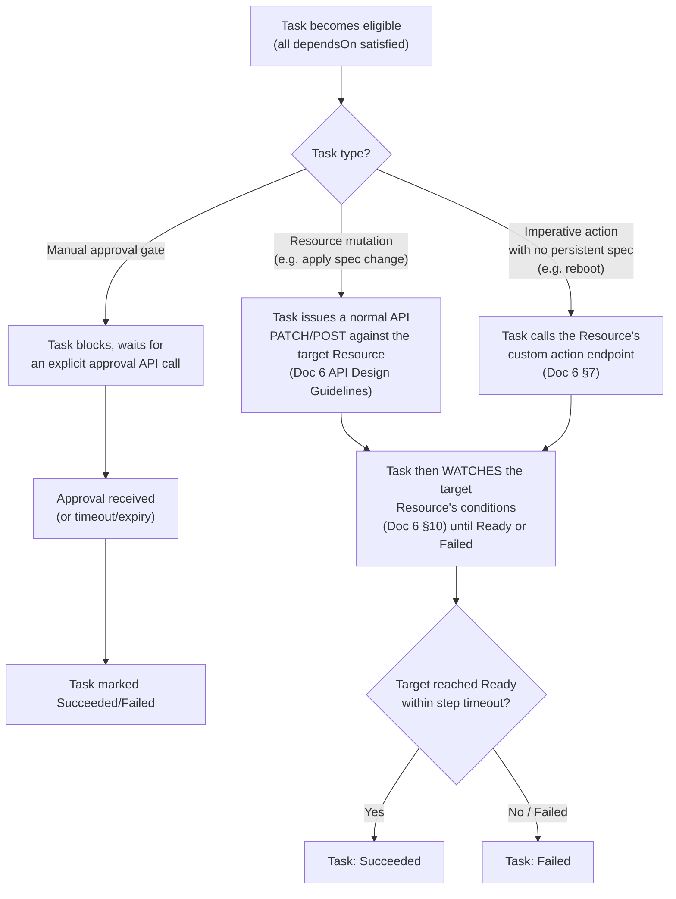
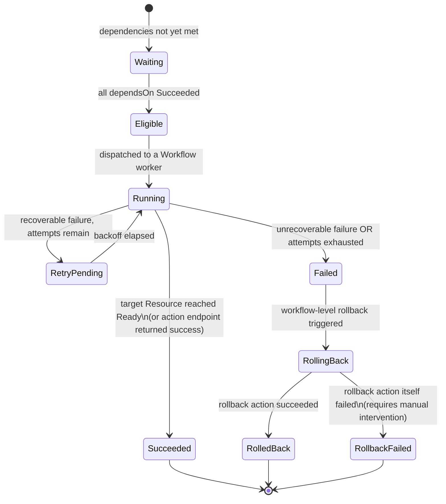
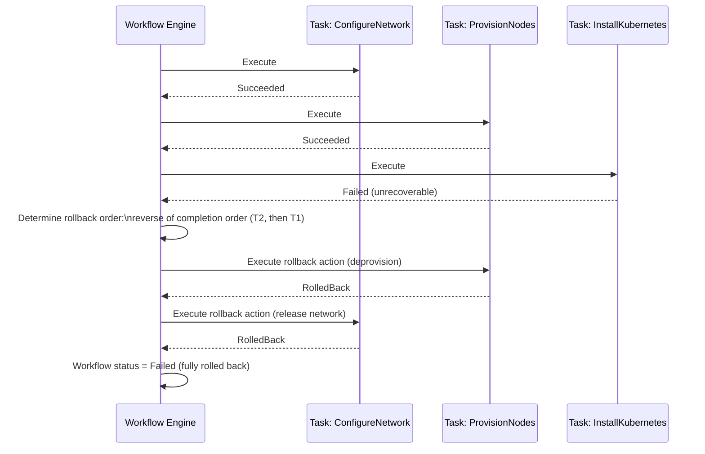
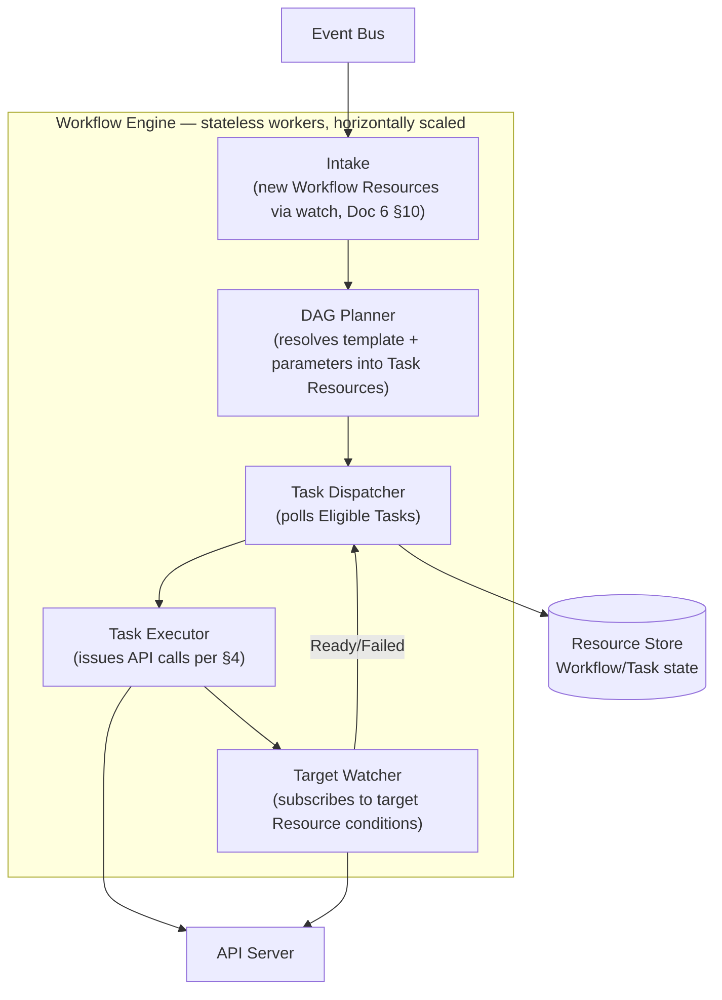

# OpenCHAI Workflow Engine Design

**Document 10 of the Phase 0 Architecture Series**
**Status:** Draft for review
**Depends on:** Docs 1–9 (Terminology, Architecture, Resource Model, Domain Model, Reconciliation & State Model, API Design Guidelines, Security & Multi-Tenancy Model, Controller Framework Design, Adapter Interface Contract)
**Feeds into:** Database Architecture, Repository Structure, Coding Standards & Engineering Guidelines

---

## 1. Purpose and Scope

The Reconciliation & State Model (Doc 5 §10) drew a firm boundary: Controllers reconcile single Resources toward steady state; the Workflow Engine orchestrates multi-step processes across Resources. This document designs that engine — its execution model, DAG definition format, retry/rollback mechanics, and its relationship to Controllers and Adapters — and resolves the build-vs-adopt question the Architecture Document (Doc 2 §12) explicitly deferred.

---

## 2. Build vs. Adopt Decision

**Decision: build a lightweight, PostgreSQL-backed workflow engine for v1, following the durable-execution pattern popularized by systems like Temporal, without taking on Temporal (or an equivalent) as an external dependency yet.**

| Option | Pros | Cons | Verdict |
|---|---|---|---|
| Adopt Temporal (or similar) | Battle-tested durability, built-in versioning, mature tooling | New infrastructure dependency (its own DB, its own ops burden); OpenCHAI's Workflow needs (§3–§9 of this doc) are narrower than a general-purpose durable-execution platform | Reconsider in Phase 5+ if Workflow complexity outgrows the in-house engine |
| Build in-house on PostgreSQL | Reuses the Resource Store (Doc 2 §10) — no new infra; Workflow/Task are already Resource Kinds (Domain Model §3.6), so state is durable "for free" via the same durability guarantees as everything else | Must implement DAG scheduling, retry, and rollback ourselves | **Chosen for v1** |
| Build on a generic job queue (Celery, etc.) | Familiar, simple | No native DAG/rollback semantics — would still require building the orchestration layer on top | Rejected — doesn't reduce the actual design burden |

This keeps Phase 2 (Core Control Plane) self-contained: the Workflow Engine is a stateless service reading/writing `Workflow`/`Task` Resources through the same API Server and Resource Store as everything else, with no separate durability mechanism to operate or reason about.

---

## 3. Workflow Definition Format

A `Workflow` Resource's `spec` declares a DAG of steps at creation time. Definitions are authored as reusable **Workflow Templates** (versioned, stored alongside code) and instantiated with parameters:

```yaml
# workflow-template: cluster-bring-up.yaml
apiVersion: openchai.io/v1
kind: WorkflowTemplate
metadata:
  name: ClusterBringUp
  version: "1.2"
spec:
  parameters:
    - name: clusterId
      required: true
    - name: nodeCount
      required: true
  steps:
    - name: ConfigureNetwork
      controller: NetworkController
      action: apply
      target: "{{ clusterId }}/network"
      rollback:
        action: release
        target: "{{ clusterId }}/network"
    - name: ProvisionNodes
      dependsOn: [ConfigureNetwork]
      controller: ProvisioningController
      action: apply
      target: "{{ clusterId }}/nodes"
      params: { count: "{{ nodeCount }}" }
      retry: { maxAttempts: 5, baseDelay: 30s }
      rollback:
        action: deprovision
        target: "{{ clusterId }}/nodes"
    - name: InstallKubernetes
      dependsOn: [ProvisionNodes]
      controller: KubernetesController
      action: apply
      target: "{{ clusterId }}/k8s"
      rollback:
        action: teardown
        target: "{{ clusterId }}/k8s"
    - name: ApprovalGate
      dependsOn: [InstallKubernetes]
      type: manual-approval          # human-in-the-loop, §7
      approverRole: ClusterAdmin
```

- `dependsOn` defines the DAG edges; steps with no unmet dependencies are eligible to run in parallel.
- Every step that mutates state **must** declare a `rollback` (enforced at template validation time, not left optional) unless explicitly marked `rollback: none` with a documented justification — this closes a gap the Architecture Document's example (Doc 2 §7.3) illustrated but didn't mandate.
- `WorkflowTemplate` is versioned independently (`metadata.version`), consistent with Adapter versioning (Doc 9 §8) and `apiVersion` (Resource Model §4) — a running Workflow instance always records which template version it was instantiated from, so mid-flight Workflows are unaffected by a template being edited.

---

## 4. Task Execution Model

Each DAG node becomes a `Task` Resource (Domain Model §3.6) when its dependencies are satisfied. Crucially, a Task **does not call a Controller's internals directly** — it acts through the same two channels any other caller would use, per Reconciliation Model §10:



**This is the load-bearing design choice of this document:** the Workflow Engine has no privileged access into Controller internals (Domain Model §3.6's rule, restated and made mechanical here). A Task is, from the target Resource's point of view, indistinguishable from a direct user API call — which is exactly what makes Controllers and the Workflow Engine independently testable and scalable, as promised in the Architecture Document.

---

## 5. Task State Machine



- `RetryPending`/backoff reuses the exact same parameters and jitter policy as the Controller Framework (Controller Framework Design §6) for consistency, though Task retry state is durable (written to the `Task` Resource) rather than in-memory, since Workflow Engine workers are stateless and any worker must be able to pick up a Task after a restart (§8).
- `RollbackFailed` is a distinct terminal state, not silently folded into `Failed` — it requires human intervention and triggers an `Alert` (Domain Model §3.8), since it means the system may be left in a partially-torn-down state with no further automated recourse.

---

## 6. Workflow-Level Rollback Semantics



**Rules:**
- Rollback proceeds in strict **reverse completion order** — never in parallel, even if the forward DAG allowed parallel execution — because a later step's rollback may assume an earlier step's resources still exist (Doc 2 §7.3's example implicitly relied on this; made explicit here).
- A step that never started (`Waiting`/`Eligible`, never reached `Running`) has no rollback to execute — only `Succeeded` steps are rolled back.
- The `ApprovalGate` step type (§7) has no rollback action by definition — it never mutated anything.

---

## 7. Human-in-the-Loop Steps

Resolving the interaction between Reconciliation Model §12 Q3 (should Health Degradation ever auto-trigger a Workflow?) and this engine: **a Workflow may include a `manual-approval` step type**, giving a controlled way to require human sign-off mid-flight without making the entire Workflow either fully automatic or fully manual.

- An `ApprovalGate` Task blocks (`Waiting` state extended indefinitely) until an authorized caller (per `approverRole`, checked via RBAC — Security Model §4) calls `POST /workflows/{id}/tasks/{taskId}/actions/approve` or `.../reject`.
- Optional `expiry` on the gate auto-fails the Task (and triggers rollback, §6) if no decision is made in time, preventing an indefinitely stuck Workflow from silently blocking resources.
- This is the concrete mechanism that would let a future "auto-drain a degrading Node" Workflow (Reconciliation Model §12 Q3) exist safely: it can auto-trigger, but insert an `ApprovalGate` before any destructive step, rather than requiring an all-or-nothing decision on Health-Degradation autonomy at this stage. The underlying product question of *whether* to build that specific Workflow at all remains open and is not resolved by this design.

---

## 8. Engine Runtime Architecture



- **Stateless workers, durable state:** exactly like Controllers (Controller Framework Design §4), any worker instance can pick up any eligible Task after a crash/restart, because all Task/Workflow progress lives in the Resource Store, not in worker memory.
- **No leader election needed** for the Workflow Engine itself (unlike the Controller Manager's shard coordination, Controller Framework Design §4.2) — Task dispatch is naturally idempotent-safe via the same per-resource-id claim mechanism used by the Controller work queue (Controller Framework Design §4.1), applied here to Task IDs instead of arbitrary Resource IDs.

---

## 9. Long-Running Task Completion: Poll vs. Watch

Per §4's flowchart, a Task that triggers a Resource mutation must know when that Resource reaches `Ready`/`Failed`. The engine uses the **Watch** mechanism (API Design Guidelines §10) rather than polling — consistent with the platform-wide preference for event-driven flows over polling (Architecture Document principle table, Doc 2 §2) — with a periodic reconciliation-style safety poll (mirroring Reconciliation Model §6's resync concept) as a fallback in case a watch stream is silently dropped, rather than relying on watch delivery alone.

---

## 10. Multi-Cluster Workflows (Resolving Domain Model §7 Q3)

Domain Model §7 asked whether a Workflow may span multiple Clusters (e.g., a platform-wide upgrade). **Resolution: yes, with no special-casing required** — because a Workflow Task acts through ordinary Resource-scoped API calls (§4), nothing in this design assumes a single-Cluster scope. A `PlatformUpgrade` template's steps simply target multiple Clusters' Resources directly. The one consequence: AuthZ re-validation (Security Model §4.5) must check permissions **per target Resource's scope**, not once for the whole Workflow, since a caller might have access to some but not all of the Clusters a multi-Cluster Workflow touches — a Task targeting a Cluster the caller lacks access to fails closed (`Blocked`) independently of the other Tasks.

---

## 11. Relationship to Controllers — Summary Table

| | Controller (Doc 8) | Workflow Engine (this doc) |
|---|---|---|
| Scope | One Resource Kind, steady-state | Multiple Resources/Kinds, one-shot process |
| Trigger | Continuous (event + resync) | Explicit instantiation (user or another Workflow) |
| Consistency unit | Single Resource's `apply()` | An ordered/DAG sequence of independent API calls |
| Failure handling | Retry the single Resource indefinitely (until poison) | Retry a Task, then roll back completed prior Tasks |
| State storage | Work queue (ephemeral) + Resource `status` (durable) | `Task`/`Workflow` Resources (fully durable) |
| Can call the other? | No — Controllers never invoke Workflows | Yes — Tasks call target Resources' APIs, indirectly causing Controller reconciliation |

---

## 12. Open Questions Carried Forward

1. Should `WorkflowTemplate` become a full Resource Kind (stored in the Resource Store, editable via API) rather than a code-adjacent versioned file (§3)? Storing it as a Resource would allow runtime template updates without a deployment, at the cost of needing its own validation/versioning UI — deferred pending Ecosystem-phase (Master Plan Phase 5) requirements around user-authored Workflows.
2. Step-level timeout defaults (§4, §6) need concrete values per action type — an implementation detail for Repository Structure / Coding Standards rather than this design.
3. Whether `RollbackFailed` (§5) should attempt a bounded number of automatic rollback retries before surfacing to a human, or surface immediately every time — leaning toward immediate surfacing given the safety-critical nature of a stuck teardown, but worth explicit product sign-off.

---

*End of Workflow Engine Design. Next in sequence: Database Architecture.*
