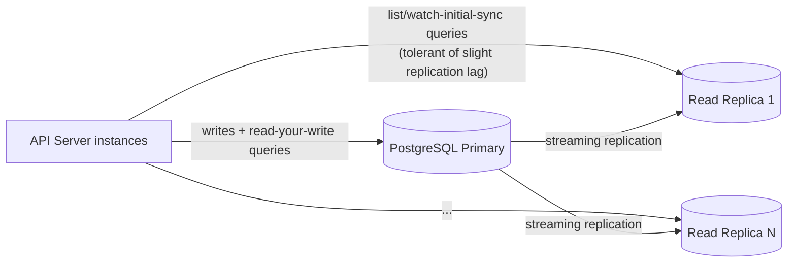
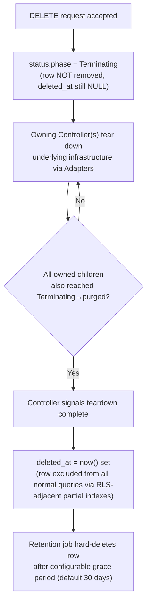
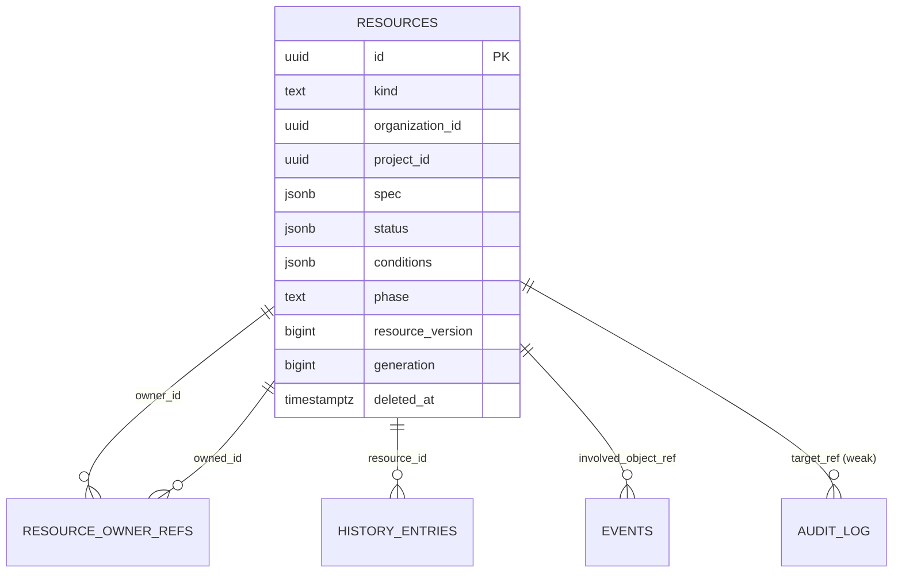

# OpenCHAI Database Architecture

**Document 11 of the Phase 0 Architecture Series**
**Status:** Draft for review
**Depends on:** Docs 1–10 (Terminology through Workflow Engine Design)
**Feeds into:** Repository Structure, Coding Standards & Engineering Guidelines

---

## 1. Purpose and Scope

This document resolves the storage-engine-level questions the Resource Model Specification (Doc 3 §11) deliberately deferred: how Resources map onto PostgreSQL tables, how tenancy isolation (Security Model §5.1) and optimistic concurrency (Resource Model §3.1, API Design Guidelines §12) are implemented at the schema level, and how `history`/`Audit`/`Event` are retained at the Master Plan's national-supercomputing scale (Resource Model §12 Q3).

---

## 2. Schema Strategy: Hybrid Table Design

**Decision: one common `resources` table for all Resource Kinds, using JSONB for `spec`/`status`/`conditions`, with select high-query-frequency fields promoted to indexed generated columns — not fully per-Kind tables, and not a pure schemaless JSONB blob either.**

| Option | Pros | Cons | Verdict |
|---|---|---|---|
| One table per Kind | Strong typing, simplest per-Kind queries | ~25+ tables to keep in lockstep with every Resource Model change; cross-Kind queries (e.g., "everything in this Project") need unions across many tables | Rejected — fights the "everything is a Resource" principle (Doc 2 §2) at the storage layer |
| Single JSONB blob, no promoted columns | Maximum schema flexibility, minimal migration burden | Every query — including tenancy scoping itself — requires JSONB path expressions; poor index selectivity for the highest-frequency filters | Rejected — tenancy isolation (Security Model §5.1) needs to be a first-class, provably-indexed column, not a JSONB lookup |
| **Hybrid: common table + generated columns for hot fields** | One schema for all Kinds (matches Resource Model uniformity goal); hot filters (`organizationId`, `projectId`, `kind`, `name`, `phase`) are real indexed columns; everything else stays flexible JSONB | Requires a migration whenever a *new* field needs promotion to a generated column | **Chosen** |

### 2.1 Core Table

```sql
CREATE TABLE resources (
    id              UUID PRIMARY KEY DEFAULT gen_random_uuid(),
    api_version     TEXT NOT NULL,
    kind            TEXT NOT NULL,
    organization_id UUID NOT NULL REFERENCES resources(id),
    project_id      UUID REFERENCES resources(id),
    name            TEXT NOT NULL,
    labels          JSONB NOT NULL DEFAULT '{}',
    annotations     JSONB NOT NULL DEFAULT '{}',
    spec            JSONB NOT NULL,
    status          JSONB NOT NULL DEFAULT '{}',
    conditions      JSONB NOT NULL DEFAULT '[]',
    phase           TEXT GENERATED ALWAYS AS (status->>'phase') STORED,
    resource_version BIGINT NOT NULL DEFAULT 1,
    generation      BIGINT NOT NULL DEFAULT 1,
    observed_generation BIGINT GENERATED ALWAYS AS ((status->>'observedGeneration')::bigint) STORED,
    created_at      TIMESTAMPTZ NOT NULL DEFAULT now(),
    created_by      UUID NOT NULL,
    updated_at      TIMESTAMPTZ NOT NULL DEFAULT now(),
    deleted_at      TIMESTAMPTZ,                    -- soft-delete marker, see §7
    UNIQUE (organization_id, project_id, kind, name)
);

CREATE INDEX idx_resources_org_project_kind ON resources (organization_id, project_id, kind) WHERE deleted_at IS NULL;
CREATE INDEX idx_resources_labels_gin ON resources USING GIN (labels);
CREATE INDEX idx_resources_phase ON resources (kind, phase) WHERE deleted_at IS NULL;
```

- `organization_id`/`project_id`/`kind`/`name`/`phase` are promoted columns — these back nearly every filter in API Design Guidelines §6 (label selectors excepted, which use the GIN index directly) and every tenancy check in Security Model §5.1.
- `phase` and `observed_generation` are **generated columns derived from JSONB**, not independently written fields — this guarantees they can never drift out of sync with `status` itself, closing off an entire class of consistency bugs at the schema level.
- Owner/reference relationships (Resource Model §5) are **not** modeled as SQL foreign keys for arbitrary `ownerReferences`/`spec.*Ref` fields (they're heterogeneous, Kind-to-Kind) — cascade-delete logic (§7) is application-enforced by the API Server/Controllers, not database `ON DELETE CASCADE`, since cascade must go through each owned Resource's own `Terminating` lifecycle (Resource Model §7), not an instantaneous row delete.

### 2.2 Companion Tables

| Table | Purpose | Notes |
|---|---|---|
| `resource_owner_refs` | Normalized `(owner_id, owned_id, controller_flag)` pairs | Enables efficient "find everything owned by X" queries without scanning JSONB across the whole table |
| `history_entries` | Append-only transition log, one row per entry, `resource_id` FK | Kept out of the main `resources.history` JSONB array to avoid unbounded row growth in the hot table — see §5 |
| `events` | Backing store for `Event` Resources | Time-partitioned, §5 |
| `audit_log` | Backing store for `Audit` Resources | Time-partitioned, immutable, §5 |

---

## 3. Optimistic Concurrency Implementation

Resolving API Design Guidelines §12 into concrete mechanics:

```sql
UPDATE resources
SET spec = $1, resource_version = resource_version + 1, generation = generation + 1, updated_at = now()
WHERE id = $2 AND resource_version = $3;
-- If 0 rows affected: the caller's If-Match was stale → API Server returns 409 (API Design Guidelines §12)
```

- `generation` increments only on `spec`-affecting writes (the `UPDATE` path above); the separate `/status` subresource write path (API Design Guidelines §5) increments `resource_version` but **not** `generation`, matching Resource Model §3.1's distinction exactly.
- No database-level trigger is used for this increment (a trigger could obscure the generation-vs-resource_version distinction) — it is explicit in the two distinct Repository Layer write paths (main resource vs. status subresource), keeping the rule visible in application code where the API Design Guidelines' write-boundary enforcement (Doc 6 §5) already lives.

---

## 4. Row-Level Security (Tenancy Isolation, Security Model §5.1)

```sql
ALTER TABLE resources ENABLE ROW LEVEL SECURITY;

CREATE POLICY tenant_isolation ON resources
    USING (
        organization_id = current_setting('app.current_org_id')::uuid
        AND (
            project_id IS NULL
            OR project_id = ANY(string_to_array(current_setting('app.current_project_scope'), ',')::uuid[])
        )
    );
```

- `app.current_org_id` and `app.current_project_scope` are set via `SET LOCAL` at the start of every request-scoped transaction by the Tenancy Middleware (Security Model §5.1) — scoped to the transaction, never leaking across pooled connections between requests.
- `app.current_project_scope` is a list (not a single value) to support the cross-Project sharing model (Security Model §5.2) — a request's effective scope may include a home Project plus explicitly shared Projects, resolved by the API layer before the transaction begins.
- The system/break-glass identity (Security Model §10) bypasses RLS via a distinct database role with `BYPASSRLS`, used **only** by the break-glass code path — never by the standard API Server connection pool, so a compromised standard API credential cannot self-grant cross-tenant access even at the database layer.

---

## 5. Retention and Partitioning (Resolving Resource Model §12 Q3)

**Decision: `events` and `audit_log` are partitioned by month (range partitioning on `created_at`); `history_entries` is partitioned by quarter given its lower expected volume; the hot `resources` table itself is never partitioned in v1** (its row count is bounded by live infrastructure inventory, not by time — partitioning it would add complexity without addressing an actual growth vector).

```sql
CREATE TABLE audit_log (
    id UUID PRIMARY KEY DEFAULT gen_random_uuid(),
    organization_id UUID NOT NULL,
    actor_id UUID NOT NULL,
    action TEXT NOT NULL,
    target_ref JSONB NOT NULL,
    via_break_glass BOOLEAN NOT NULL DEFAULT false,
    created_at TIMESTAMPTZ NOT NULL DEFAULT now()
) PARTITION BY RANGE (created_at);

CREATE TABLE audit_log_2026_07 PARTITION OF audit_log
    FOR VALUES FROM ('2026-07-01') TO ('2026-08-01');
-- New partitions created automatically ahead of time by a scheduled maintenance job
```

| Table | Partition interval | Default retention | Rationale |
|---|---|---|---|
| `events` | Monthly | 90 days, then dropped | High volume, low long-term value beyond recent troubleshooting (Terminology & Glossary §7: transport-adjacent record) |
| `audit_log` | Monthly | 7 years (configurable per Organization, compliance-driven) | Security Model §9's audit trail must survive far longer than operational Events |
| `history_entries` | Quarterly | 2 years, then archived to cold storage (not dropped) | Balances the Resource Model's "never deleted, only retained per policy" (Doc 3 §3.1) against unbounded growth |

- Dropping old partitions (for `events`) is a `DROP TABLE` on the partition, not a row-by-row `DELETE` — avoids the severe autovacuum/bloat cost row-level deletion would incur at scale, directly serving the Master Plan's national-supercomputing scale goal.
- `audit_log` partitions are **never dropped** by default, only optionally moved to cheaper storage tiers, consistent with its immutability invariant (Domain Model §3.8).

---

## 6. Read Scaling: Replicas



- Writes and any read that must observe its own immediately-preceding write (e.g., a `GET` right after a `PATCH` in the same logical operation, or any RLS-sensitive check tied to a just-changed permission) go to the **primary**.
- Bulk `list` queries (API Design Guidelines §6) and a Watch stream's initial-sync (API Design Guidelines §10) are routed to **replicas**, since a few hundred milliseconds of replication lag is an acceptable tradeoff for the read-heavy, list-heavy access pattern expected at scale (many Nodes/GPUs polled or watched by dashboards).
- This is a Phase 7 (High Availability & Scale, Master Plan) concern operationally, but the schema/query-routing design is specified now so the Repository Layer (Architecture Document §6.1) is written against a primary/replica-aware interface from the start, rather than retrofitted later.

---

## 7. Deletion Semantics: Soft-Delete Tied to the `Terminating` Lifecycle

Resolving Resource Model §7's `Terminating` phase and §12 Q4's `force` question at the storage layer:



- `deleted_at` is the actual soft-delete marker; `status.phase = Terminating` is the *visible* signal consumers watch, but the row remains fully queryable by Controllers throughout teardown — a plain `DELETE FROM resources` is never issued until the grace period (§7) expires, giving a recovery window for accidental deletions and satisfying the audit trail's need to show what a Resource looked like right up until removal.
- The `force` flag (Resource Model §12 Q4, Doc 3 §5.2) is implemented as an explicit override that skips waiting for step D above and proceeds straight to `deleted_at`, but **always** logs an `Audit` entry flagged `forced: true` — force-delete is possible but never silent, mirroring the break-glass principle (Security Model §10).

---

## 8. Migration Framework

- **Alembic**, one linear migration history per deployment (Master Plan's stated tech stack, Doc 2 §10).
- Because the schema is largely Kind-agnostic (§2), most Resource Model evolution (new Kinds, new `spec` fields) requires **no schema migration at all** — it's absorbed by the JSONB columns. Migrations are reserved for: promoting a new field to a generated/indexed column, adding a new companion table, or genuine structural changes to the core `resources` table.
- Every migration must be backward-compatible for at least one deployment cycle (old API Server code must run correctly against the new schema during a rolling deployment) — additive-first migrations (add nullable column → backfill → make non-null in a later migration), never a single migration that both adds a NOT NULL column and expects it populated atomically.

---

## 9. Transaction Isolation and Connection Management

- Default isolation level: **Read Committed** (PostgreSQL default) for standard API Server transactions — sufficient given that cross-Resource consistency is deliberately not attempted at the database transaction level (Domain Model §4 rule 1: "one transaction, one aggregate").
- **Serializable** isolation is used specifically for the optimistic-concurrency `UPDATE ... WHERE resource_version = $3` pattern's surrounding transaction where quota validation (Resource Model §9.6) also occurs in the same transaction, to prevent a race between two concurrent creations both passing quota validation against a stale count.
- Connection pooling via **PgBouncer** in transaction-pooling mode, with the `SET LOCAL app.current_org_id` RLS pattern (§4) specifically chosen because it is transaction-scoped and therefore safe under transaction-mode pooling (session-level `SET` would leak across pooled connections and was rejected for exactly this reason).

---

## 10. Backup and Disaster Recovery

- Continuous WAL archiving with Point-In-Time Recovery (PITR), consistent with the Master Plan's Phase 4 "Backup, Disaster recovery" roadmap item.
- The `Backup` Resource Kind (Resource Model §6.4) models *user infrastructure* backups (Cluster/Project-level state snapshots relevant to HPC workloads) and is **distinct** from the platform's own database backup strategy described here — the platform's own PostgreSQL backup is an operational concern configured at the deployment layer, not represented as a `Backup` Resource itself, to avoid a confusing self-referential case where the control plane's backup of itself is modeled as a Resource inside itself.

---

## 11. Entity-Relationship Summary



---

## 12. Open Questions Carried Forward

1. `resource_owner_refs` (§2.2) duplicates ownership information already present in `metadata.ownerReferences` JSONB — worth confirming this denormalization is worth its write-path cost versus computing owned-resource queries from JSONB with a functional index instead, once real query patterns are profiled.
2. Read replica lag tolerance (§6) is asserted as "acceptable" but not yet bounded numerically — needs a concrete SLO once Phase 7 HA work begins, informing replica count and placement.
3. Cross-Organization Audit querying for platform-level compliance reporting (as opposed to per-Organization RLS-scoped access, §4) — needs a defined superuser/reporting-role path that this document does not yet specify.
4. Cold-storage archival target for `history_entries` (§5) beyond 2 years — object storage (S3-compatible) is the likely choice but is a deployment/Repository Structure decision, not resolved here.

---

*End of Database Architecture. Next in sequence: Repository Structure.*
