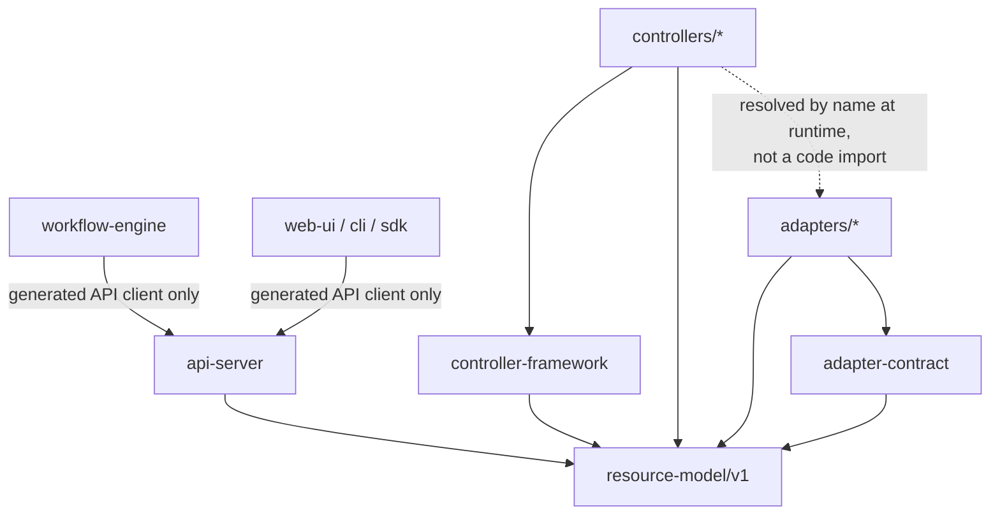
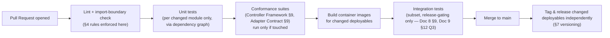

# OpenCHAI Repository Structure

**Document 12 of the Phase 0 Architecture Series**
**Status:** Draft for review
**Depends on:** Docs 1–11 (Terminology through Database Architecture)
**Feeds into:** Coding Standards & Engineering Guidelines, Five-Year Product Roadmap

---

## 1. Purpose and Scope

This document translates the logical component boundaries established throughout Phase 0 (Architecture Document's component list, Domain Model's bounded contexts, Controller Framework's Controller/Adapter split) into an actual repository layout, module boundaries, build/CI structure, and deployment topology decisions — including the two deployment-boundary questions explicitly left open by Doc 8 (§7) and Doc 9 (§12 Q1).

---

## 2. Monorepo vs. Polyrepo Decision

**Decision: a single monorepo for v1**, containing the API Server, Controller Framework + all in-tree Controllers, Adapters, Workflow Engine, Web UI, CLI, and shared libraries. Third-party/community Adapters (Master Plan Phase 5, Ecosystem) may live in separate repos once the Adapter Interface Contract (Doc 9) stabilizes as a versioned, external-facing contract.

| Reasoning | Detail |
|---|---|
| Shared schema evolution | Resource Model (Doc 3) changes must be reflected consistently across API Server, every Controller, and the Web UI simultaneously — a monorepo lets one PR make a coordinated change and CI verify it end-to-end, rather than coordinating version bumps across many repos during Phase 0–2 while the schema is still actively evolving |
| Shared framework code | The Controller Framework (Doc 8) and Adapter interface (Doc 9) are consumed by every Controller/Adapter — monorepo avoids publishing/versioning an internal package on every framework change |
| Independent deploy units still possible | A monorepo does not imply a single deployable — API Server, each Controller type, the Workflow Engine, and the Web UI are still built and deployed as separate artifacts (§5); the monorepo is a source-organization decision, not a runtime-coupling decision |

---

## 3. Top-Level Layout

```
openchai/
├── api-server/                 # FastAPI application (Architecture Doc §6.1)
│   ├── routers/                 # one module per Resource Kind group (Doc 6 §2)
│   ├── middleware/               # authn, authz, validation, tenancy (Doc 6 §8, Security Model §5.1)
│   ├── services/                 # per-Kind business logic, quota checks (Resource Model §9)
│   ├── repository/               # SQLAlchemy repository layer, RLS session mgmt (Database Arch §4)
│   └── schemas/                  # Pydantic models per Kind + apiVersion (Resource Model §4)
│
├── resource-model/              # apiVersion'd Pydantic schemas + JSON Schema exports
│   └── v1/                       # shared by api-server, controllers, cli, sdk — single source of truth
│
├── controller-framework/        # Doc 8: base Controller interface, work queue, leader election,
│   │                             #        status writer, metrics, health checks — Kind-agnostic
│   └── testing/                  # conformance test harness (Doc 8 §9) + fake Adapter base classes
│
├── controllers/
│   ├── provisioning/
│   ├── network/
│   ├── gpu/
│   ├── storage/
│   ├── kubernetes/
│   ├── slurm/
│   └── monitoring/               # each: reconcile() implementation only (Doc 8 §2)
│
├── adapter-contract/             # Doc 9: InfrastructureAdapter interface, ActionResult/ObservedState types,
│   └── testing/                  #        conformance suite (Doc 9 §9)
│
├── adapters/
│   ├── xcat/
│   ├── redfish/
│   ├── slurm/
│   ├── kubernetes/
│   ├── ldap/
│   ├── storage/
│   ├── network/
│   └── monitoring/
│
├── workflow-engine/              # Doc 10: DAG planner, task dispatcher, executor, rollback manager
│   └── templates/                 # built-in WorkflowTemplate definitions (Doc 10 §3)
│
├── web-ui/                       # React + TypeScript + Tailwind + Vite (Architecture Doc §10)
│   ├── src/
│   │   ├── resources/             # one module per Resource Kind, generated from resource-model/v1 where possible
│   │   └── shared/
│
├── cli/                          # OpenCHAI CLI, thin client over the REST API (Doc 6)
│
├── sdk/                          # generated/hand-maintained client libraries (Master Plan Phase 5)
│
├── migrations/                   # Alembic migration history (Database Architecture §8)
│
├── deploy/
│   ├── helm/                      # one chart per deployable unit (§5)
│   ├── docker/
│   └── adapter-registry.yaml      # Doc 9 §4 — deployment-time Adapter registration config
│
├── docs/
│   └── architecture/              # this Phase 0 series lives here, versioned with the code it describes
│
└── tools/                        # codegen (schemas → TS types), local dev environment, ci scripts
```

---

## 4. Module Boundary Rules (Enforced, Not Just Documented)

These map directly onto the architectural rules established earlier and are enforced via import-linting in CI, not left to reviewer discipline alone:

| Rule | Enforces |
|---|---|
| `controllers/*` may import `controller-framework` and `resource-model`, but **never** import from `adapters/*` directly — only via the Adapter Registry's name-based resolution (Doc 9 §4) | Controller Framework Design §3: Controllers depend on Adapters by declared name, not by direct code coupling |
| `adapters/*` may import `adapter-contract` and `resource-model`, but **never** import from `controllers/*` or `workflow-engine/*` | Architecture Document §4.1: Adapters are the leaf layer, never callers of upstream logic |
| `workflow-engine/*` may **only** call other components through generated API client code (the same one `cli/` and `sdk/` use) — never a direct in-process import of `api-server` internals | Reconciliation & State Model §10 / Workflow Engine Design §4: Workflow Tasks are indistinguishable from any other API caller |
| `api-server/*` is the **only** module permitted to import a database session/connection directly | Architecture Document §4.1: the API Server is the sole writer to the Resource Store |
| `resource-model/v1` has **zero** dependencies on any other in-repo module | It is the shared vocabulary (Terminology & Glossary, Resource Model) every other module depends on — it must never depend back |



---

## 5. Deployable Units (Resolving Doc 8 §7 and Doc 9 §12 Q1)

**Decision: Adapters deploy as a sidecar container within each Controller's pod, not as a separately-reachable shared service, for v1.**

| Option (Adapter deployment) | Pros | Cons | Verdict |
|---|---|---|---|
| Sidecar per Controller pod | Simple network topology (localhost call from Controller to its Adapter sidecar); matches Adapter Interface Contract's process-isolation requirement (Doc 9 §7) directly — a sidecar crash is isolated to that pod without extra infra | Some duplication if multiple Controller types need the same Adapter (e.g., both GPU and Provisioning Controllers use Redfish) — each gets its own sidecar instance | **Chosen for v1** — duplication cost is acceptable at expected Controller-type counts (dozens, not thousands) |
| Shared Adapter service (its own deployment, called over the network) | No duplication; centralizes credential access per Adapter type | Adds a network hop and a new failure mode (Adapter service reachability) to every reconciliation; more complex to reason about circuit-breaker isolation (Doc 9 §7) across many Controller callers | Rejected for v1; revisit if sidecar duplication becomes a measured resource cost problem at scale |

```
Pod: gpu-controller
├── container: gpu-controller           (controllers/gpu + controller-framework)
└── container: redfish-adapter-sidecar   (adapters/redfish + adapter-contract)
    # communicate over localhost, per Controller Framework Design §3's adapters() resolution
```

Each deployable unit gets its own Helm chart under `deploy/helm/`:

| Deployable | Chart | Scaling model |
|---|---|---|
| API Server | `api-server` | Horizontal, stateless (Architecture Document §9) |
| Each Controller type (+ sidecar Adapters) | `controller-{name}` | Horizontal, sharded (Controller Framework Design §4.2) |
| Workflow Engine | `workflow-engine` | Horizontal, stateless (Workflow Engine Design §8) |
| Web UI | `web-ui` | Horizontal, stateless static assets |
| PostgreSQL | External/managed, not chart-deployed by default | Primary + replicas (Database Architecture §6) |

---

## 6. Build and CI Pipeline Structure



- CI runs **only against changed modules and their dependents** (using the dependency graph from §4's boundary rules) rather than the entire monorepo on every PR — necessary for monorepo scalability as the Controller/Adapter count grows toward the full catalog (Resource Model §6).
- The import-boundary check (§4) runs first and fails fast — a PR violating module boundaries never reaches the more expensive test stages.

---

## 7. Versioning and Release Strategy

- Each deployable unit (§5) is versioned and released **independently** (its own semver, its own container tag), even though they share one repository — a Controller bugfix does not force a Web UI release.
- `resource-model/v1` changes are the one exception requiring coordinated attention: a merged change to it triggers CI to run the full test suite for **every** module that depends on it (API Server, all Controllers, all Adapters, Web UI codegen), since it's the shared vocabulary every other module trusts (§4).
- `WorkflowTemplate` definitions (Workflow Engine Design §3) are versioned independently of the `workflow-engine` code itself, living in `workflow-engine/templates/` with their own `metadata.version`, consistent with Doc 10 §3's requirement that in-flight Workflows are unaffected by template edits.

---

## 8. Local Development Environment

- `tools/` provides a single command to bring up a local stack: PostgreSQL, API Server, one instance of each Controller type with its sidecar Adapters pointed at simulators (a Redfish simulator, a local xCAT stub, etc.) rather than real hardware — mirroring the "fake Adapter" testing philosophy (Controller Framework Design §9) at the whole-stack level for local iteration.
- Schema codegen (`tools/codegen`) generates TypeScript types for `web-ui`/`cli`/`sdk` directly from `resource-model/v1`'s Pydantic models, so the frontend and backend can never silently drift out of sync on Resource shape.

---

## 9. Open Questions Carried Forward

1. Sidecar duplication cost (§5) — needs actual resource-usage measurement once real Controller-type counts and pod density are known; the shared-service alternative remains on the table for a future revision if warranted.
2. Third-party/community Adapter repos (Ecosystem phase, Master Plan Phase 5) — the versioned Adapter Interface Contract (Doc 9) is the prerequisite; this document doesn't yet define the external contribution/certification process for those repos.
3. Whether `sdk/` client libraries are hand-maintained per language or fully generated from the OpenAPI spec the API Server exposes — leaning toward generated-first with hand-maintained ergonomic wrappers, to be resolved alongside Coding Standards.

---

*End of Repository Structure. Next in sequence: Coding Standards & Engineering Guidelines.*
