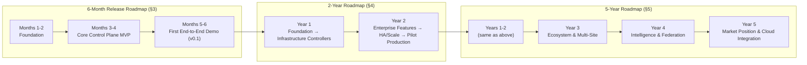
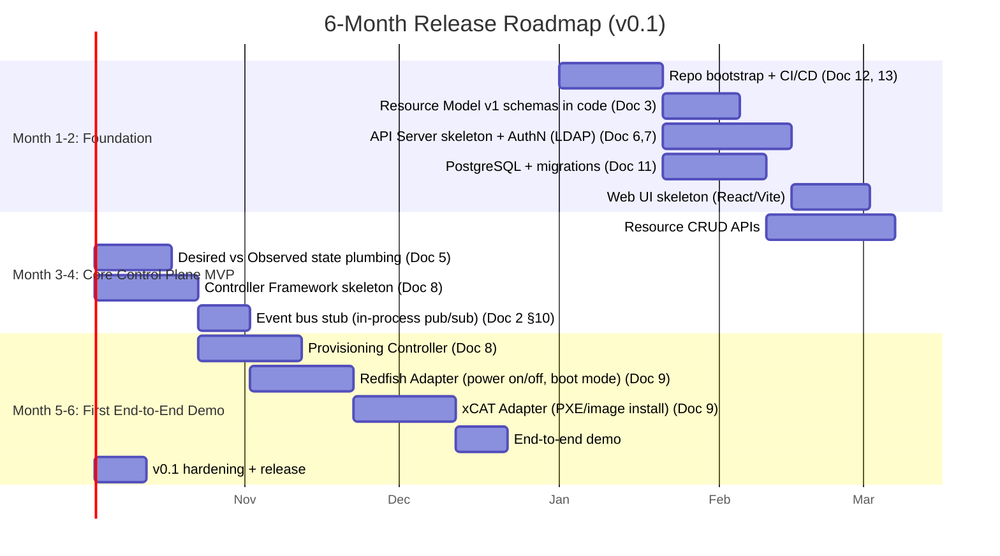

# OpenCHAI Product Roadmap

**Document 14 of the Phase 0 Architecture Series (final document)**
**Status:** Draft for review
**Depends on:** Docs 1–13 (Terminology through Coding Standards & Engineering Guidelines)
**Covers:** a 6-month initial release roadmap, a 2-year roadmap, and a 5-year strategic roadmap

---

## 1. Purpose and Scope

Docs 1–13 answered *how* OpenCHAI is built. This document answers *when* — sequencing the Master Plan's original phase list (Vision doc's Phases 1–7, and the engineering-process Phases 0–5) into three nested horizons: a near-term **6-month release roadmap** engineers can plan sprints against today, a **2-year roadmap** that gets OpenCHAI to a production-hardened, multi-tenant platform, and a **5-year roadmap** that positions it as the ecosystem the Master Plan envisioned (SDK, plugins, marketplace, national-scale deployments).

Each horizon is a **refinement**, not a replacement, of the one above it — the 6-month roadmap is the first slice of the 2-year roadmap, which is in turn the first two years of the 5-year roadmap. Nothing here contradicts the phase ordering established in the original Master Plan; this document sequences it in calendar time and ties each phase to the specific Phase 0 documents it depends on being finished.

---

## 2. How the Roadmap Horizons Relate



---

## 3. Six-Month Release Roadmap

**Goal of this horizon:** ship **v0.1** — a working, end-to-end (if narrow) demonstration that the Control Plane philosophy (Architecture Document §2) actually works: a user declares a small bare-metal Cluster's desired state via the API, and OpenCHAI provisions it, reconciles it, and shows its status — without any manual scripting in the loop. Everything in this window is single-tenant, single-Cluster scale, and intentionally excludes HA, full RBAC, and most Controllers/Adapters (those come in the 2-year roadmap, §4).

### 3.1 Timeline



### 3.2 Milestones and Exit Criteria

| Milestone | Target | Exit criteria |
|---|---|---|
| **M1: Foundation complete** | End of Month 2 | CI enforces module boundaries (Repository Structure §4, §6); `resource-model/v1` schemas exist for `Organization`, `Project`, `Cluster`, `Rack`, `Node`; API Server AuthNs against LDAP (Security Model §3.1) |
| **M2: Core Control Plane MVP** | End of Month 4 | Full CRUD via REST (API Design Guidelines) on the five foundation Kinds; `spec`/`status` write boundary enforced (Doc 6 §5); a Controller can watch and reconcile a Resource end-to-end against a **fake** Adapter |
| **M3 / v0.1: First real demo** | End of Month 6 | A user can `POST` a Cluster + Nodes via the API and watch OpenCHAI actually power on, PXE-boot, and image real (or lab) hardware via Redfish + xCAT, with `status.phase` correctly progressing `Pending → Provisioning → Ready` |

### 3.3 Deliberately Out of Scope for v0.1

To keep this horizon honest about what six months can realistically produce:

- No Workflow Engine (Doc 10) — v0.1 reconciles single Resources only; multi-step orchestration (e.g., full ClusterBringUp) is a Year-1 H2 item (§4).
- No RBAC beyond a single built-in admin role — full RBAC (Security Model §4) lands with Multi-Tenancy in Year 1 H2/Year 2.
- No GPU, Storage, Network, Kubernetes, or Slurm Controllers/Adapters — only Provisioning (bare-metal power + OS install) ships in v0.1.
- No HA — single API Server instance, single Controller instance acceptable for this milestone; sharding/leader election (Controller Framework Design §4.2) is exercised in code but not load-tested yet.

---

## 4. Two-Year Roadmap

**Goal of this horizon:** take v0.1's narrow demo to a **production-pilot-ready** platform — the full infrastructure Controller/Adapter catalog, multi-tenancy, RBAC, the Workflow Engine, and enough hardening (HA, monitoring, backup) to run a real pilot Cluster for an early adopter organization.

### 4.1 Timeline

```mermaid
gantt
    title 2-Year Roadmap
    dateFormat  YYYY-MM-DD
    axisFormat  %Y-%m

    section Year 1 H1 (Months 1-6)
    v0.1 (see §3 for detail)                    :y1h1, 2027-01-01, 180d

    section Year 1 H2 (Months 7-12)
    Workflow Engine v1 (Doc 10)                  :y1h2a, after y1h1, 60d
    Network + Storage Controllers/Adapters       :y1h2b, after y1h1, 60d
    GPU Controller/Adapter                       :y1h2c, after y1h2b, 30d
    Kubernetes Controller/Adapter                :y1h2d, after y1h2c, 45d
    Slurm Controller/Adapter                     :y1h2e, after y1h2d, 30d
    v0.5: Multi-Kind Cluster bring-up via Workflow :y1h2f, after y1h2e, 15d

    section Year 2 H1 (Months 13-18)
    Full RBAC + Multi-Tenancy (Doc 7)            :y2h1a, after y1h2f, 45d
    Monitoring Controller/Adapter (Prometheus)   :y2h1b, after y1h2f, 30d
    Secrets/Credential/Certificate mgmt (Vault)  :y2h1c, after y2h1a, 30d
    Audit + Alert Kinds fully wired              :y2h1d, after y2h1c, 20d
    v0.8: Multi-tenant, secured pilot candidate  :y2h1e, after y2h1d, 15d

    section Year 2 H2 (Months 19-24)
    HA: Controller sharding + DB replicas (Doc 11 §6) :y2h2a, after y2h1e, 45d
    Backup/DR (Doc 3 Backup Kind + Database Arch §10) :y2h2b, after y2h2a, 30d
    First production pilot deployment            :y2h2c, after y2h2b, 45d
    v1.0: General Availability                    :y2h2d, after y2h2c, 15d
```

### 4.2 Year 1 vs. Year 2 Summary

| | Year 1 | Year 2 |
|---|---|---|
| Primary focus | Breadth: get every Infrastructure Controller/Adapter and the Workflow Engine working | Depth: multi-tenancy, security hardening, HA, and one real production pilot |
| Master Plan phases covered | Phase 1 (Platform Foundation), Phase 2 (Core Control Plane), Phase 3 (Infrastructure) | Phase 4 (Enterprise Features), start of Phase 7 (HA & Scale) |
| Tenancy model | Single-tenant assumed throughout | Full multi-tenant, RBAC-enforced (Security Model) |
| Deployment scale | Lab/dev clusters, tens of Nodes | One real pilot Cluster, hundreds of Nodes |
| Key risk | Adapter integration complexity (Redfish/xCAT/Slurm/K8s all behave differently in practice) — see Risk Register §7 | Multi-tenancy correctness (RLS + RBAC) under real concurrent usage |

### 4.3 Two-Year Milestone Table

| Version | Target | Headline capability |
|---|---|---|
| v0.1 | Month 6 | Single-Cluster bare-metal provisioning, no orchestration |
| v0.5 | Month 12 | Multi-step Cluster bring-up (network + nodes + K8s/Slurm) via Workflow Engine |
| v0.8 | Month 18 | Multi-tenant, RBAC-secured, Vault-backed secrets, full Audit trail |
| **v1.0 (GA)** | Month 24 | HA, backup/DR, first real production pilot running |

---

## 5. Five-Year Roadmap

**Goal of this horizon:** evolve OpenCHAI from a hardened single-platform product (v1.0, end of Year 2) into the **ecosystem and scale story** the Master Plan's Vision described — "scale from small clusters to national supercomputing deployments" and Phase 5's SDK/Plugins/Marketplace — while remaining realistic that ecosystem and scale goals depend on adoption traction that can't be fully scheduled in advance.

### 5.1 Timeline

```mermaid
gantt
    title 5-Year Roadmap (Strategic View)
    dateFormat  YYYY-MM-DD
    axisFormat  %Y

    section Years 1-2: Foundation & GA
    See §4 for detail (v0.1 -> v1.0 GA)          :y12, 2027-01-01, 730d

    section Year 3: Ecosystem & Multi-Site
    Public SDK + versioned Adapter contract for 3rd parties (Doc 9 §8) :y3a, after y12, 120d
    Plugin architecture (Master Plan Phase 5)     :y3b, after y3a, 90d
    Multi-site / multi-datacenter Cluster federation :y3c, after y3b, 120d
    National-scale load testing (1000s of Nodes)  :y3d, after y3c, 60d

    section Year 4: Intelligence & Federation
    Cross-Cluster capacity planning & forecasting :y4a, after y3d, 120d
    Policy-driven cost/power optimization          :y4b, after y4a, 90d
    Cross-Organization federation (shared backbone Networks, Domain Model §7) :y4c, after y4b, 120d
    Marketplace v1 (community Adapters/Plugins)    :y4d, after y4c, 90d

    section Year 5: Market Position & Cloud Integration
    Hybrid/public-cloud burst-out integration (Master Plan Vision) :y5a, after y4d, 150d
    Compliance certifications (as required by target sector) :y5b, after y5a, 90d
    Ecosystem maturity: 3rd-party Adapter certification program :y5c, after y5b, 90d
    v2.0: Federated, ecosystem-driven platform      :y5d, after y5c, 30d
```

### 5.2 Year-by-Year Narrative

| Year | Theme | Representative capabilities |
|---|---|---|
| **1** | Foundation | Resource Model, core Controllers/Adapters, Workflow Engine, v0.1→v0.5 |
| **2** | Production-readiness | Multi-tenancy, RBAC, secrets, HA, backup/DR, v1.0 GA, first pilot |
| **3** | Ecosystem & scale | Public SDK/plugin architecture, multi-site federation, load-tested at national scale |
| **4** | Intelligence & federation | Cross-Cluster planning/forecasting, cost/power-aware Policies, cross-Organization federation, Marketplace v1 |
| **5** | Market position | Hybrid/cloud burst-out (the Master Plan's "future cloud integration"), compliance certifications, mature 3rd-party ecosystem, v2.0 |

### 5.3 Explicit Dependencies Between Horizons

- Year 3's public SDK/Plugin work is **not schedulable with confidence today** — it depends on the Adapter Interface Contract (Doc 9) having proven stable across the Year 1–2 in-tree Adapters first; if that contract needs breaking changes during Year 2, Year 3's ecosystem work slips accordingly rather than being forced onto a fixed date.
- Year 4's cross-Organization federation directly extends the cross-Project sharing model (Security Model §5.2) — it is architecturally prepared for by Year 2's work, not something requiring a redesign, but it is not attempted before multi-tenancy (Year 2) has been proven correct in production.
- Year 5's cloud burst-out integration is the direct fulfillment of the original Master Plan Vision statement ("future cloud integration") — modeled as new Infrastructure Adapters (e.g., an AWS/Azure/GCP capacity Adapter) fitting the existing Adapter Interface Contract (Doc 9), not a parallel architecture.

---

## 6. Success Metrics by Horizon

| Horizon | Primary metric(s) |
|---|---|
| 6-month (v0.1) | One successful end-to-end demo: declared Cluster spec → provisioned, `Ready` Nodes, with zero manual intervention outside the API |
| 2-year (v1.0 GA) | One real production pilot running for 30+ consecutive days without a Sev-1 incident traced to a Control Plane defect (as opposed to underlying hardware/infra failure, which the platform is expected to detect and report, not prevent) |
| 5-year | Number of independently-maintained 3rd-party Adapters/Plugins in the Marketplace; number of distinct Organizations running OpenCHAI in production; largest single deployment's Node count (tracking toward the "national supercomputing" goal) |

---

## 7. Risk Register

| Risk | Horizon most affected | Mitigation |
|---|---|---|
| Adapter integration complexity (real Redfish/xCAT/Slurm/K8s behavior diverges from the clean interface in Doc 9) | 6-month, Year 1 | Conformance suite (Doc 9 §9) catches contract violations early; budget explicit integration-testing time per Adapter rather than assuming interface compliance implies working behavior |
| Multi-tenancy correctness under real concurrent load | Year 2 | RLS + RBAC dual-layer defense (Security Model §5.1) is the mitigation; still requires dedicated adversarial/load testing before GA, not just unit tests |
| Workflow Engine build (in-house) proves insufficient at scale | Year 1 H2 onward | Doc 10 §2 explicitly flagged Temporal-class adoption as a fallback; revisit that decision if Year 2/3 load testing reveals the in-house engine can't keep up |
| Ecosystem adoption lower than hoped | Year 3+ | Years 1–2 deliver a complete, usable platform on their own merits regardless of ecosystem traction — the 5-year roadmap's later years are explicitly the part most subject to revision based on real adoption signals, not a fixed commitment |
| Team scaling / hiring lags the roadmap | All horizons | This roadmap assumes engineering capacity will be resourced to match; it is a target sequencing, not a guarantee independent of staffing — see Open Questions |

---

## 8. Assumptions

- This roadmap assumes a dedicated engineering team is staffed and ramped starting at the 6-month roadmap's Month 1 — actual team size/composition is not specified here and materially affects whether these dates are achievable.
- The 6-month and Year-1 roadmap assume access to real or lab bare-metal hardware for Redfish/xCAT integration testing from Month 3 onward; a purely simulated environment would let coding proceed but would not validate the v0.1 exit criteria (§3.2) as written.
- The 5-year roadmap's Years 3–5 are explicitly **directional, not committed** — they carry far more uncertainty than Years 1–2 and should be revisited at least annually as real usage data comes in, consistent with this being a living roadmap rather than a fixed contract.

---

## 9. Open Questions Carried Forward

1. Team size/composition assumption (§8) is unstated — should this roadmap be re-cut once actual headcount is confirmed, given dates are highly sensitive to that input?
2. Which real-world pilot partner/use case anchors the Year 2 production pilot (§4.3)? Choosing this early would let non-functional requirements (compliance, scale, specific hardware vendors) shape Year 1–2 priorities more concretely.
3. Should the Workflow Engine build-vs-adopt decision (Doc 10 §2, restated as a Year 1 H2 risk here) have an explicit re-evaluation checkpoint built into the roadmap (e.g., end of Year 1) rather than being purely reactive to problems discovered later?

---

*End of Product Roadmap. This completes the Phase 0 Architecture Series (Documents 1–14).*
