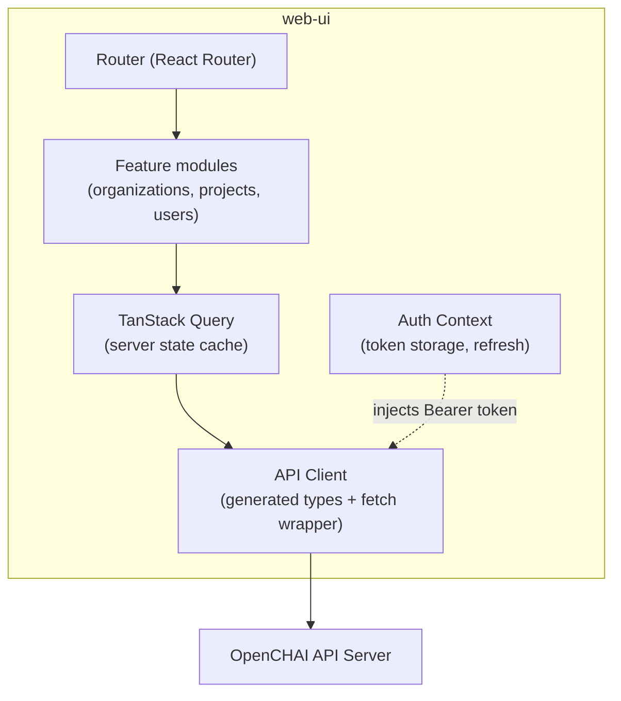
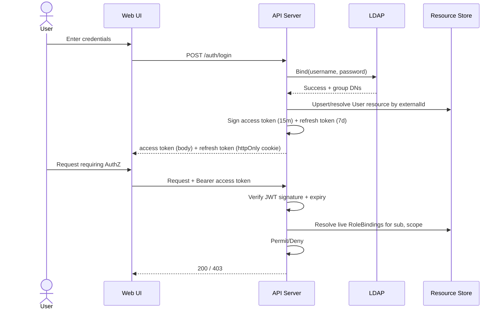

# OpenCHAI Phase 1: Platform Foundation — Implementation Guide

**Status:** Draft for review
**Depends on:** Phase 0 Architecture Series (Docs 1–14), especially Architecture Document (Doc 2), Resource Model Specification (Doc 3), API Design Guidelines (Doc 6), Security & Multi-Tenancy Model (Doc 7), Database Architecture (Doc 11), Repository Structure (Doc 12), Coding Standards & Engineering Guidelines (Doc 13)
**Purpose:** Turn Phase 0's architectural decisions into a concrete, buildable Platform Foundation — the repository skeleton, backend, frontend, AuthN/AuthZ, database, migrations, configuration, logging, and metrics that every later Controller/Adapter/Workflow will be built on top of.

> **How this document relates to Phase 0:** Phase 0 decided *what must be true* (e.g., "the API Server is the only writer to the Resource Store," Doc 2 §4.1) and *why* (e.g., "hybrid JSONB schema," Doc 11 §2). This document decides the concrete files, folders, libraries, and code patterns that make those decisions real on Day 1 of Phase 1. Where Phase 0 left something open for "the implementation," this is that implementation decision — and each one is flagged as such.

---

## Table of Contents

1. [Repository Structure](#1-repository-structure)
2. [Backend Architecture](#2-backend-architecture)
3. [Frontend Architecture](#3-frontend-architecture)
4. [Authentication and Authorization](#4-authentication-and-authorization)
5. [PostgreSQL Database Design and Setup](#5-postgresql-database-design-and-setup)
6. [Database Migration Framework](#6-database-migration-framework)
7. [Configuration Management](#7-configuration-management)
8. [Logging Framework](#8-logging-framework)
9. [Metrics and Observability](#9-metrics-and-observability)
10. [How Phase 1 Fits the Long-Term Vision](#10-how-phase-1-fits-the-long-term-vision)

---

## 1. Repository Structure

### 1.1 Architecture and Rationale

Repository Structure (Doc 12) already decided: one monorepo, module-boundary rules enforced in CI, and one deployable unit per major component. Phase 1's job is to stand up the **subset** of that structure needed for Platform Foundation — the parts that don't yet require Controllers/Adapters/Workflow Engine (those arrive in Phase 2/3) but that everything else will be built on:

- `resource-model/v1` must exist first — it is the zero-dependency shared vocabulary (Doc 12 §4) every other module trusts.
- `api-server` and `web-ui` need real skeletons, not stubs, because Phase 1's exit criteria (Doc 14 §3.2, Milestone M1) requires working AuthN and CRUD on the foundation Kinds.
- `migrations`, `deploy/`, and `tools/` need to exist from day one so database schema, local dev environment, and CI are never "added later" as an afterthought — retrofitting these onto months of undisciplined code is exactly the failure mode Doc 13's Definition of Done (§10) is designed to prevent.

### 1.2 Phase 1 Directory Tree

```
openchai/
├── resource-model/
│   └── v1/
│       ├── __init__.py
│       ├── common.py              # ResourceEnvelope, Metadata, Conditions base models
│       ├── organization.py
│       ├── project.py
│       ├── user.py
│       ├── role.py
│       └── json_schema_export.py  # generates JSON Schema for tools/codegen
│
├── api-server/
│   ├── pyproject.toml
│   ├── app/
│   │   ├── main.py                 # FastAPI app factory, middleware wiring
│   │   ├── config.py               # pydantic-settings (§7)
│   │   ├── logging.py              # structured logging setup (§8)
│   │   ├── metrics.py              # Prometheus instrumentation (§9)
│   │   ├── middleware/
│   │   │   ├── authn.py
│   │   │   ├── authz.py
│   │   │   ├── tenancy.py          # sets RLS session vars (Doc 11 §4)
│   │   │   ├── request_id.py
│   │   │   └── error_handling.py   # RFC 7807 envelope (Doc 6 §13)
│   │   ├── routers/
│   │   │   ├── organizations.py
│   │   │   ├── projects.py
│   │   │   ├── users.py
│   │   │   ├── roles.py
│   │   │   ├── auth.py             # /auth/login, /auth/refresh
│   │   │   └── health.py           # /healthz, /readyz (§9)
│   │   ├── services/
│   │   │   ├── organization_service.py
│   │   │   ├── project_service.py
│   │   │   └── rbac_service.py
│   │   ├── repository/
│   │   │   ├── base.py             # generic Resource repository (Doc 11 §2)
│   │   │   ├── session.py          # session factory + RLS var setting
│   │   │   └── models.py           # SQLAlchemy models mapping to resources table
│   │   └── schemas/
│   │       └── (re-exports resource-model/v1, adds request/response wrappers)
│   └── tests/
│       ├── unit/
│       └── conftest.py
│
├── web-ui/
│   ├── package.json
│   ├── vite.config.ts
│   ├── tailwind.config.ts
│   ├── src/
│   │   ├── main.tsx
│   │   ├── app/
│   │   │   ├── router.tsx
│   │   │   └── providers.tsx        # QueryClient, Auth context
│   │   ├── api/
│   │   │   ├── client.ts             # generated + hand-written wrapper
│   │   │   └── types/                # generated from resource-model/v1
│   │   ├── features/
│   │   │   ├── auth/
│   │   │   ├── organizations/
│   │   │   ├── projects/
│   │   │   └── users/
│   │   └── shared/
│   │       ├── components/
│   │       └── hooks/
│
├── migrations/
│   ├── alembic.ini
│   ├── env.py
│   └── versions/
│
├── deploy/
│   ├── docker/
│   │   ├── api-server.Dockerfile
│   │   └── web-ui.Dockerfile
│   ├── docker-compose.dev.yaml       # local Postgres + api-server + web-ui
│   └── helm/
│       └── api-server/
│
├── tools/
│   ├── codegen/
│   │   └── generate_ts_types.py      # resource-model/v1 → web-ui/src/api/types
│   └── dev-env/
│       └── seed_dev_data.py
│
├── docs/
│   └── architecture/                 # Phase 0 series lives here
│
├── .github/workflows/ci.yaml         # or equivalent CI config
├── pyproject.toml                    # workspace root (if using uv/poetry workspaces)
└── README.md
```

### 1.3 Coding Standards for This Structure

- No module outside `resource-model/v1` may define its own copy of a Resource envelope shape — every Pydantic model for `Organization`, `Project`, `User`, `Role` lives in `resource-model/v1` and is imported, never re-declared (Doc 12 §4's rule, enforced from the first commit).
- `api-server/app/repository/` is the **only** place a database session is created or a SQL/ORM query is issued — services and routers never import SQLAlchemy directly (Doc 13 §8).
- CI's import-boundary lint (Doc 12 §6) is configured in Phase 1, not deferred — even with only two modules (`resource-model`, `api-server`) plus `web-ui`, the rule "web-ui never imports api-server internals" is real starting now.

### 1.4 Scalability Considerations

- Keeping `resource-model/v1` a pure-schema, zero-dependency package from day one means it can be published as an installable package later (for the SDK, Doc 12 §9 open question) without restructuring — a Phase 1 decision with a direct payoff in the Year 3 ecosystem roadmap (Doc 14 §5).
- `docker-compose.dev.yaml` is deliberately kept separate from `deploy/helm/` — local dev convenience must never leak into production deployment assumptions (e.g., dev Postgres has no RLS-bypass superuser trickery that production would need to avoid).

### 1.5 Security Recommendations

- `.env` files (local dev secrets, e.g., a dev LDAP bind password) are `.gitignore`d from commit 1, with a checked-in `.env.example` containing only placeholder values — this is the kind of thing that's trivial to get right at the start and painful to retrofit after a real secret has already been committed to history.
- CI secrets (registry credentials, etc.) use the CI platform's native secret store, never plaintext in `.github/workflows/ci.yaml` or equivalent.

### 1.6 Long-Term Vision Fit

This structure is intentionally the smallest slice of the full Repository Structure (Doc 12) that is still internally consistent — every later addition (a Controller, an Adapter, the Workflow Engine) plugs into the same `resource-model/v1` foundation and the same CI/module-boundary discipline, rather than Phase 1 code needing to be reorganized when Phase 2/3 arrive.

---

## 2. Backend Architecture

### 2.1 Architecture and Rationale

The Architecture Document (Doc 2 §6.1) specified the API Server's internal layering: Router → AuthN Middleware → AuthZ Middleware → Validation → Service Layer → Repository Layer. Phase 1 implements exactly this layering for the foundation Kinds (`Organization`, `Project`, `User`, `Role`), using it as the reference implementation every later Kind's endpoints will copy.

```mermaid
flowchart LR
    REQ["Incoming HTTP request"] --> RID["Request ID middleware"]
    RID --> AUTHN["AuthN middleware §4"]
    AUTHN --> TEN["Tenancy middleware\n(sets RLS vars, Doc 11 §4)"]
    TEN --> AUTHZ["AuthZ middleware §4"]
    AUTHZ --> ROUTE["Router\n(FastAPI path operation)"]
    ROUTE --> VALID["Pydantic validation\n(resource-model/v1 schemas)"]
    VALID --> SVC["Service layer\n(business rules, quota checks)"]
    SVC --> REPO["Repository layer\n(SQLAlchemy, one session per request)"]
    REPO --> DB[("PostgreSQL")]
```



### 2.2 Recommended Technologies

| Concern | Choice | Rationale |
|---|---|---|
| Web framework | **FastAPI** | Master Plan's stated stack (Doc 2 §10); native Pydantic integration matches Resource Model's schema-first design |
| Data validation | **Pydantic v2** | Directly backs `resource-model/v1`; fast, mature |
| ORM | **SQLAlchemy 2.0 (async)** | Matches Master Plan stack; async engine pairs with FastAPI's async request handling for I/O-bound DB calls |
| ASGI server | **Uvicorn** (behind Gunicorn in production, multi-worker) | Standard FastAPI deployment pattern |
| Dependency injection | **FastAPI's native `Depends()`** | Avoids introducing a second DI framework; sufficient for this scale |

### 2.3 Implementation Strategy

**App factory pattern** (`app/main.py`) — the app is built by a function, not built at import time, so tests can construct isolated instances with overridden dependencies (e.g., a fake AuthN provider):

```python
# app/main.py
from fastapi import FastAPI
from app.config import Settings
from app.middleware import authn, authz, tenancy, request_id, error_handling
from app.routers import organizations, projects, users, roles, auth, health

def create_app(settings: Settings) -> FastAPI:
    app = FastAPI(title="OpenCHAI API", version="v1")

    app.add_middleware(error_handling.ErrorHandlingMiddleware)
    app.add_middleware(request_id.RequestIDMiddleware)
    app.add_middleware(authn.AuthNMiddleware, settings=settings)
    app.add_middleware(tenancy.TenancyMiddleware)
    app.add_middleware(authz.AuthZMiddleware)

    app.include_router(health.router)
    app.include_router(auth.router, prefix="/api/v1/auth")
    app.include_router(organizations.router, prefix="/api/v1/organizations")
    app.include_router(projects.router)
    app.include_router(users.router)
    app.include_router(roles.router)
    return app

app = create_app(Settings())
```

**Router → Service → Repository, illustrated for Project (a representative foundation Kind):**

```python
# app/routers/projects.py
@router.patch("/organizations/{org_id}/projects/{project_id}", response_model=ProjectEnvelope)
async def update_project(
    org_id: UUID, project_id: UUID, patch: ProjectSpecPatch,
    if_match: int = Header(..., alias="If-Match"),          # Doc 6 §12
    identity: Identity = Depends(get_current_identity),       # from AuthN middleware
    svc: ProjectService = Depends(get_project_service),
):
    return await svc.update(org_id, project_id, patch, expected_version=if_match, actor=identity)
```

```python
# app/services/project_service.py
class ProjectService:
    def __init__(self, repo: ProjectRepository, rbac: RBACService):
        self._repo = repo
        self._rbac = rbac

    async def update(self, org_id, project_id, patch, expected_version, actor) -> Project:
        await self._rbac.require(actor, verb="write", kind="Project", scope=(org_id, project_id))
        await self._validate_quota_impact(org_id, patch)          # Resource Model §9.6
        return await self._repo.update_spec(project_id, patch, expected_version)  # 409 on mismatch
```

```python
# app/repository/base.py
class ResourceRepository(Generic[T]):
    """Generic repository for any Resource Kind's spec/status write boundary (Doc 6 §5)."""

    async def update_spec(self, resource_id: UUID, patch: dict, expected_version: int) -> T:
        result = await self._session.execute(
            update(ResourceRow)
            .where(ResourceRow.id == resource_id, ResourceRow.resource_version == expected_version)
            .values(
                spec=ResourceRow.spec.op("||")(patch),
                resource_version=ResourceRow.resource_version + 1,
                generation=ResourceRow.generation + 1,
            )
            .returning(ResourceRow)
        )
        row = result.scalar_one_or_none()
        if row is None:
            raise ConcurrencyConflictError(resource_id)   # → 409, API Design Guidelines §12
        return self._to_domain(row)

    async def update_status(self, resource_id: UUID, status_patch: dict) -> T:
        """Distinct method — the ONLY path a Controller identity may call (Doc 6 §5)."""
        ...
```

Notice `update_spec` and `update_status` are **separate methods**, not one method with a flag — this makes the Resource Model's write-boundary rule (Doc 3 §3.1, Doc 6 §5) structurally visible in the code, not just enforced by a runtime check that could be bypassed by a future refactor.

### 2.4 Project Structure Detail

See §1.2 for the tree. Key convention: **one router module per Resource Kind group**, mirroring the Domain Model's bounded contexts (Doc 4 §2) — `organizations.py`/`projects.py`/`users.py`/`roles.py` together form the Tenancy & Identity Context's API surface, so a future engineer working in that context has one clear place to look, not scattered logic.

### 2.5 Coding Standards

- Every router function's signature must show its full dependency chain (`Depends(...)`) explicitly — no hidden global state, consistent with FastAPI idioms and testability.
- Every service method that mutates state takes an `actor: Identity` parameter, even if the current implementation doesn't yet use it for every check — this makes it structurally impossible to "forget" to pass identity through as more AuthZ/audit logic accretes (Doc 13 §8's re-validation rule made easy to satisfy).
- Async all the way down: no blocking I/O calls inside an `async def` route/service/repository method (no `requests`, only `httpx.AsyncClient`; no sync `psycopg2`, only SQLAlchemy's async engine).

### 2.6 Scalability Considerations

- Stateless API Server processes (Architecture Document §9) — no in-process session state beyond a single request's lifetime; horizontal scaling is just "run more Uvicorn/Gunicorn workers/pods," with no sticky-session requirement, since AuthN is token-based (Security Model §3.2).
- Connection pooling via SQLAlchemy's async pool, sized conservatively per instance and fronted by PgBouncer (Database Architecture §9) so scaling API Server replicas doesn't linearly scale raw Postgres connection count.

### 2.7 Security Recommendations

- The AuthN → Tenancy → AuthZ middleware order (§2.1 diagram) is **not arbitrary** — Tenancy (which sets RLS session variables) must run before AuthZ so that an AuthZ check evaluating "does this Role apply within this scope" is itself already operating under the correct tenant boundary, and before any repository call, so a bug in a single route handler cannot accidentally query outside the caller's tenant even before AuthZ denies the request.
- The error-handling middleware (`error_handling.py`) must catch and sanitize exceptions **before** they reach a generic FastAPI exception handler that might leak a stack trace to the client — this is where Doc 13 §4's "secrets never appear in an error message" rule is enforced structurally in the backend.

### 2.8 Long-Term Vision Fit

The Router/Service/Repository split, the generic `ResourceRepository[T]`, and the separate `update_spec`/`update_status` methods are written now, for four Kinds, in a way that generalizes to all ~25 Resource Kinds (Doc 3 §6) without modification — Phase 2/3 Controllers will call `update_status` through the exact same repository method a Project's `update_spec` uses today, keeping the "one schema, one write-boundary rule" promise real as the platform grows toward the Master Plan's full Resource catalog.

---

## 3. Frontend Architecture

### 3.1 Architecture and Rationale

The Web UI's job, per Architecture Document §4, is to be a thin, stateless consumer of the same REST API the CLI and SDK use (Doc 6) — it must never encode business logic that the API Server should own (e.g., no client-side quota calculation that could drift from the server's actual enforcement, Resource Model §9.6).



### 3.2 Recommended Technologies

| Concern | Choice | Rationale |
|---|---|---|
| Framework | **React 18 + TypeScript** | Master Plan's stated stack (Doc 2 §10) |
| Build tool | **Vite** | Master Plan's stated stack; fast local dev iteration |
| Styling | **Tailwind CSS** | Master Plan's stated stack |
| Server state | **TanStack Query (React Query)** | Purpose-built for exactly the "cache + refetch + optimistic update" pattern needed against a REST API with `resourceVersion`-based concurrency (Doc 6 §12) — avoids hand-rolling caching/retry logic |
| Client-only UI state | **Zustand** (lightweight) or React Context for small cases | Avoids over-engineering with a heavier state manager (e.g., Redux) when most state genuinely is server state owned by TanStack Query |
| Type generation | **openapi-typescript** (or hand-authored, generated from `resource-model/v1`'s JSON Schema export, §1.2) | Keeps frontend types provably in sync with backend schemas (Repository Structure §8) |

### 3.3 Implementation Strategy

**Feature-folder structure**, mirroring backend router-per-Kind-group organization (§2.4) so a contributor working on "Projects" finds both the frontend feature and backend router named and organized the same way:

```typescript
// src/features/projects/api.ts
export function useProject(orgId: string, projectId: string) {
  return useQuery({
    queryKey: ['projects', orgId, projectId],
    queryFn: () => apiClient.get<ProjectEnvelope>(`/organizations/${orgId}/projects/${projectId}`),
  });
}

export function useUpdateProject(orgId: string, projectId: string) {
  const queryClient = useQueryClient();
  return useMutation({
    mutationFn: (patch: { spec: Partial<ProjectSpec>; ifMatch: number }) =>
      apiClient.patch(`/organizations/${orgId}/projects/${projectId}`, patch.spec, {
        headers: { 'If-Match': String(patch.ifMatch) },
      }),
    onSuccess: () => queryClient.invalidateQueries({ queryKey: ['projects', orgId, projectId] }),
  });
}
```

- Every mutation hook requires the caller to supply `ifMatch` explicitly (from the last-read `resourceVersion`) — the frontend never "blind writes," mirroring API Design Guidelines §12's concurrency contract, and surfacing a 409 as a "this was changed elsewhere, please review" UI state rather than silently retrying with stale data.

**Auth context** wraps token storage and silent refresh (Security Model §3.2's short-lived access token + refresh token):

```typescript
// src/features/auth/AuthProvider.tsx
// Access token held in memory only (not localStorage) to reduce XSS exfiltration risk;
// refresh token handled via httpOnly cookie set by the API Server's /auth/login response.
```

### 3.4 Project Structure Detail

See §1.2. `src/api/types/` is **generated, not hand-written** — regenerated by `tools/codegen/generate_ts_types.py` whenever `resource-model/v1` changes (Repository Structure §8), and is checked into version control with a CI check that fails if generated output doesn't match what's committed (catching a forgotten regeneration).

### 3.5 Coding Standards

- No component directly calls `fetch`/`axios` — every API interaction goes through `src/api/client.ts`, so token injection, error envelope parsing (RFC 7807, Doc 6 §13), and request-id propagation happen in exactly one place.
- Components in `features/*` may not import from another feature's internals (e.g., `features/projects` must not reach into `features/users/internal-state`) — cross-feature data needs go through `shared/` or the API layer, mirroring the backend's bounded-context discipline (Doc 4 §2) on the frontend.

### 3.6 Scalability Considerations

- TanStack Query's cache + background refetch naturally suits the eventual Watch-based live updates (API Design Guidelines §10) — Phase 1 uses polling-based `refetchInterval` as a placeholder; swapping to an SSE-backed live subscription later is a data-source change inside the same `useQuery` hooks, not a UI rearchitecture.
- Code-splitting by feature (Vite's default dynamic-import behavior with React Router lazy routes) keeps initial bundle size manageable as more feature modules (Clusters, Nodes, GPUs...) are added in Phase 2/3.

### 3.7 Security Recommendations

- Access tokens held in memory, never `localStorage` (mitigates XSS token theft, per §3.3's note); refresh token as an `httpOnly`, `Secure`, `SameSite=Strict` cookie.
- Every write action's UI affordance (buttons, forms) is gated by the current user's known RBAC permissions (fetched once per session) purely as a **UX convenience** (hide/disable actions the user can't perform) — never as the actual security boundary, which remains entirely server-side (Security Model §4). The frontend hiding a button is not a substitute for the API Server's AuthZ check.

### 3.8 Long-Term Vision Fit

Structuring the UI around generated types and a thin API client from day one means the eventual CLI and SDK (Repository Structure §3, Master Plan Phase 5) can reuse the same generated-type pipeline — the Web UI is Phase 1's proof that the "one schema, many clients" model (Resource Model §1) actually works end to end, before the CLI/SDK are built against the same guarantee.

---

## 4. Authentication and Authorization

### 4.1 Architecture and Rationale

Security & Multi-Tenancy Model (Doc 7) specified the full model; Phase 1 implements its v1 slice: LDAP-backed AuthN, JWT session tokens, and RBAC evaluated live against `RoleBinding` state (never cached in the token, Doc 7 §3.2).



### 4.2 Recommended Technologies

| Concern | Choice | Rationale |
|---|---|---|
| LDAP client | `ldap3` (Python) | Mature, pure-Python, async-friendly wrapper available |
| JWT | `python-jose` or `PyJWT` | Standard, well-audited libraries |
| Password/credential handling | Never touches OpenCHAI's own DB — LDAP owns credential storage entirely | OpenCHAI is not a credential store for human users in v1 (Security Model §3.1) |
| RBAC evaluation | Hand-rolled service (`rbac_service.py`) querying `RoleBinding` rows directly | The model (Doc 7 §4) is simple enough (verb, Kind, scope union) that a third-party policy engine (e.g., OPA) is unnecessary overhead for Phase 1 — revisit only if Policy (Doc 7 §4.4) rules grow materially more complex |

### 4.3 Implementation Strategy

**AuthN middleware** resolves a request's `Identity` (human `User` or Controller service identity, Security Model §3.3) and attaches it to request state; it does not itself decide permissions:

```python
# app/middleware/authn.py
class AuthNMiddleware(BaseHTTPMiddleware):
    async def dispatch(self, request: Request, call_next):
        token = extract_bearer_token(request)
        if token is None:
            request.state.identity = None   # unauthenticated; AuthZ will deny anything requiring auth
        else:
            claims = verify_and_decode(token, self._settings.jwt_public_key)
            request.state.identity = Identity(
                sub=claims["sub"], org_id=claims["orgId"],
                identity_type=claims["identityType"],
            )
        return await call_next(request)
```

**RBAC service**, called by AuthZ middleware and directly by services needing fine-grained checks (§2.3):

```python
# app/services/rbac_service.py
class RBACService:
    async def permitted_verbs(self, identity: Identity, kind: str, scope: Scope) -> set[str]:
        bindings = await self._repo.role_bindings_for(identity.sub, scope)   # org-wide + project-scoped, Doc 7 §4.3
        return {v for b in bindings for v in b.role.permissions if matches(v, kind)}

    async def require(self, identity: Identity, verb: str, kind: str, scope: Scope) -> None:
        if identity is None:
            raise AuthenticationRequiredError()
        if verb not in await self.permitted_verbs(identity, kind, scope):
            await self._audit.record_denied(identity, verb, kind, scope)   # Security Model §9
            raise ForbiddenError(verb, kind, scope)
```

**Controller identity distinction**, enforced at the `/status` subresource specifically (API Design Guidelines §5, Security Model §3.3):

```python
# app/routers/projects.py (status subresource — pattern repeated for every Kind from Phase 2 onward)
@router.patch("/organizations/{org_id}/projects/{project_id}/status")
async def update_project_status(..., identity: Identity = Depends(get_current_identity)):
    if identity.identity_type != "controller":
        raise ForbiddenError(reason="status writes are Controller-only, Doc 6 §5")
    ...
```

### 4.4 Project Structure Detail

`app/middleware/authn.py`, `authz.py`, `tenancy.py` are three separate files/classes (§1.2), not one combined middleware — matching Doc 6 §8's explicit three-stage pipeline and making each stage's single responsibility testable in isolation.

### 4.5 Coding Standards

- No route handler calls `RBACService` with a hardcoded verb string typo-prone at each call site — verbs are an enum (`Verb.READ`, `Verb.WRITE`, `Verb.DELETE`, `Verb.STATUS_WRITE`, `Verb.ACT`) shared from `resource-model/v1` or a dedicated `auth` shared module, so a misspelled permission string fails at type-check time, not silently at runtime (Doc 13 §8's "explicit RBAC declaration" rule made mechanically enforceable).
- Every new endpoint's PR must include its `RBACService.require(...)` call in the same diff as the route itself — reviewers (Doc 13 §7) check for this specifically as part of required review on `api-server/app/middleware` and any new router.

### 4.6 Scalability Considerations

- `permitted_verbs` results may be cached per-request (computed once, reused if a single request needs multiple checks) but **never** cached across requests or in the JWT (Security Model §3.2's explicit rule) — Phase 1 accepts the DB round-trip cost per request as the correct tradeoff for immediate Role-revocation effect; if this becomes a measured bottleneck at scale, a short-TTL cache with explicit invalidation (mirroring the Policy-check caching pattern, Reconciliation Model §12 Q1 / Controller Framework Design §5.3) is the documented fallback, not a redesign.

### 4.7 Security Recommendations

- JWT signing uses **asymmetric keys** (RS256), not a shared HMAC secret — the API Server holds the private key; any future component that only needs to *verify* tokens (not issue them) gets the public key only, minimizing where the signing secret exists.
- Refresh tokens are stored server-side (a `refresh_tokens` table, hashed) so they can be revoked (e.g., on logout, on suspected compromise) — a stateless-refresh-token design would preclude revocation, an unacceptable gap for an infrastructure control plane.
- Every LDAP bind failure and every AuthZ denial is written to `audit_log` (§4.3's `_audit.record_denied`, Security Model §9) from Phase 1 onward — audit logging is not a "Phase 4 Enterprise Features" add-on for these two events specifically, since retrofitting audit history is impossible (you can't audit-log the past).

### 4.8 Long-Term Vision Fit

Building AuthN/AuthZ as the very first Phase 1 subsystem (rather than "add auth later") directly reflects the Master Plan's Core Philosophy that OpenCHAI is a Control Plane, not a script — a Control Plane that can't answer "who is allowed to change this" from day one isn't a control plane yet. This foundation is also what makes the Year 2 Multi-Tenancy hardening (Doc 14 §4) an *extension* (more Roles, finer Policies, Vault-backed secrets) rather than a retrofit of a security model bolted on after the fact.

---

## 5. PostgreSQL Database Design and Setup

### 5.1 Architecture and Rationale

Database Architecture (Doc 11) decided the hybrid JSONB schema and RLS-based tenancy isolation. Phase 1 stands up exactly that schema, scoped to the foundation Kinds, plus the companion tables needed for AuthN/AuthZ and audit from day one (§4.7).

### 5.2 Recommended Technologies

| Concern | Choice | Rationale |
|---|---|---|
| Database | **PostgreSQL 16+** | Master Plan's stated choice; native `GENERATED ALWAYS AS` columns (Doc 11 §2.1) require PG 12+, JSONB GIN indexing mature and fast |
| Local dev | **Docker Compose** with official `postgres` image | Fast, disposable, matches production engine exactly (no SQLite substitution that could hide JSONB/RLS behavior differences) |
| Extensions | `pgcrypto` (for `gen_random_uuid()`) | Needed for the `id` column default (Doc 11 §2.1) |

### 5.3 Implementation Strategy

**Phase 1 schema** — the `resources` table exactly as specified in Database Architecture §2.1, plus:

```sql
-- Companion tables needed starting Phase 1 (not deferred to later phases)
CREATE TABLE role_bindings (
    id UUID PRIMARY KEY DEFAULT gen_random_uuid(),
    user_id UUID NOT NULL REFERENCES resources(id),
    role_id UUID NOT NULL REFERENCES resources(id),
    scope_org_id UUID NOT NULL,
    scope_project_id UUID,              -- NULL = org-wide binding (Doc 7 §4.3)
    created_at TIMESTAMPTZ NOT NULL DEFAULT now()
);

CREATE TABLE refresh_tokens (
    id UUID PRIMARY KEY DEFAULT gen_random_uuid(),
    user_id UUID NOT NULL REFERENCES resources(id),
    token_hash TEXT NOT NULL,             -- never store raw refresh tokens (§4.7)
    expires_at TIMESTAMPTZ NOT NULL,
    revoked_at TIMESTAMPTZ
);

CREATE TABLE audit_log (
    id UUID PRIMARY KEY DEFAULT gen_random_uuid(),
    organization_id UUID NOT NULL,
    actor_id UUID,
    action TEXT NOT NULL,
    target_ref JSONB NOT NULL,
    decision TEXT,                        -- 'permit' | 'deny', for AuthZ events (§4.7)
    via_break_glass BOOLEAN NOT NULL DEFAULT false,
    created_at TIMESTAMPTZ NOT NULL DEFAULT now()
) PARTITION BY RANGE (created_at);
```

**Row-Level Security** — enabled from the first migration, not added later, since retrofitting RLS onto a table with existing application code that assumes unscoped queries is a much larger, riskier change than building against it from day one:

```sql
ALTER TABLE resources ENABLE ROW LEVEL SECURITY;
CREATE POLICY tenant_isolation ON resources
    USING (
        organization_id = current_setting('app.current_org_id')::uuid
        AND (project_id IS NULL OR project_id = ANY(
            string_to_array(current_setting('app.current_project_scope', true), ',')::uuid[]
        ))
    );
```

### 5.4 Local Setup

```yaml
# deploy/docker-compose.dev.yaml (excerpt)
services:
  postgres:
    image: postgres:16
    environment:
      POSTGRES_DB: openchai
      POSTGRES_USER: openchai_app        # non-superuser; RLS applies to this role (§5.5)
    ports: ["5432:5432"]
    volumes: ["pgdata:/var/lib/postgresql/data"]
```

```bash
# tools/dev-env — one-command bootstrap
docker compose -f deploy/docker-compose.dev.yaml up -d postgres
alembic upgrade head
python tools/dev-env/seed_dev_data.py   # creates a dev Organization, admin User, admin Role/RoleBinding
```

### 5.5 Coding Standards

- The application's database role (`openchai_app`) is **never** a superuser and never has `BYPASSRLS` — only a separate, distinctly-credentialed break-glass role (Security Model §10, Database Architecture §4) has that, and Phase 1's application code path never assumes it.
- Every new table added after Phase 1 that holds tenant-scoped data must have its RLS policy added in the **same migration** that creates the table — this is a required Definition of Done item (Doc 13 §10), not a follow-up task.

### 5.6 Scalability Considerations

- Indexing from §5.3/Database Architecture §2.1 (`idx_resources_org_project_kind`, GIN on `labels`) is created in Phase 1's first migration, not added reactively after a slow-query incident — Phase 1's foundation Kinds have low row counts, but the indexing pattern is validated now so Phase 2/3's much higher Node/GPU row counts inherit correct indexing from the start.
- Read replica routing (Database Architecture §6) is **not** implemented in Phase 1 (single-instance Postgres is sufficient at foundation scale) but the Repository Layer's session factory (`app/repository/session.py`) is written with a `read_only: bool` parameter from day one, defaulting to routing to the primary — so adding replica routing later is a change inside `session.py`, not a signature change across every call site.

### 5.7 Security Recommendations

- Local dev Postgres credentials are never the same as any staging/production credential, and `docker-compose.dev.yaml` is never used as a template copied into production deployment manifests (§1.6's separation).
- `audit_log.action` values are drawn from a fixed, documented enum from the start — free-text audit action strings would undermine the "queryable, meaningful audit trail" goal (Security Model §9) as soon as inconsistent naming crept in.

### 5.8 Long-Term Vision Fit

Building RLS and the hybrid JSONB schema in Phase 1 against only four Resource Kinds means the schema and tenancy-isolation pattern are already proven before Phase 2/3 add twenty more Kinds — there is no "we'll add multi-tenancy properly later" debt, directly serving the Master Plan's "support multi-tenancy and RBAC" and "scale to national supercomputing deployments" goals from the earliest possible point.

---

## 6. Database Migration Framework

### 6.1 Architecture and Rationale

Database Architecture (Doc 11 §8) specified Alembic with additive-first, backward-compatible migrations. Phase 1 sets up the actual Alembic environment and establishes the migration-writing conventions every future phase will follow.

### 6.2 Recommended Technologies

**Alembic**, per the Master Plan's stated stack (Doc 2 §10) — no alternative seriously considered, since it's the standard, well-integrated choice for SQLAlchemy.

### 6.3 Implementation Strategy

```
migrations/
├── alembic.ini
├── env.py                     # configured for async SQLAlchemy engine
└── versions/
    ├── 0001_create_resources_table.py
    ├── 0002_enable_rls_resources.py
    ├── 0003_create_role_bindings.py
    ├── 0004_create_refresh_tokens.py
    └── 0005_create_audit_log_partitioned.py
```

- **One logical change per migration file** — `0001` creates the table structure only; `0002` enables RLS as a distinct, separately-reviewable step, even though both would typically ship in the same PR — this makes `git blame`/rollback reasoning about "when did RLS get enabled" unambiguous.
- **Autogenerate is used cautiously.** Alembic's `--autogenerate` diffing works well for the promoted/generated columns (Doc 11 §2.1) but does not meaningfully diff JSONB *contents* — migrations affecting `spec`/`status` shape (which don't require a schema migration at all, per Doc 11 §8) must never be represented as an Alembic migration; only genuine structural changes (new tables, new indexes, new generated columns) go through Alembic.

```python
# migrations/versions/0002_enable_rls_resources.py
def upgrade():
    op.execute("ALTER TABLE resources ENABLE ROW LEVEL SECURITY;")
    op.execute("""
        CREATE POLICY tenant_isolation ON resources
        USING (organization_id = current_setting('app.current_org_id')::uuid ...);
    """)

def downgrade():
    op.execute("DROP POLICY tenant_isolation ON resources;")
    op.execute("ALTER TABLE resources DISABLE ROW LEVEL SECURITY;")
```

### 6.4 Coding Standards

- Every migration has a working, tested `downgrade()` — a migration that can't be cleanly reversed is rejected in review (Doc 13 §7), since production incident response sometimes requires rolling back a bad deploy including its migration.
- Migration filenames are sequential and descriptive (`000N_verb_noun.py`), never auto-generated hash-only names left unedited — a reviewer or future engineer should be able to understand the migration history from filenames alone without opening each file.

### 6.5 Scalability Considerations

- Migrations that would lock a large table (e.g., adding a `NOT NULL` column with a default on a populated `resources` table) are written as the additive-then-backfill-then-constrain three-step pattern (Doc 11 §8) from Phase 1 onward, even while table sizes are still small — establishing the habit now avoids a painful lesson once `resources` holds hundreds of thousands of Node/GPU rows in Phase 2/3.

### 6.6 Security Recommendations

- Migrations never embed real credentials or seed data containing real secrets — `seed_dev_data.py` (§5.4) is a separate, clearly-non-production script, never an Alembic migration, so there's no risk of dev seed data accidentally running against a production database via `alembic upgrade head`.
- Migration execution in CI/CD requires the same database credentials as the application (not a separate elevated migration-only superuser) wherever possible, to keep the credential surface area small — exceptions (e.g., `CREATE EXTENSION` requiring superuser) are documented explicitly per migration.

### 6.7 Long-Term Vision Fit

Establishing disciplined, reversible, review-gated migrations against a four-table schema in Phase 1 is what makes Doc 11 §8's promise credible at scale — that most Resource Model evolution needs *no* migration at all, and the migrations that do happen are safe, reviewable, single-purpose changes, not ad hoc scripts run by hand against production.

---

## 7. Configuration Management

### 7.1 Architecture and Rationale

OpenCHAI follows 12-factor-app configuration principles: configuration lives in the environment, never hardcoded, and is validated at process startup rather than failing lazily deep inside a request handler.

### 7.2 Recommended Technologies

| Concern | Choice | Rationale |
|---|---|---|
| Backend config | **pydantic-settings** | Same validation engine as `resource-model/v1`; typed, fails fast on missing/invalid config at boot |
| Frontend config | Vite's `import.meta.env` with a typed `env.d.ts` | Standard Vite pattern; build-time injection for public config (API base URL), never for secrets |
| Secret sourcing (Phase 1) | Environment variables, sourced from the deployment platform's secret store | Vault integration (Security Model §6) is a Phase 2+ concern once `Secret`/`Credential` Resource Kinds are implemented; Phase 1 has no Adapter credentials yet, only LDAP bind credentials and the JWT signing key, which are handled as plain env-sourced secrets for now |

### 7.3 Implementation Strategy

```python
# app/config.py
class Settings(BaseSettings):
    model_config = SettingsConfigDict(env_prefix="OPENCHAI_", env_file=".env")

    database_url: PostgresDsn
    ldap_uri: str
    ldap_bind_dn_template: str
    jwt_private_key_path: FilePath
    jwt_public_key_path: FilePath
    access_token_ttl_minutes: int = 15
    refresh_token_ttl_days: int = 7
    environment: Literal["development", "staging", "production"] = "development"

    @field_validator("jwt_private_key_path")
    @classmethod
    def key_must_exist_and_be_readable(cls, v: FilePath) -> FilePath:
        ...  # fail fast at boot, not on first login attempt
```

- `Settings()` is instantiated **once**, at app-factory time (§2.3's `create_app(settings)`), and passed explicitly to every component that needs it — no module reaches for a global `os.environ.get(...)` scattered throughout the codebase, keeping all configuration surface area in one typed, reviewable place.

### 7.4 Project Structure Detail

One `config.py` per deployable (`api-server/app/config.py`; a future `controllers/*/config.py` follows the same pattern in Phase 2/3) — no shared cross-deployable config module, since different deployables genuinely need different settings (a Controller needs Adapter registry paths, the API Server doesn't).

### 7.5 Coding Standards

- Every config field has a type annotation and, where it's not obviously required, an explicit default — an `Optional[str] = None` with unclear meaning is rejected in review in favor of a documented default or making the field required.
- No boolean "feature flag" config sprawl without a plan for removal — a temporary flag added for a migration/rollout gets a tracked follow-up to remove it, per Doc 13's Definition of Done spirit (leaving no undocumented permanent forks in behavior).

### 7.6 Scalability Considerations

- Config validated at boot means a misconfigured deployment fails to start (and fails health checks, §9) rather than starting in a half-broken state and failing individual requests unpredictably — critical for safe horizontal scaling, since a bad config rolled out to N replicas should show as N failed readiness probes, not N sources of intermittent 500s.

### 7.7 Security Recommendations

- `jwt_private_key_path`/`jwt_public_key_path` point to mounted files (e.g., a Kubernetes Secret volume), never a raw key value in an environment variable — reduces the chance of a key leaking via process-listing tools (`ps`, `/proc/*/environ`) that can expose env vars more easily than mounted file contents.
- `.env` (local) is never loaded in `environment == "production"` — `pydantic-settings`'s `env_file` is conditioned on environment so a stray `.env` file accidentally present on a production host can't silently override real configuration.

### 7.8 Long-Term Vision Fit

A typed, fail-fast, single-source config system in Phase 1 is what makes it safe to add dozens more settings across Phase 2/3 (Adapter registry paths, Vault addresses, Event Bus connection strings) without configuration sprawl becoming its own source of production incidents — a direct enabler of the Master Plan's "scale to national supercomputing deployments" goal, where configuration mistakes have outsized blast radius.

---

## 8. Logging Framework

### 8.1 Architecture and Rationale

Coding Standards (Doc 13 §5) mandated structured JSON logging with a specific minimum field set. Phase 1 implements this as shared, reusable logging setup — not something each router/service reinvents.

### 8.2 Recommended Technologies

| Concern | Choice | Rationale |
|---|---|---|
| Backend logging | **structlog** (wrapping stdlib `logging`) | Purpose-built for structured, contextual logging; integrates cleanly with `logging`-based libraries (SQLAlchemy, Uvicorn) |
| Frontend logging | Lightweight wrapper around `console.*` with structured payloads, forwarded to a backend `/logs` sink only for genuine errors (not verbose debug) | Avoids over-engineering frontend telemetry in Phase 1; expand if/when real UI-error-tracking need emerges |
| Log shipping (future) | Loki (per Master Plan stack, Doc 2 §10) | Not wired up in Phase 1 (no Loki deployment yet) — Phase 1 logs to stdout in JSON, ready to be shipped by any log collector without application changes later |

### 8.3 Implementation Strategy

```python
# app/logging.py
def configure_logging(settings: Settings) -> None:
    structlog.configure(
        processors=[
            structlog.contextvars.merge_contextvars,
            structlog.processors.TimeStamper(fmt="iso"),
            structlog.processors.add_log_level,
            structlog.processors.JSONRenderer(),
        ],
        wrapper_class=structlog.make_filtering_bound_logger(logging.INFO),
    )
```

```python
# app/middleware/request_id.py
class RequestIDMiddleware(BaseHTTPMiddleware):
    async def dispatch(self, request, call_next):
        request_id = str(uuid4())
        structlog.contextvars.bind_contextvars(request_id=request_id)
        response = await call_next(request)
        response.headers["X-Request-ID"] = request_id
        return response
```

Every log call downstream (routers, services, repository) uses `structlog.get_logger()` and includes Doc 13 §5's minimum fields where applicable:

```python
logger.info(
    "resource.updated", resource_id=str(project_id), kind="Project",
    organization_id=str(org_id), project_id=str(org_id),
    resource_version=new_version, actor=str(identity.sub),
)
```

### 8.4 Project Structure Detail

`app/logging.py` is called once, in `create_app()` (§2.3), before any middleware or router is wired — ensuring even startup-time errors are captured in the same structured format rather than falling back to unstructured default `logging` output.

### 8.5 Coding Standards

- **No `print()` statements** anywhere in `api-server` — a lint rule (`ruff`, Doc 13 §2) specifically bans it, catching the most common way unstructured logging creeps back in.
- Log level discipline from Doc 13 §5 is enforced by convention and code review in Phase 1 (no Controllers/Adapters yet to generate the `Retryable`/`Terminal` distinction that governs `WARN`/`ERROR` there) — AuthZ denials log at `WARN`, unexpected exceptions at `ERROR`, successful mutations at `INFO`.
- Every log statement that includes user-supplied data (e.g., a `name` field from a request body) must ensure structlog's JSON rendering, not string interpolation, handles escaping — never build a log message via f-string concatenation of untrusted input, which risks log injection.

### 8.6 Scalability Considerations

- JSON-to-stdout logging (no local file writing, no in-process log rotation) is the correct pattern for horizontally-scaled, ephemeral containers from day one — Phase 1 never introduces file-based logging that would need revisiting once replicas scale out.

### 8.7 Security Recommendations

- A dedicated `structlog` processor strips or redacts any field literally named `password`, `secret`, `token`, or `credential` before rendering, as a defense-in-depth backstop against Doc 13 §4's "secrets never appear in a log line" rule — this catches an accidental `logger.info("login attempt", password=pw)` even if code review misses it.
- Request bodies are **never** logged wholesale (only specific, allowlisted fields per log call, as shown in §8.3's example) — an unfiltered request-body dump is exactly how a credential field would leak into logs by accident.

### 8.8 Long-Term Vision Fit

The `request_id` correlation pattern established in Phase 1 is what will let a single user-facing action be traced across the API Server, and later, Controllers/Adapters/Workflow Engine (Doc 8 §8, Doc 9) in Phase 2/3 — propagating the same `request_id`/`resource_id` field conventions through every future component, rather than each component inventing its own tracing scheme.

---

## 9. Metrics and Observability

### 9.1 Architecture and Rationale

Phase 1 establishes the observability primitives — health/readiness endpoints and Prometheus metrics — that every later Controller (Controller Framework Design §8) and Adapter will extend, using identical naming and labeling conventions from the start.

### 9.2 Recommended Technologies

| Concern | Choice | Rationale |
|---|---|---|
| Metrics | **prometheus-client** (Python) + `prometheus-fastapi-instrumentator` | Master Plan's stated stack (Doc 2 §10); the FastAPI instrumentator gives request-count/latency histograms with near-zero custom code |
| Health checks | Two distinct endpoints: `/healthz` (liveness) and `/readyz` (readiness) | Standard Kubernetes-compatible pattern; liveness answers "is the process alive," readiness answers "can it currently serve traffic" (e.g., DB reachable) — conflating them causes bad restart behavior under transient DB issues |
| Dashboards | **Grafana** (Master Plan stack) | Not built out with specific dashboards in Phase 1 (no meaningful traffic yet) but the metrics exposed are Grafana-ready from day one |

### 9.3 Implementation Strategy

```python
# app/metrics.py
REQUEST_LATENCY = Histogram(
    "openchai_api_request_duration_seconds", "API request latency",
    labelnames=["method", "route", "status_code"],
)
AUTHZ_DECISIONS = Counter(
    "openchai_authz_decisions_total", "AuthZ permit/deny decisions",
    labelnames=["kind", "verb", "decision"],
)
```

```python
# app/routers/health.py
@router.get("/healthz")
async def liveness():
    return {"status": "ok"}

@router.get("/readyz")
async def readiness(db: AsyncSession = Depends(get_db_session)):
    try:
        await db.execute(text("SELECT 1"))
    except Exception:
        raise HTTPException(status_code=503, detail="database unreachable")
    return {"status": "ready"}
```

- Metric naming follows `openchai_<component>_<metric>` (Doc 13 §5) starting with `openchai_api_*` in Phase 1 — Phase 2's `openchai_controller_reconcile_duration_seconds` (Controller Framework Design §8) will sit naturally alongside these in the same Grafana instance without a naming-convention migration.

### 9.4 Project Structure Detail

`/metrics` (Prometheus scrape endpoint) is exposed on the **same** port as the API in Phase 1 for simplicity (acceptable at foundation scale); revisit exposing it on a separate internal-only port once network-policy hardening becomes a concern (a Phase 2+/Security-hardening item, not blocking Phase 1).

### 9.5 Coding Standards

- Every new endpoint automatically gets request-count/latency metrics via the instrumentator middleware — no route handler manually increments a counter for basic request tracking; manual metrics (like `AUTHZ_DECISIONS`) are reserved for business-meaningful events the generic HTTP instrumentation can't see.
- Label cardinality is bounded deliberately: `route` labels use the FastAPI route *template* (`/organizations/{org_id}/projects/{project_id}`), never the raw interpolated path — using raw UUIDs as a label value would create unbounded cardinality and degrade Prometheus performance, a well-known metrics anti-pattern avoided from day one.

### 9.6 Scalability Considerations

- `/readyz` checking real DB connectivity (not just "the process is up") means a load balancer or orchestrator correctly stops routing traffic to a replica that's lost its DB connection, rather than serving 500s until a human notices — essential once running many API Server replicas behind a load balancer (Architecture Document §9).

### 9.7 Security Recommendations

- `/metrics` and `/readyz` are not authenticated (standard practice for scrape endpoints and orchestrator probes) but are also not exposed on the public-facing ingress in production deployment (Repository Structure §5's Helm chart configuration) — reachable only from the internal cluster network, avoiding leaking internal operational detail (route latencies, error rates) to unauthenticated external callers.

### 9.8 Long-Term Vision Fit

Establishing the `openchai_<component>_<metric>` convention and liveness/readiness separation against just the API Server in Phase 1 means every Controller, Adapter, and the Workflow Engine added in Phase 2/3/beyond plugs into the same Grafana dashboards and the same orchestrator health-check semantics — a consistent operational picture across the whole platform as it grows toward the Master Plan's "national supercomputing deployment" scale, rather than each new component needing its own bespoke observability story.

---

## 10. How Phase 1 Fits the Long-Term Vision

Each section above included a "Long-Term Vision Fit" note; collected together, the throughline is: **Phase 1 builds nothing that Phase 2 or beyond will need to tear out.**

| Phase 1 foundation | Enables directly, without rework |
|---|---|
| `resource-model/v1` as a zero-dependency package | Publishable SDK (Year 3, Doc 14 §5) |
| Router/Service/Repository with `update_spec`/`update_status` split | Every Controller's `/status` writes (Phase 2, Doc 8) |
| RLS + RBAC dual-layer tenancy | Full Multi-Tenancy hardening (Year 2, Doc 14 §4) without a redesign |
| `request_id`/structured logging conventions | Cross-component tracing once Controllers/Adapters/Workflow Engine exist (Phase 2/3) |
| `openchai_<component>_<metric>` naming | Unified Grafana observability across the whole platform as it scales |
| Alembic additive-first migration discipline | Safe schema evolution at the Master Plan's national-supercomputing row counts |

Phase 1 is deliberately narrow in *scope* (four Resource Kinds, one Controller-free API Server, no Adapters, no Workflow Engine) but deliberately **not** narrow in *rigor* — every pattern established here is the one every later phase will copy at scale, which is the entire point of calling it the "Platform Foundation."

---

## 11. Open Questions Carried Forward

1. Vault integration (§7.2) is deferred past Phase 1 since no `Secret`/`Credential` Resource Kinds exist yet — confirm this doesn't block anything in Phase 2's early Adapter work, which will need real credential handling sooner than Vault might otherwise be scheduled.
2. RBAC-check caching (§4.6) defers to a documented fallback if DB round-trip cost proves too high — needs a concrete load-testing checkpoint before Phase 1 exit, not left purely reactive.
3. Frontend logging/telemetry (§8.2) is intentionally minimal in Phase 1 — revisit once real usage patterns suggest what's actually worth capturing, rather than over-instrumenting speculatively now.
4. `/metrics` network exposure (§9.7) assumes a Kubernetes-style internal-network deployment; confirm this holds for whatever Phase 1's actual initial deployment target turns out to be (bare VM? single-node dev cluster?).

---

*End of Phase 1: Platform Foundation Implementation Guide.*
